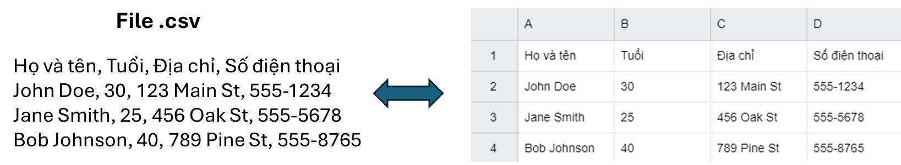

# LESSON 1: COMPILER-MACRO
<details><summary>Chi tiết</summary>
<p>
  
## 1. Compiler

Compiler (trình biên dịch) là chương trình có nhiệm vụ xử lý chương trình ngôn ngữ bậc cao thành ngôn ngữ bậc thấp hơn để máy tính thực thi.

Quá trình biên dịch gồm các giai đoạn như sau:

<p align="center">
  
</p>

- Giai đoạn Preprocessor (Tiền xử lý): thực hiện nhận source code (bao gồm các file: .c,.h,.cpp,.hpp,...), xóa bỏ comment và xử lý các chỉ thị tiền xử lý và đầu ra là file .i.

  Lệnh thực hiện trên terminal:
  ```bash
  gcc -E main.c -o main.i
  ```
- Giai đoạn Compiler: chuyển từ ngôn ngữ bậc cao sang ngôn ngữ bậc thấp assembly, đầu vào là file .i đầu ra là file .s.

    Lệnh thực hiện trên terminal:
  ```bash
  gcc main.i -S -o main.s
  ```
- Giai đoạn Assembler: dịch chương trình sang mã máy 0 và 1, đầu vào là file .s đầu ra là file .o hay còn gọi là file Object.
  
  Lệnh thực hiện trên terminal:
  ```bash
  gcc - c main.s -o main.o
  ```
- Giai đoạn Linker: liên kết các file Object .0 lại thành một chương trình duy nhất.

   Lệnh thực hiện và chạy file trên terminal:
  ```bash
  gcc test1.o test2.o main.o -o main
  ./main
  ```
## 2. Macro
### Các chỉ thị tiền xử lý

Chỉ thị tiền xử lý là những chỉ thị cung cấp cho bộ tiền xử lý để xử lý những thông tin trước khi bắt đầu quá trình biên dịch. Các chỉ thị tiền xử lý bắt đầu với `#`:
- `#include`: mang toàn bộ mã nguồn của file được include vào file .i mà không cần viết lại, giúp chương trình dễ quản lý do phân chia thành các module.
	
```c
#include <stdio.h>
#incldue "test1.h"
```
- `#define`: thay thế một đoạn chương trình bị lặp lại, không có kiểu dữ liệu. Việc sử dụng từ khóa `#define` để định nghĩa được gọi là Macro.
```bash
#define PI 3.14
```
- `#undef`: để hủy định nghĩa một `#define` đã được định nghĩa trước đó.
```c
#include <stdio.h>
#define MAX_SIZE 100

int main() {
	printf("MAX_SIZE is defined as: %d\n", MAX_SIZE);
	
	// Bỏ định nghĩa của MAX_SIZE
	#undef MAX_SIZE
	
	// Định nghĩa lại MAX_SIZE với giá trị khác
	#define MAX_SIZE 50
	
	printf("MAX_SIZE is now redefined as: %d\n", MAX_SIZE);

return 0;
}
```
- `#if`, `#elif`, `#else`: để kiểm tra điều kiện của Macro.
```c
#include <stdio.h>
// Định nghĩa một macro
#define VERSION 3

int main() {
	// Sử dụng #if, #elif, #else
	#if VERSION == 1                               // Điều kiện #if sai, nếu không còn kiểm tra điều kiện nào
                                                       // nữa đi tới #endif luôn
	  printf("This is version 1.\n");
	#elif VERSION == 2                             // Tiếp tục kiểm tra với #elif
	  printf("This is version 2.\n");            
	#else                                          // Không có điều kiện nào ở trên đúng
	  printf("This is another version.\n");
 	#endif

return 0;
}
```
- `#ifdef`, `#ifndef`: kiểm tra xem macro này đã hoặc chưa được định nghĩa ("đã" ứng với `#ifdef` và "chưa" ứng với `#ifndef`) hay chưa nếu đúng như vậy thì mã phía sau sẽ được biên dịch.
```c
#include <stdio.h>
// Định nghĩa một macro
#define FEATURE_ENABLED

int main() {
	// Kiểm tra xem FEATURE_ENABLED đã được định nghĩa đúng không?
	#ifdef FEATURE_ENABLED
	  printf("Feature is enabled.\n");
	#endif
	
	// Kiểm tra xem ANOTHER_FEATURE chưa được định nghĩa đúng không?
	#ifndef ANOTHER_FEATURE
	  printf("Another feature is not enabled.\n");
	#endif

return 0;
}
```
### Macro function

Macro function là khi đoạn chương trình `#define` là một hàm có tham số truyền vào. Nếu macro function có nhiều dòng thì cuối các dòng kết thúc bằng kí tự `\` và dòng cuối cùng không cần.
  
```c
#include <stdio.h>

#define DISPLAY_SUM(a,b)                        \
printf("This is macro to sum 2 number\n");      \
printf("Result is: %d", a+b);

int main() {
	DISPLAY_SUM(5,6);
return 0;
}
```
- Ưu điểm của macro function so với một function là không tối ưu về bộ nhớ trên RAM nhưng tối ưu về tốc độ. Cụ thể hơn khi viết một function, thì function đó sẽ được lưu vào một vùng nhớ. Khi function được gọi ra trong `main()`, programe counter sẽ lưu địa chỉ hiện tại vào stack pointer và trỏ đến từng địa chỉ của vùng nhớ chứa function. Còn macro function thì thay thế trực tiếp vô luôn, tuy chiếm một bộ nhớ trên RAM và không cần các các bước như trên nhưng tốc độ lại nhanh hơn.

### Toán tử trong macro

Toán tử `#`: tự chuẩn hóa kiểu chuỗi cho tham số nhập vào.

Toán tử `##`: nối các chuỗi lại với nhau.
```c
  #include <stdio.h>
  
  // Sử dụng toán tử tự chuẩn hóa 
  #define CREATE_FUNC(func, cmd)  \
  void func() {                   \
      printf(#cmd);               \
      printf("\n");               \
  }
  
  // Sử dụng toán tử nối chuỗi
  #define CREATE_VAR(name)        \
  int int_##name;                 
  
  CREATE_FUNC (test1, this is function test1); 
  CREATE_VAR(test);
  
  int main() {
      return 0;
  }
```
Kết quả trong file .i:
```c
void test1() { printf("this is function test1"); printf("\n"); };
int int_test;
```
### Variadic macro

Là loại macro có thể chấp nhận một số lượng tham số không xác định, cho phép bạn truyền vào bất kỳ số lượng đối số nào khi sử dụng macro.
  
```c
#include <stdio.h>

// Định nghĩa một variadic macro
#define PRINT_ARGS(format, ...) printf(format, __VA_ARGS__)

int main() {
    // Sử dụng variadic macro để in ra các giá trị
    PRINT_ARGS("This is a variadic macro example: %d, %f\n", 42, 3.14);

    return 0;
}
```
</p>
</details>

# LESSON 2: STDARG-ASSERT
<details><summary>Chi tiết</summary>
<p>
  
## 1. Thư viện STDARG

Thư viện stdarg.h hỗ trợ viết function với số lượng tham số không xác định. Thư viện này cung cấp một số từ khóa như sau:
- `va_list va`: `va_list` là một kiểu dữ liệu của tập hợp các đối số không xác định được đặt tên là `va`. (Bản chất nó giống như con trỏ kiểu `char` được định nghĩa lại tên bằng `typedef`: `typedef char* va_list;)`.

- `va_start(va, count)`: hàm này mang các kí tự vào chuỗi `va`. Cách hoạt động của nó là sẽ tạo một con trỏ có giá trị bằng địa chỉ kí tự đầu tiên của chuỗi không xác định và thực hiện vòng lặp so sánh các kí tự trong chuỗi có giống với từng kí tự của label count không và con trỏ địa chỉ tăng dần dần ứng với địa chỉ của các kí tự tiếp theo của chuỗi. Sau khi xác định được kí tự giống với label count thì mới bắt đầu mang các kí tự sau dấu `,` vào chuỗi `va`.
  
- `va_arg(va, type)`: lấy giá trị của tham số tiếp theo từ chuỗi va và ép kiểu nó sang kiểu dữ liệu được chỉ định. Khi gọi hàm `va_arg(va, type)` thì nó đọc giá trị tại ô phía sau `va_start` và trỏ tới ô tiếp theo.

- `va_end(va_list ap)`: kết thúc việc sử dụng danh sách đối số biến đổi, giải phóng bộ nhớ.

**Ví dụ nhập vào 5 tham số:**
```bash
  #include <stdio.h>
  #include <stdarg.h>
  
  void display(int count, ...) {
      va_list av;
      va_start(av, count);
     
      for (int i = 0; i < count; i++) {
          printf("Value at %d: %d\n", i, va_arg(av,int)); 
      }
  
      va_end(va);
  }
  
  int main()
  {
      // Số lượng tham số là 5
      display(5, 6, 8, 15, 10, 13);
  
      return 0;
  }
  ```
**Output:**
```bash
> Value at 0: 6
> Value at 1: 8
> Value at 2: 15
> Value at 3: 10
> Value at 4: 13
```
## 2. Thư viện ASSERT

Thư viện assert.h là thư viện để hỗ trợ debug chương trình.

- Hàm assert(): dùng để kiểm tra điều kiện, nếu điều kiện đúng thì chương trình tiếp tục thực thi còn sai thì dừng chương trình và báo lỗi. 

**Ví dụ báo lỗi chia cho 0:**
```bash
  #include <stdio.h>
  #include <assert.h>
  
  double thuong(int a, int b){
      assert( b != 0 && "Mẫu bằng 0");
      return (double) a/b;
  }
  
  int main(int argc, char const*argv[])
  {
      printf("Thuong: %f\n", thuong(6, 0)); 
      return 0;
  }
  ```
**Báo lỗi như sau:**
```bash
> Assertion failed: b != 0 && "Mẫu bằng 0", file tempCodeRunnerFile.c, line 5
```
Thường thấy hơn sẽ sử dụng macro để định nghĩa một lỗi.
  ```bash
  #include <stdio.h>
  #include <assert.h>
  #define LOG(condition, cmd) assert(condition && #cmd)
  
  double thuong(int a, int b){
      LOG(b != 0, "Mau bang bang 0");
  }
  
  int main(int argc, char const *argv[])
  {
      thuong(6,0);
      return 0;
  }
  ```
</p>
</details>

# LESSON 3: POINTER
<details><summary>Chi tiết</summary>
<p>
  
## 1. Định nghĩa con trỏ
<details><summary>Chi tiết</summary>
<p>
  
Con trỏ (pointer) là một biến chứa địa chỉ của một đối tượng khác (đối tượng ở đây có thể là: biến, hàm, mảng,...).

**Cú pháp:**
   ```bash
  int   *ptr;        // con trỏ kiểu int
  char  *ptr_char;   // con trỏ kiểu char
  float *ptr_float;  // con trỏ kiểu float
  ```
**Ví dụ:**
   ```bash
  #include <stdio.h>
  
  int a = 10;
  int *ptr = &a;                 // toán tử lấy địa chỉ &
  int *ptr1 = (int*)0x01101010;  // phải ép kiểu khi gán trực tiếp cho địa chỉ
  
  int main(int argc, char const*argv[]){
      printf("Dia chi a: %p\n", &a);
      printf("Gia tri ptr: %p\n", ptr); 
      printf("Gia tri ptr1: %p\n", ptr1); 
      return 0;
  }
  ```
**Kết quả:**
  ```bash
  > Dia chi a: 	  00007FF7960F3000  
  > Gia tri ptr:  00007FF7960F3000
  > Gia tri ptr1: 0000000001101010
  ```
**Kích thước của con trỏ phụ thuộc vào kiến trúc vi xử lý.**

Hệ thống 32 – bit, kích thước của con trỏ là 4 byte.

Hệ thống 64 – bit, kích thước của con trỏ là 8 byte.

  ```bash
  #include <stdio.h>
  #include <stdbool.h>
  
  int main(int argc, char const *argv[]){
      printf("%d bytes\n", sizeof(int *));              // 8bytes
      printf("%d bytes\n", sizeof(char *));             // 8bytes
      printf("%d bytes\n", sizeof(float *));            // 8bytes
      printf("%d bytes\n", sizeof(double *));           // 8bytes
      printf("%d bytes\n", sizeof(long *));             // 8bytes
      printf("%d bytes\n", sizeof(short *));            // 8bytes
      printf("%d bytes\n", sizeof(long long *));        // 8bytes
      printf("%d bytes\n", sizeof(bool *));             // 8bytes
      return 0;
  }
  ```
</p>
</details>

## 2. Các kiểu con trỏ
### Function pointer (Con trỏ hàm)
<details><summary>Chi tiết</summary>
<p>
  
Con trỏ hàm là một biến giữ địa chỉ của hàm.

**Cú pháp:**
  ```bash
  void (*ptr)(int, double);  
  ```
  - Con trỏ ptr trỏ đến hàm kiểu trả về là `void` (ngoài ra còn có thể là `int`,...), tham số truyền vào là kiểu `int` và `double`.
  - Các hàm nào có cùng cú pháp trong cùng một chương trình, con trỏ đều trỏ đến được.
    
**Ví dụ:**
  ```bash
  #include <stdio.h>
  #include <assert.h>
  
  void chao() {
      printf("Hello!\n");
  }
  
  void chia(int a, int b) {
      assert(b != 0);
      printf("Thuong %d va %d: %f\n", a, b, (double)a / (double)b);
  }
  
  int main(int argc, char const *argv[]){
      // Khai báo con trỏ hàm
      void (*ptr0)();
      void (*ptr1)(int, int);
  
      // Gán địa chỉ của hàm cho con trỏ hàm
      ptr0 = chao;
      ptr1 = &chia;
  
      // Gọi hàm ra
      ptr0();
      ptr1(8, 2);

      // Gọi hàm ra
      (*ptr0)();
      (*ptr1)(8, 2);
  
      return 0;
  }
  ```
**Kết quả:**
  ```bash
  > Hello!
  > Thuong 8 va 2: 4.000000
  > Hello!
  > Thuong 8 va 2: 4.000000
  ```
**Ví dụ sử dụng mảng lưu địa chỉ nhiều con trỏ hàm:**
  ```bash
  #include <stdio.h>
  #include <assert.h>
  
  void tong(int a, int b) {
      printf("Tong %d va %d: %d\n", a, b, a + b);
  }
  
  void hieu(int a, int b) {
      printf("Hieu %d va %d: %d\n", a, b, a - b);
  }
  
  void tich(int a, int b) {
      printf("Tich %d va %d: %d\n", a, b, a * b);
  }
  
  void thuong(int a, int b) {
      assert(b != 0);
      printf("Thuong %d va %d: %d\n", a, b, a / b);
  }
  
  int main(int argc, char const *argv[]){
      // Khai báo con trỏ hàm
      void (*array[])(int, int)={&tong,&hieu,&tich,&thuong};
      //void (*array[4])(int, int)={&tong,&hieu,&tich,&thuong};
  
      // Tính
      array[0](1,1);
      array[1](1,1);
      return 0;
  }
  ```
**Kết quả:**
  ```bash
  > Tong 1 va 1: 2
  > Hieu 1 va 1: 0
  ```
**ỨNG DỤNG CON TRỎ HÀM: Tham số truyền vào hàm là một hàm khác.**
  ```bash
  #include <stdio.h>
  #include <assert.h>
  
  void tong(int a, int b) {
      printf("Tong %d va %d: %d\n", a, b, a + b);
  }
  
  void tinhToan(void (*ptr)(int, int), int a, int b) {
      printf("Thuc hien phep toan duoi:\n");
      ptr(a, b);
  }
  
  int main(int argc, char const *argv[]){
      // Gọi hàm
      tinhToan(&tong, 5, 3);
      return 0;
  }
  ```
</p>
</details>

### Void pointer (Con trỏ void)
<details><summary>Chi tiết</summary>
<p>

Void pointer là một con trỏ có thể trỏ đến bất kỳ kiểu dữ liệu nào. 

**Cú pháp:**
  ```bash
  void *ptr; 
  ```

Khi in ra giá trị được void point trỏ đến, do nó không biết kiểu dữ liệu của giá trị được trỏ đến nên phải ép kiểu con trỏ void thành con trỏ kiểu đó trước rồi mới giải tham chiếu (Vd: `*(int*)ptr`).
  
**Ví dụ:**
  ```bash
  #include <stdio.h>
  
  void tong(int a, int b) {
      printf("Tong cua %d va %d la: %d\n", a, b, a + b);
  }
  
  int main(int argc, char const *argv[]) {
      int a = 10;
      double b = 20.5;
      char c = 'X';
  
      void *ptr;
  
      // Trỏ đến biến kiểu int
      ptr = &a;
      printf("Gia tri cua a = %d\n", *(int*)ptr);       // Ép kiểu và giải tham chiếu
  
      // Trỏ đến biến kiểu double
      ptr = &b;
      printf("Gia tri cua b = %.2f\n", *(double*)ptr);  // Ép kiểu và giải tham chiếu
  
      // Trỏ đến biến kiểu char
      ptr = &c;
      printf("Gia tri cua c = %c\n", *(char*)ptr);      // Ép kiểu và giải tham chiếu

      // Trỏ đến hàm
      ptr = &tong;
      ((void (*)(int, int))ptr)(9, 3);                  // Ép kiểu về con trỏ hàm
  
      return 0;
  }
  ```
**Kết quả:**
  ```bash
  > Gia tri cua a = 10
  > Gia tri cua b = 20.50
  > Gia tri cua c = X
  > Tong cua 9 va 3 la: 12
  ```
</p>
</details>

### NULL pointer (Con trỏ NULL)
<details><summary>Chi tiết</summary>
<p>

Con trỏ NULL  là một con trỏ không trỏ đến đối tượng nào hết. Nó có địa chỉ và giá trị bằng 0.

Khi khai báo con trỏ mà chưa sử dụng ngay hoặc sử dụng xong thì phải gán NULL.

**Cú pháp:**
  ```bash
  int *ptr_null = NULL;
  //  ptr_null = 0x00: địa chỉ khởi tạo
  // *ptr_null = 0   : giá trị tại địa chỉ khởi tạo
  ```

</p>
</details>

### Pointer to constant (Con trỏ hằng)
<details><summary>Chi tiết</summary>
<p>

Con trỏ hằng là con trỏ **chỉ có thể đọc giá trị tại địa chỉ mà nó trỏ đến**, nghĩa là không được phép dùng toán tử giải tham chiếu `*` truy cập đến địa chỉ để thay đổi giá trị.

**Cú pháp:**
  ```bash
  <data_type> const *ptr_const; 
  const <data_type> *ptr_const;
  ```
**Ví dụ**
  ```bash
  #include <stdio.h>
  
  int value = 10;
  const int *ptr_const = &value;
  
  int main(int argc, char const *argv[]){
      printf("%p\n", ptr_const);
      printf("%d\n", *ptr_const);

      // Lỗi: Không được phép thay đổi giá trị của con trỏ hằng!
      *ptr_const = 20;
      printf("%d\n", *ptr_const);
      return 0;
  }
  ```
Kết quả sau khi chạy sẽ gặp lỗi: ```assignment of read-only location '*ptr_const'```

</p>
</details>

### Constant pointer (Hằng con trỏ)
<details><summary>Chi tiết</summary>
<p>
  
Hằng con trỏ là một con trỏ mà **trỏ đến 1 địa chỉ cố định**, nghĩa là khi con trỏ này được khởi tạo thì nó sẽ không thể trỏ tới địa chỉ khác.

Hằng con trỏ cho phép dùng toán tử giải tham chiếu `*` để thay đổi giá trị.

**Cú pháp:**
  ```bash
  <data_type> *const const_ptr = &value;
  ```
**Ví dụ**
  ```cpp
  #include <stdio.h>
  
  int value1 = 10;
  int value2 = 20;
  int *const const_ptr = &value1;
  
  int main(int argc, char const *argv[]){
      printf("%p\n", const_ptr);
      printf("%d\n", *const_ptr);
  
      const_ptr = &value2;
      printf("%p\n", const_ptr);
      return 0;
  }
  ```
Kết quả sau khi chạy sẽ gặp lỗi: ```assignment of read-only variable 'const_ptr'```

</p>
</details>

### Pointer to pointer (Con trỏ trỏ đến con trỏ)
<details><summary>Chi tiết</summary>
<p>

Con trỏ đến con trỏ là một kiểu dữ liệu trong ngôn ngữ lập trình cho phép lưu trữ địa chỉ của một con trỏ.

Con trỏ đến con trỏ cung cấp một cấp bậc trỏ mới, cho phép thay đổi giá trị của con trỏ gốc.

Cấp bậc này có thể hữu ích trong nhiều tình huống, đặc biệt là khi làm việc với các hàm cần thay đổi giá trị của con trỏ.

**Cú pháp:**
  ```bash
  int **ptp = &p;
  ```
**Ví dụ:**
  ```bash
  #include <stdio.h>
  
  int main() {
      int value = 42;
      int *ptr1 = &value;  // Con trỏ thường trỏ đến một biến
  
      int **ptr2 = &ptr1;  // Con trỏ đến con trỏ
  
      /*
          **ptr2 = &ptr1
          ptr2 = &ptr1;
          *ptr2 = ptr1 = &value;
          **ptr2 = *ptr1 = value
      */
  
      printf("address of value: %p\n", &value);
      printf("value of ptr1: %p\n", ptr1);
  
      printf("address of ptr1: %p\n", &ptr1);
      printf("value of ptr2: %p\n", ptr2);
  
      printf("dereference ptr2 first time: %p\n", *ptr2);
      printf("dereference ptr2 second time: %d\n", **ptr2);
  
      return 0;
  }
  ```
**Kết quả:**
  ```bash
  address of value: 		000000E6425FF904
  value of ptr1: 		000000E6425FF904
  address of ptr1:		000000E6425FF8F8
  value of ptr2: 		000000E6425FF8F8
  dereference ptr2 first time: 	000000E6425FF904
  dereference ptr2 second time: 42
  ```

</p>
</details>

</p>
</details>

# BÀI 4: EXTERN-STATIC-VOLATILE-REGISTER
<details><summary>Chi tiết</summary>
<p>

## 1. Extern
<details><summary>Chi tiết</summary>
<p>
  
Từ khóa `extern` được sử dụng để khai báo rằng một **biến hoặc một hàm** được định nghĩa ở một nơi khác (thường là trong một tệp khác). 

Từ khóa `extern` không tạo ra một biến mới mà chỉ thông báo cho trình biên dịch rằng **biến hoặc một hàm** này đã được định nghĩa ở nơi khác và có thể được sử dụng trong tệp hiện tại.

**Ví dụ file main.c:**
  ```bash
  #include <stdio.h>
  
  int value = 90;
  extern void display();
  
  int main(){
  	printf("hello\n");
  	display();
  }
  ```
**Ở file other.c:**
  ```bash
  #include <stdio.h>
  
  extern int value;
  void display()
  {
  	printf("value: %d\n", value);
  }
  ```
</p>
</details>

## 2. Static
### Static local variables
<details><summary>Chi tiết</summary>
<p>
	
Biến cục bộ tĩnh (Static local variables) là các biến được khai báo với từ khóa `static` ở **trong phạm vi của một hàm**. Nó có những tính chất đặc biệt như sau:

  - **Tồn tại trong suốt vòng đời của chương trình**: Biến cục bộ tĩnh được khai báo bên trong một hàm và chỉ có thể truy cập được từ trong hàm đó, sau khi hàm kết thúc nó không bị phóng bộ nhớ. Thay vào đó, nó vẫn tồn tại trong suốt thời gian chạy của chương trình và giữ lại giá trị của nó giữa các lần gọi hàm.
    
  - **Chỉ khởi tạo một lần**: Biến cục bộ tĩnh chỉ được khởi tạo một lần duy nhất, vào lần đầu tiên hàm được gọi. Sau đó, biến này sẽ giữ nguyên giá trị của nó từ lần cuối cùng hàm được gọi và không được khởi tạo lại trong các lần gọi tiếp theo.

**Ví dụ biến cục bộ tĩnh:**
  ```bash
  #include <stdio.h>
  
  void exampleFunction() {
      static int count = 0;  // Biến static giữ giá trị qua các lần gọi hàm
      count++;
      printf("Count: %d\n", count);
  }
  
  int main() {
      exampleFunction();  // In ra lần 1
      exampleFunction();  // In ra lần 2
      exampleFunction();  // In ra lần 3
      return 0;
  }
  ```
**Kết quả:**
  ```bash
  > Count: 1
  > Count: 2
  > Count: 3
  ```

</p>
</details>

### Static global variables
<details><summary>Chi tiết</summary>
<p>
	
Biến toàn cục tĩnh (Static global variables) là các biến được khai báo với từ khóa `static` ở **ngoài tất cả các hàm** (tức là trong phạm vi toàn cục của file). Nó có những tính chất đặc biệt như sau:
  - **Phạm vi truy cập chỉ giới hạn trong file**: Biến toàn cục tĩnh chỉ có thể truy cập được trong file nơi nó được khai báo. Có nghĩa là các biến này không thể được sử dụng bởi các file khác, ngay cả khi chúng được khai báo là `extern`. Khác với biến toàn cục không có từ khóa `static`, có thể được truy cập từ các file khác nếu được khai báo `extern`.
  - **Thời gian tồn tại**: Biến toàn cục tĩnh có thời gian tồn tại từ khi chương trình bắt đầu cho đến khi chương trình kết thúc, tương tự như các biến toàn cục thông thường. Giá trị của chúng được duy trì trong suốt thời gian chạy của chương trình. Chỉ khởi tạo một lần duy nhất trước khi chương trình bắt đầu thực thi.

**Ví dụ file main.c:**
  ```bash
  #include <stdio.h>
  
  extern void display();
  //extern int s_g_value;      // Không được phép, vì s_g_value là biến toàn cục tĩnh của file other.c!!
  extern int g_value;
  
  int main()
  {
  	printf("hello\n");
  	g_value = 40;
  	
  	display();
  
  	return 0;
  }
  ```
**Ở file other.c:**
```bash
#include <stdio.h>

int g_value = 30;
static int s_g_value = 20;

void display()
{
	printf("static global value: %d\n", s_g_value);
	printf("global value: %d\n", g_value);
}
```

</p>
</details>

## 3. Volatile 
<details><summary>Chi tiết</summary>
<p>
  
Từ khóa `volatile` được sử dụng để thông báo cho trình biên dịch rằng giá trị của một biến có thể thay đổi bất kỳ lúc nào, trình biên dịch không được tối ưu hóa hoặc xóa bỏ các thao tác trên biến đó.

Sau đây là một trường hợp đơn giản trong nhúng mà việc khai báo biến `volatile` rất cần thiết để tránh những lỗi sai khó phát hiện do tính năng optimization của compiler:

**Thanh ghi ngoại vi có ánh xạ đến ô nhớ**

Các thiết bị ngoại vi (GPIO, UART, ...) chứa các thanh ghi mà giá trị của nó có thể thay đổi ngoài ý muốn của dòng chương trình, đặc biệt là những thanh ghi trạng thái.

Ví dụ: đợi một nút bấm, với địa chỉ thanh ghi GPIO tương ứng nút bấm được định nghĩa như sau:

```bash
/* Input data register address */
volatile uint32_t* button = (volatile uint32_t*)0x40020810;
...
while ((*button & (1 << 13)) == 0);
```

Ở đây nếu không có `volatile`, con trỏ button sẽ đọc giá trị tại địa chỉ `0x40020810` (và giá trị này mắc định đang là 0).

Khi đó compiler sẽ tối ưu - optimize điều kiện trong câu lệnh sau trở thành `while ((0 & (1 << 13)) == 0);`

Tức là `while (1);`

Vòng lặp này đương nhiên không bao giờ dừng lại => Bug!

</p>
</details>

## 4. Register
<details><summary>Chi tiết</summary>
<p>
  
 Từ khóa `register` được sử dụng để yêu cầu trình biên dịch lưu trữ một biến trong các thanh ghi của bộ xử lý thay vì trong bộ nhớ RAM. 
  
<p align="center">
  
</p>

Cơ chế tính toán của máy tính:

  - ALU (Arithmetic Logic Unit) nhận dữ liệu từ các thanh ghi (register) hoặc từ bộ nhớ (RAM).
  - ALU thực hiện phép toán.
  - Kết quả của phép toán được gửi và lưu lại về thanh ghi hoặc RAM.
    
Từ khóa `register` làm tăng tốc độ truy cập biến, vì truy cập vào các thanh ghi nhanh hơn nhiều so với truy cập vào bộ nhớ RAM.

**Kiểm tra tốc độ chương trình khi lưu biến trong thanh ghi và trong RAM:**
  ```bash
  #include <stdio.h>
  #include <time.h>
  
  int main(int argc, char const *argv[])
  {
      unsigned long i;                // Lưu trong RAM
      //register unsigned long i;     // Lưu trong thanh ghi
  
      clock_t start, end;
  
      start = clock();
  
      for ( i = 0; i < 99999999; i++);
  
      end = clock();
  
      printf("Time: %f\n", (double)(end - start)/1000);
      
      return 0;
  }
  ```
**Kết quả:**
  ```bash
  > Time: 0.144000    // Lưu trong RAM
  > Time: 0.054000    // Lưu trong thanh ghi
  ```
</p>
</details>

</p>
</details>

# BÀI 5: GOTO-SETJMP.H
<details><summary>Chi tiết</summary>
<p>
  
## 1. Goto
<details><summary>Chi tiết</summary>
<p>
	
Từ khóa `goto` được sử dụng để nhảy đến vị trí bất kì tùy vào label có phạm vi **trong cùng một hàm**.

**Ví dụ:**
```bash
#include <stdio.h>

int main() {
    int num = 0;

    while (num < 10) {
        if (num == 5)
            goto end; 				// Nhảy đến nhãn 'end' khi num bằng 5
        printf("Number: %d\n", num);
        num++;
    }
end:					       // Nhãn 'end'
    printf("This is the end.\n");

    return 0;
}
```
Từ khóa `goto` có thể được thay thế nhiều `break` hoặc các phương pháp khác khi cần thoát ra khỏi một số lượng lớn các vòng lặp lồng nhau. Điều này làm đoạn code trở nên đơn giản hơn. 
```bash
#include <stdio.h>

int main() {
    int i = 0, j;

    while (i < 10) {
        for (j = 0; j < 10; j++) {
            if (i == 5 && j == 5) {
                goto end_loops;  				// Nhảy đến nhãn 'end_loops' để thoát khỏi cả hai vòng lặp
            }
            printf("i = %d, j = %d\n", i, j);
        }
        i++;
    }
end_loops:						       // Nhãn 'end_loops'
    printf("Exited loops at i = %d, j = %d\n", i, j);

    return 0;
}
```

</p>
</details>

## 2. Setjmp.h
<details><summary>Chi tiết</summary>
<p>

Thư viện `setjmp.h` là cung cấp cơ chế nhảy đến một vị trí xác định trong chương trình. **Khác với `go to` phạm vi nhảy có thể nhảy đến vị trí ở một hàm khác**. 

Thư viện này cung cấp hai hàm chính là `setjmp` và `longjmp`, cú pháp sử dụng như sau:

 - Trước tiên, cần khai báo một biến:
```bash 
jmp_buf buffer;  // Tên biến là `buffer` kiểu dữ liệu là `jmp_buf` (kiểu này được định nghĩa sẵn bởi thư viện)
```
- Sử dụng `setjmp` để lưu trữ trạng thái của môi trường tại điểm mà nó được gọi, `setjmp` sẽ trả về 0 nếu nó được gọi lần đầu tiên.
```bash 
int val = setjmp(buffer);	// val = 0
```
- Sử dung `longjmp`, chương trình sẽ quay trở lại điểm mà `setjmp` đã được gọi, và `setjmp` sẽ trả về giá trị là một số nguyên (không bao giờ là 0, vì giá trị 0 đặc biệt để nhận diện việc gọi setjmp lần đầu tiên).
```bash 
longjmp(buffer, 1); // Nhảy trở lại điểm trước đó với giá trị trả về val = 1
```
**Ví dụ:**
```bash
#include <stdio.h>
#include <setjmp.h>

jmp_buf buffer;						// Khai báo tên biến là `buffer`

void jump_function() {
    printf("In jump_function.\n");
    longjmp(buffer, 5); 				// Nhảy trở lại setjmp và trả về giá trị 5
}

int main() {
    int val = setjmp(buffer); 			       // Đây là nơi chương trình sẽ quay lại sau khi longjmp được gọi
    printf("I'm here! \n");
    if (val == 0) {
        // Thực thi lần đầu khi setjmp trả về 0
        printf("Val = %d\n", val);
        jump_function(); 			       // Gọi hàm sẽ thực hiện longjmp
    } else {
        // Thực thi sau khi longjmp được gọi và setjmp trả về 5
        printf("Val = %d\n", val);
    }

    return 0;
}
```
**Kết quả:**
```bash
> I'm here! 
> Val = 0
> In jump_function.
> I'm here! 
> Val = 5
```

Ứng dụng của hai hàm `setjmp`/`longjmp` thường được sử dụng để thực hiện xử lý ngoại lệ. Nhưng, đó chưa phải là cách thông dụng nhất trong việc xử lý ngoại lệ.

**Ví dụ xử lý ngoại lệ khi chia cho 0:**
```bash
#include <stdio.h>
#include <setjmp.h>

jmp_buf buf;
int exception_code;

#define TRY if ((exception_code = setjmp(buf)) == 0) 
#define CATCH(x) else if (exception_code == (x)) 
#define THROW(x) longjmp(buf, (x))

double divide(int a, int b) {
    if (b == 0) {
        THROW(1); 						// Mã lỗi 1 cho lỗi chia cho 0
    }
    return (double)a / b;
}

int main() {
    int a = 10;
    int b = 0;
    double result = 0.0;

    TRY {
        result = divide(a, b);
        printf("Result: %f\n", result);
    } CATCH(1) {
        printf("Error: Divide by 0!\n");
    }

    return 0;
}
```

</p>
</details>

</p>
</details>

# BÀI 6: BITMASK
<details><summary>Chi tiết</summary>
<p>
	
Bitmask là một kỹ thuật thực hiện các thao tác trên các bit của word. 

Thay vì sử dụng một biến riêng cho mỗi cờ (flag), bạn có thể sử dụng bitmask để lưu trữ nhiều giá trị nhị phân (on/off, true/false).

Ví dụ:
```bash
uint8_t bitmask = 0b10101010;
```
Giả sử ta có một dãy bitmask 8 bit (1 byte) để lưu trữ trạng thái của 8 thiết bị khác nhau. Mỗi thiết bị có thể ở trạng thái bật (1) hoặc tắt (0).
<p align="center">
  
</p>

## NOT bitwise
<details><summary>Chi tiết</summary>
<p>
	
NOT bitwise (phép đảo bit) là phép toán làm cho tất cả các bit của giá trị đó sẽ bị đảo ngược: bit 0 sẽ trở thành 1, và bit 1 sẽ trở thành 0.

Toán tử NOT: `~`

**Ví dụ:**
```bash
uint8_t value = 0b00001101;  
uint8_t not_value = ~value;  // Sử dụng phép NOT bitwise
```
**Kết quả:**
```bash
> 0b11110010
```
</p>
</details>

## AND bitwise
<details><summary>Chi tiết</summary>
<p>
	
Phép AND bitwise thực hiện so sánh từng cặp bit tương ứng giữa hai số:

 - Nếu cả hai bit đều là 1, kết quả là 1.
 - Nếu một trong hai bit hoặc cả hai bit là 0, kết quả là 0.

<p align="center">
  
</p>

Toán tử AND: `&`

**Ví dụ:**
```bash
uint8_t a = 0b11001010; // Số thứ nhất
uint8_t b = 0b10110110; // Số thứ hai
uint8_t result = a & b;  // Áp dụng AND bitwise
```
**Kết quả:**
```bash
  11001010
& 10110110
  --------
> 10000010
```
</p>
</details>

## OR bitwise
<details><summary>Chi tiết</summary>
<p>
	
Phép OR bitwise thực hiện so sánh từng cặp bit tương ứng giữa hai số:

 - Nếu ít nhất một trong hai bit là 1, kết quả là 1.
 - Nếu cả hai bit đều là 0, kết quả là 0.

<p align="center">
  	
</p>

Toán tử OR: `|`

**Ví dụ:**
```bash
uint8_t a = 0b11001010; // Số thứ nhất
uint8_t b = 0b10110110; // Số thứ hai
uint8_t result = a | b;  // Áp dụng OR bitwise
```
**Kết quả:**
```bash
  11001010
| 10110110
  --------
> 11111110
```
</p>
</details>

## XOR bitwise
<details><summary>Chi tiết</summary>
<p>
	
Phép XOR bitwise (Exclusive OR) thực hiện so sánh từng cặp bit tương ứng giữa hai số:

 - Nếu hai bit khác nhau (một là 0 và một là 1), kết quả là 1.
 - Nếu hai bit giống nhau (cả hai cùng là 0 hoặc cùng là 1), kết quả là 0.

<p align="center">
  	
</p>

Toán tử XOR: `^`

**Ví dụ:**
```bash
uint8_t a = 0b11001010; // Số thứ nhất
uint8_t b = 0b10110110; // Số thứ hai
uint8_t result = a ^ b;  // Áp dụng XOR bitwise
```
**Kết quả:**
```bash
  11001010
^ 10110110
  --------
> 01111100
```
</p>
</details>

## Shift left bitwise
<details><summary>Chi tiết</summary>
<p>
	
Phép Shift left bitwise dịch chuyển tất cả các bit trong một giá trị nhị phân sang trái một số vị trí cụ thể. Các bit bên phải được lấp đầy bằng các số 0.

Toán tử Shift left: `<<`

**Ví dụ:**
```bash
uint8_t value = 0b00001101;  // Giá trị ban đầu: 13 (00001101)
uint8_t shifted_value = value << 2;  // Dịch trái 2 bit
```
**Kết quả:**
```bash
  00001101 << 2
  -----------
> 00110100
```
</p>
</details>

## Shift right bitwise
<details><summary>Chi tiết</summary>
<p>
	
Phép Shift right dịch chuyển tất cả các bit trong một giá trị nhị phân sang phải một số vị trí cụ thể. Các bit bên trái được lấp đầy bằng các số 0.

Toán tử Shift right: `>>`

**Ví dụ:**
```bash
uint8_t value = 0b00101100;  // Giá trị ban đầu: 44 (00101100)
uint8_t shifted_value = value >> 2;  // Dịch phải 2 bit
```
**Kết quả:**
```bash
  00101100 >> 2
  -----------
> 00001011
```
</p>
</details>


</p>
</details>

# BÀI 7: STRUCT-UNION
<details><summary>Chi tiết</summary>
<p>

## 1. Struct
<details><summary>Chi tiết</summary>
<p>

### Khái niệm
`struct` là một cấu trúc dữ liệu cho phép lập trình viên tự định nghĩa một kiểu dữ liệu mới bằng cách nhóm các biến có các kiểu dữ liệu khác nhau lại với nhau.

**Cú pháp:**
```c
struct StructureName {
    data_type1 variable_name1;
    data_type2 variable_name2;
    // Other members of the structure
};

// Ví dụ
struct SinhVien {
    char ten[50];        // Tên sinh viên
    int tuoi;            // Tuổi sinh viên
    float diem_trung_binh; // Điểm trung bình
};
```

### Kích thước của struct

Kích thước của một `struct` trong C phụ thuộc vào các **thành phần bên trong** nó và cách chúng được **sắp xếp trong bộ nhớ**.

**Ví dụ 1:**
```c
typedef struct {
    uint16_t c;    // Kiểu uint16_t = 2 byte
    uint32_t a;    // Kiểu uint32_t = 4 bytes, kích thước lớn nhất.
    uint8_t  b;    // Kiểu uint8_t = 1 bytes
} examp1;
```

Kích thước của `examp1` sẽ được tính như sau:

- Lấy **kích thước kiểu dữ liệu lớn nhất** của thành phần bên trong làm chuẩn, `uint32_t` tương đương 4 bytes, giả sử ta có một bảng ô nhớ mỗi hàng kích thước 4 bytes như hình.
<p align="center">
  	
</p>

- Lần lượt sắp xếp các biến thành phần trong `frame` vào từng hàng, bắt đầu với biến c. Biến c chiếm 2 bytes còn thừa 2 bytes.
- Biến a có kích thước 4 bytes không vừa với 2 bytes thừa đó nên phải xuống hàng mới, và 2 bytes thừa sẽ bị đánh dấu là **padding**.
- Tiếp tục với biến c, biến c chiếm 1 byte và thừa 3 bytes. Do không còn biến nào nữa nên 3 bytes thừa sẽ bị **padding**.
  <p align="center">
  	
  </p>
  
 - Kích thước của cả `examp1` sẽ bằng số hàng (3 hàng) đã lấp vào nhân với kích thước hàng (4 bytes) là 12 bytes.
   
**Ví dụ 2:**
```c
typedef struct {
    uint8_t a[9];	//Kiểu uint8_t = 1 byte
    uint64_t b[3];	//Kiểu uint64_t = 8 byte, kích thước lớn nhất.
    uint16_t c[10];	//Kiểu uint16_t = 2 byte
    uint32_t d[2];	//Kiểu uint32_t = 4 byte
} exam2;
```
Tương tự thao tác như ví dụ 1 ta được kích thước là 72 bytes.
<p align="center">
  	
</p>
 
### Tối ưu bộ nhớ bằng cách sắp xếp thứ tự khai báo

Với ví dụ 1, thứ tự khai báo chưa được tối ưu. Bằng cách sắp xếp lại thứ tự khai báo ta có thể giảm kích thước của struct..

**Ví dụ 1 sau khi được tối ưu:**
```c
typedef struct {
    uint32_t a;    // Kiểu uint32_t = 4 bytes, kích thước lớn nhất.
    uint8_t  b;    // Kiểu uint8_t = 1 bytes
    uint16_t c;    // Kiểu uint16_t = 2 byte
} examp1;
```
Kích thước sau khi tối ưu đã được giảm đáng kể còn 8 bytes.

<p align="center">
  	
</p>
</p>
</details>

## 2. Union
<details><summary>Chi tiết</summary>
<p>

### Khái niệm
`union` trong ngôn ngữ lập trình C là một kiểu dữ liệu tự định nghĩa, tương tự như `struct`.

**Cú pháp:**
```c
union UnionName {
    data_type1 variable_name1;
    data_type2 variable_name2;
    // Other members of the union
};

// Ví dụ
 union examp3{
    uint8_t a[13];  // Kiểu uint8_t = 1 bytes	
    uint32_t b[3];  // Kiểu uint32_t = 4 bytes, kích thước lớn nhất.
    uint16_t c[6];  // Kiểu uint16_t = 2 byte
};
```
Nhưng đặc trưng là tất cả các thành phần bên trong `union` đều chia sẻ cùng một vùng nhớ. 

**Địa chỉ các biến thành phần:**
```c
Dia chi data:	00000097873FF9E4
Dia chi data.a: 00000097873FF9E4
Dia chi data.b: 00000097873FF9E4
Dia chi data.c: 00000097873FF9E4
```
Điều này có nghĩa là union chỉ có thể lưu trữ một giá trị cho một thành phần tại một thời điểm.
### Kích thước của union

Kích thước của union sẽ bằng kích thước của **thành phần có kích thước lớn nhất**.

Cách tính kích thước cũng gần giống với `struct`, lấy **kích thước kiểu dữ liệu lớn nhất** của thành phần bên trong làm chuẩn, `uint32_t` tương đương 4 bytes, giả sử ta có một bảng ô nhớ mỗi hàng kích thước 4 bytes.

Vì các thành phần của `union` chia sẻ cùng một vị trí bộ nhớ, nên ta lấp các thành phần vào bảng một cách độc lập:

- Kích thước của `uint8_t a[13]` là 16 bytes.
<p align="center">
  	
</p>

- Kích thước của `uint32_t b[3]` là 12 bytes.
<p align="center">
  	
</p>

- Kích thước của `uint16_t c[6]` là 12 bytes.
<p align="center">
  	
</p>

Nên 16 bytes là kích thước của `examp3`


</p>
</details>

## 3. Ứng dụng kết hợp struct và union
<details><summary>Chi tiết</summary>
<p>
	
Ứng dụng của `struct` và `union` sẽ thường thấy trong lập trình nhúng, điển hình nhất là trong việc truyền nhận dữ liệu.
	
Ví dụ khi truyền một khung dữ liệu, `union` cho phép tiết kiệm bộ nhớ bằng cách chia sẻ cùng một vùng nhớ cho các thành phần khác nhau của `struct`.

<p align="center">
  	
</p>

**Ví dụ:**
```c
#include <stdio.h>
#include <stdint.h>
#include <string.h>

typedef union {
    struct {
        uint8_t id[2];
        uint8_t data[4];
        uint8_t check_sum[2];
    } data;

    uint8_t frame[8];

} Data_Frame;

int main(int argc, char const *argv[]){
    Data_Frame transmitter_data, receiver_data;

    // Gửi data đi
    strcpy(transmitter_data.data.id, "10");
    strcpy(transmitter_data.data.data, "1234");
    strcpy(transmitter_data.data.check_sum, "70");
    // Nhận data về
    strcpy(receiver_data.frame, transmitter_data.frame);

    return 0;
}
```
</p>
</details>

</p>
</details>

# BÀI 8: MEMORY LAYOUT
<details><summary>Chi tiết</summary>
<p>
Chương trình main.exe (trên window), main.hex (nạp vào vi điều khiển) được lưu ở bộ nhớ SSD (ROM) hoặc FLASH. Khi nhấn run chương trình trên window (cấp nguồn cho vi điều khiển) thì những chương trình này sẽ được copy vào bộ nhớ RAM để thực thi.

Chương trình C/C++ được tổ chức lưu trong memory layout (phân vùng nhớ) thành các phần như sau:

## 1. Text segment
Phân vùng này chứa:
 - Mã máy (mã máy là tập hợp các lệnh thực thi).

Quyền truy cập thường chỉ có quyền đọc và thực thi, nhưng không có quyền ghi.

Tất cả các biến lưu ở phần vùng Text đều không thể thay đổi giá trị mà chỉ được đọc.

**Ví dụ:**
```c
#include <stdio.h>

const int a = 10;			//Hằng số
char *arr1 = "Hello";			//Con trỏ kiểu char

int main() {
    //a=10;             		//Không được phép thay đổi->Bị lỗi
    //arr1[3] = 'E';

    printf("a: %d\n", a);
    printf("arr1: %s", arr1);

    return 0;
}
```
## 2. Data segment
Hay còn gọi là phân vùng Initialized Data Segment (Dữ liệu Đã Khởi Tạo), chứa:
 - Biến toàn cục và biến static (static global, static local) được khởi tạo với giá trị khác 0.
 - Giá trị của hằng số (const), giá trị của con trỏ kiểu char.
  
Đối với - thứ 1: quyền truy cập là đọc và ghi, tức là có thể đọc và thay đổi giá trị của biến.
Đối với - thứ 2: quyền truy cập là chỉ được đọc.

Tất cả các biến sẽ được thu hồi sau khi chương trình kết thúc.

**Ví dụ:**
```c
#include <stdio.h>

int a = 10;			//Biến toàn cục khởi tạo khác 0
double d = 20.5;		//Biến toàn cục khởi tạo khác 0

static int var = 5;		//Biến static toàn cục khởi tạo khác 0

void test(){
    static int local = 10;	//Biến static cục bộ khởi tạo khác 0
}

int main(int argc, char const *argv[]){  
    a = 15;			//Có thể đọc và thay đổi giá trị của biến
    d = 25.7;
    var = 12;
    printf("a: %d\n", a);
    printf("d: %f\n", d);
    printf("var: %d\n", var);
    
    return 0;
}
```
## 3. Bss segment
Hay còn gọi là phân vùng Uninitialized Data Segment (Dữ liệu Chưa Khởi Tạo):
 - Biến toàn cục khởi tạo với giá trị bằng 0 hoặc không gán giá trị.
 - Biến static với giá trị khởi tạo bằng 0 hoặc không gán giá trị.
   
Quyền truy cập là đọc và ghi, tức là có thể đọc và thay đổi giá trị của biến.

Tất cả các biến sẽ được thu hồi sau khi chương trình kết thúc.

**Ví dụ:**
```c
#include <stdio.h>

typedef struct 			//Lưu ý: Đây là kiểu dữ liệu,
{				//nó không nằm bất kì trong phân vùng nào!	
    int x;
    int y;
} Point_Data;

int a = 0;			//Biến toàn cục khởi tạo bằng 0
int b;				//Biến toàn cục ko khởi tạo

static int global = 0;		//Biến static toàn cục khởi tạo bằng 0
static int global_2;		//Biến static toàn cục ko khởi tạo

static Point_Data p1 = {5,7};	//Lưu ý: biến p1 này đã khởi tạo có giá trị nên nằm ở DS

void test(){
    static int local = 0;	//Biến static cục bộ khởi tạo bằng 0
    static int local_2;		//Biến static cục bộ ko khởi tạo
}

int main() {
    global = 0;			//Lưu ý: dù thay đổi giá trị nó vẫn nằm ở BSS

    printf("a: %d\n", a);
    printf("global: %d\n", global);

    return 0;
}
```
## 4. Stack
Phân vùng này chứa:
 - Các biến cục bộ, tham số truyền vào.
   
Quyền truy cập là đọc và ghi, nghĩa là có thể đọc và thay đổi giá trị của biến trong suốt thời gian chương trình chạy.

Sau khi ra khỏi hàm, sẽ thu hồi vùng nhớ.

LIFO(Last In Fist Out).


**Ví dụ:**
```c
#include <stdio.h>

void test(){
    int test = 0;
    test = 5;
    printf("test: %d\n",test);
}

int sum(int a, int b){
    int c = a + b;
    printf("sum: %d\n",c);
    return c;
}

int main() {
    sum(3,5);
    /*
        0x01
        0x02
        0x03
    */
   test();
   /*
    int test = 0; // 0x01
   */
  
    return 0;
}
```
## 5. Heap
Heap được sử dụng để **cấp phát bộ nhớ động** trong quá trình thực thi của chương trình.

Quyền truy cập: có quyền đọc và ghi, nghĩa là có thể đọc và thay đổi giá trị của biến trong suốt thời gian chương trình chạy.

Nếu liên tục cấp phát vùng nhớ mà không giải phóng thì sẽ bị lỗi tràn vùng nhớ Heap (Heap overflow).

Nếu khởi tạo một vùng nhớ quá lớn mà vùng nhớ Heap không thể lưu trữ một lần được sẽ bị lỗi khởi tạo vùng nhớ Heap thất bại.

**Ví dụ:**
```c
int *A = (int *)malloc(18446744073709551615);
```

Các hàm như `malloc()`, `calloc()`, `realloc()`, và `free()` được sử dụng để cấp phát và giải phóng bộ nhớ trên heap.

### Hàm `malloc()`
Cấp phát một vùng nhớ có kích thước được xác định bằng số byte và trả về một con trỏ đến vùng nhớ này. 

Vùng nhớ được cấp phát nhưng không được khởi tạo (nội dung là ngẫu nhiên).

Tại sao gọi là ngẫu nhiên vì nó có thể chứa các giá trị rác từ trước đó, lập trình viên cần tự khởi tạo giá trị cho vùng nhớ sau khi cấp phát.

**Đây là điểm khác biệt so với calloc!**

**Ví dụ:**
```c
#include <stdio.h>
#include <stdlib.h> // malloc, calloc, realloc, free
#include <stdint.h>

int main(int argc, char const *argv[]) {
    uint16_t *ptr = NULL;
    ptr = (uint16_t*)malloc(sizeof(uint16_t)*4); 	//0x01 0x02 0x03 0x04 0x05 0x06 0x07 0x08
    
    for (int i=0; i<4; i++) {
        ptr[i] = 2*i;
    }

    for (int i=0; i<8; i++) {
        printf("Địa chỉ: %p, giá trị: %d\n", (uint8_t*)ptr+i, *((uint8_t*)ptr+i));
    }

    free(ptr);

    return 0;
}
```
 - Sử dụng hàm `malloc` để cấp phát một vùng nhớ đủ để chứa 4 phần tử uint16_t (tổng cộng là 8 byte). Con trỏ ptr sẽ trỏ đến vùng nhớ được cấp phát.
 - Vòng lặp `for`: Gán giá trị cho các phần tử tiếp theo của mảng.
 - Vòng lặp `for` thứ hai duyệt qua từng byte của vùng nhớ đã cấp phát (tổng cộng là 8 byte vì mỗi uint16_t chiếm 2 byte và có 4 phần tử).

**Output từ Terminal:**
```c
> Địa chỉ: 000002353F1A8990, giá trị: 0
> Địa chỉ: 000002353F1A8991, giá trị: 0
> Địa chỉ: 000002353F1A8992, giá trị: 2
> Địa chỉ: 000002353F1A8993, giá trị: 0
> Địa chỉ: 000002353F1A8994, giá trị: 4
> Địa chỉ: 000002353F1A8995, giá trị: 0
> Địa chỉ: 000002353F1A8996, giá trị: 6
> Địa chỉ: 000002353F1A8997, giá trị: 0
```
Giải thích tại sao lại có kết quả như vậy, lấy phần tử `ptr[1]` đại diện:
 - `ptr[1] = 2` (dạng nhị phân: 0b 00000000 00000010).
 - Byte 3: 0b00000010 (2).
 - Byte 4: 0b00000000 (0).

### Hàm `calloc()`
Cấp phát bộ nhớ cho một mảng gồm nhiều phần tử, **khởi tạo tất cả các phần tử của mảng với giá trị 0**, và trả về một con trỏ đến vùng nhớ này.

**Ví dụ:**
```c
#include <stdio.h>
#include <stdlib.h>
#include <stdint.h>

int main() {
    // Cấp phát bộ nhớ cho 6 phần tử kiểu uint16_t bằng hàm calloc
    uint16_t *ptr = NULL;
    ptr = (uint16_t*)calloc(6, sizeof(uint16_t));

    // In địa chỉ và giá trị của từng phần tử trong mảng
    for (int i = 0; i < 6; i++) {
        printf("Địa chỉ: %p, giá trị: %d\n", (void*)(ptr + i), ptr[i]);
    }

    // Giải phóng bộ nhớ đã cấp phát
    free(ptr);

    return 0;
}
```
**Output từ Terminal:**
```c
> Địa chỉ: 00000241654EE9D0, giá trị: 0
> Địa chỉ: 00000241654EE9D2, giá trị: 0
> Địa chỉ: 00000241654EE9D4, giá trị: 0
> Địa chỉ: 00000241654EE9D6, giá trị: 0
> Địa chỉ: 00000241654EE9D8, giá trị: 0
> Địa chỉ: 00000241654EE9DA, giá trị: 0
```
### Hàm `realloc()`
Thay đổi kích thước của vùng nhớ đã được cấp phát trước đó bằng malloc hoặc calloc, và trả về một con trỏ đến vùng nhớ mới (nội dung của vùng nhớ có thể thay đổi).

```c
uint16_t *ptr = NULL;
ptr = (uint16_t*)malloc(sizeof(uint16_t)*4); 		//0x01 0x02 0x03 0x04 0x05 0x06 0x07 0x08

//Cấp phát thêm 4 byte nữa
ptr = (uint16_t*)realloc(ptr, sizeof(uint16_t)*6); 	//0x01 0x02 0x03 0x04 0x05 0x06 0x07 0x08 0x09 0x0A 0x0B 0x0C
```

### Hàm `free()`
Giải phóng bộ nhớ đã được cấp phát trước đó bằng `malloc`, `calloc`, hoặc `realloc`.
```c
free(ptr);
```

</p>
</details>

# BÀI 9: LINKED LIST
<details><summary>Chi tiết</summary>
<p>
	
## 1. Khái niệm
<details><summary>Chi tiết</summary>
<p>
	
Linked List là một cấu trúc dữ liệu bao gồm một chuỗi các node (nút), mỗi nút chứa hai thành phần chính:
- Dữ liệu (data): Đây là giá trị được lưu trữ trong nút.
- Con trỏ (pointer): Đây là tham chiếu (địa chỉ) đến nút tiếp theo trong danh sách.
 <p align="center">
  	
</p>

Trong C, ta thường dùng cấu trúc (struct) để định nghĩa một node. Cấu trúc này bao gồm:
- Một thành viên lưu dữ liệu.
- Một thành viên là con trỏ trỏ đến node tiếp theo cùng kiểu dữ liệu.
```c
typedef struct Node {
    int data;           // Giá trị (dữ liệu) của node
    struct Node* next;  // Con trỏ trỏ đến node tiếp theo
} Node_t;
```
</p>
</details>

## 2. Thao tác trên danh sách liên kết
<details><summary>Chi tiết</summary>
<p>
	
### Khởi tạo một node mới 
```c
// Hàm khởi tạo một node mới
Node* create_node(int value) {
    // Cấp phát bộ nhớ động cho node mới
    Node* new_node = (Node*)malloc(sizeof(Node));

    // Gán giá trị cho node và trỏ next đến NULL
    new_node->data = value;
    new_node->next = NULL;

    return new_node;
}
```

### Thêm một node vào vị trí cuối cùng
```c
// Hàm khởi tạo một node mới
Node* create_node(int value) {...}

// Hàm thêm một node vào cuối danh sách
void push_back(node** array, int value) {
    // Tạo một node mới
    node* new_node = create_node(value);

    // Nếu danh sách trống, node mới sẽ là node đầu tiên
    if (*array == NULL) {
        *array = new_node;
        return;
    }

    // Duyệt đến node cuối cùng
    node* temp = *array;
    while (temp->next != NULL) {
        temp = temp->next;
    }

    // Gán node mới vào cuối danh sách
    temp->next = new_node;
}
```
### Thêm một node vào vị trí đầu tiên
```c
// Hàm khởi tạo một node mới
Node* create_node(int value) {...}

// Hàm thêm một node vào đầu danh sách
void push_front(node** array, int value) {
    // Tạo một node mới
    node* new_node = create_node(value);

    // Node mới trỏ đến node hiện tại đang là đầu danh sách
    new_node->next = *array;

    // Gán node mới làm đầu danh sách
    *array = new_node;
}

```
### Thêm một node vào vị trí bất kì
```c
// Hàm tạo node mới
node* create_node(int value) {...}

// Hàm chèn một node mới vào vị trí `pos`
void insert(node** array, int value, int pos) {
    node* new_node = create_node(value);

    // Nếu chèn vào vị trí đầu tiên (hoặc danh sách rỗng)
    if (pos == 0 || *array == NULL) {
        new_node->next = *array;
        *array = new_node;
        return;
    }

    node* temp = *array;

    // Duyệt đến vị trí trước vị trí cần chèn
    for (int i = 0; temp != NULL && i < pos - 1; i++) {
        temp = temp->next;
    }

    // Nếu vị trí vượt quá kích thước danh sách
    if (temp == NULL) {
        printf("Vị trí vượt quá kích thước danh sách.\n");
        free(new_node); // Giải phóng node mới tạo vì không thể chèn
        return;
    }

    // Chèn node mới vào danh sách
    new_node->next = temp->next;
    temp->next = new_node;
}
```

### Xóa node ở vị trí cuối cùng
```c
// Hàm xóa node cuối cùng trong danh sách
void pop_back(node** array) {
    // Nếu danh sách rỗng, không làm gì cả
    if (*array == NULL) {
        printf("Danh sách rỗng.\n");
        return;
    }

    // Nếu danh sách chỉ có một phần tử
    if ((*array)->next == NULL) {
        free(*array);  // Giải phóng node cuối cùng
        *array = NULL; // Đặt lại danh sách thành rỗng
        return;
    }

    // Duyệt đến node gần cuối cùng
    node* temp = *array;
    while (temp->next->next != NULL) {
        temp = temp->next;
    }

    // Giải phóng node cuối cùng
    free(temp->next);
    temp->next = NULL; // Đặt node gần cuối thành node cuối
}
```

### Xóa node ở vị trí đầu tiên
```c
// Hàm xóa node đầu tiên trong danh sách
void pop_front(node** array) {
    // Kiểm tra nếu danh sách rỗng
    if (*array == NULL) {
        printf("Danh sách rỗng.\n");
        return;
    }

    // Lưu lại node đầu tiên
    node* temp = *array;

    // Di chuyển đầu danh sách sang node tiếp theo
    *array = (*array)->next;

    // Giải phóng node đầu tiên
    free(temp);
}
```

### Xóa một node tại vị trí bất kì
```c
// Hàm xóa node tại vị trí `pos` trong danh sách
void delete_list(node** array, int pos) {
    // Nếu danh sách rỗng hoặc vị trí không hợp lệ
    if (*array == NULL || pos < 0) {
        printf("Danh sách rỗng hoặc vị trí không hợp lệ.\n");
        return;
    }

    node* temp = *array;

    // Nếu vị trí cần xóa là node đầu tiên
    if (pos == 0) {
        *array = temp->next; // Di chuyển đầu danh sách
        free(temp);          // Giải phóng node đầu tiên
        return;
    }

    // Duyệt đến node trước vị trí cần xóa
    for (int i = 0; temp != NULL && i < pos - 1; i++) {
        temp = temp->next;
    }

    // Nếu vị trí vượt quá kích thước danh sách
    if (temp == NULL || temp->next == NULL) {
        printf("Vị trí vượt quá kích thước danh sách.\n");
        return;
    }

    // Node cần xóa là `temp->next`
    node* node_to_delete = temp->next;
    temp->next = node_to_delete->next; // Liên kết lại danh sách

    free(node_to_delete); // Giải phóng node tại vị trí `pos`
}
```

### Lấy giá trị của node cuối cùng
```c
// Hàm lấy giá trị của node cuối cùng trong danh sách
int back(node* array) {
    // Kiểm tra nếu danh sách rỗng
    if (array == NULL) {
        printf("Danh sách rỗng.\n");
        return -1; // Giá trị đặc biệt để biểu thị danh sách rỗng
    }

    // Duyệt đến node cuối cùng
    node* temp = array;
    while (temp->next != NULL) {
        temp = temp->next;
    }

    // Trả về giá trị của node cuối cùng
    return temp->data;
}
```

### Lấy giá trị của node đầu tiên
```c
// Hàm lấy giá trị của node đầu tiên trong danh sách
int front(node* array) {
    // Kiểm tra nếu danh sách rỗng
    if (array == NULL) {
        printf("Danh sách rỗng.\n");
        return -1; // Giá trị đặc biệt để biểu thị danh sách rỗng
    }

    // Trả về giá trị của node đầu tiên
    return array->data;
}
```

### Lấy giá trị tại vị trí bất kì
```c
// Hàm lấy giá trị của node tại vị trí `pos`
int get(node* array, int pos) {
    // Kiểm tra nếu danh sách rỗng hoặc vị trí không hợp lệ
    if (array == NULL || pos < 0) {
        printf("Danh sách rỗng hoặc vị trí không hợp lệ.\n");
        return -1; // Giá trị đặc biệt để biểu thị lỗi
    }

    node* temp = array;
    int current_pos = 0;

    // Duyệt qua danh sách đến vị trí `pos`
    while (temp != NULL && current_pos < pos) {
        temp = temp->next;
        current_pos++;
    }

    // Nếu vị trí vượt quá số lượng node trong danh sách
    if (temp == NULL) {
        printf("Vị trí vượt quá kích thước danh sách.\n");
        return -1; // Giá trị đặc biệt để biểu thị lỗi
    }

    // Trả về giá trị của node tại vị trí `pos`
    return temp->data;
}
```

### Lấy kích thước của list
```c
// Hàm tính kích thước của danh sách liên kết
int size(node* array) {
    int count = 0;
    node* temp = array;

    // Duyệt qua danh sách và đếm số lượng node
    while (temp != NULL) {
        count++;
        temp = temp->next;
    }

    return count;
}
```

### Kiểm tra list có rỗng hay không
```c
// Hàm kiểm tra xem danh sách có rỗng hay không
bool empty(node* array) {
    return (array == NULL);
}
```

</p>
</details>

</p>
</details>

# BÀI 10: STACK-QUEUE
<details><summary>Chi tiết</summary>
<p>

## 1. Stack
<details><summary>Chi tiết</summary>
<p>

## Khái niệm
Stack (ngăn xếp) là một cấu trúc dữ liệu hoạt động theo nguyên tắc LIFO (Last In, First Out), tức là phần tử được thêm vào sau cùng sẽ được lấy ra đầu tiên.
<p align="center">
  	
</p>

## Các thao tác trên stack
### Push
Push trong stack dùng để thêm một phần tử mới vào đỉnh của stack.

Stack đầy khi chỉ số của phần tử đỉnh top bằng kích thước của stack trừ đi 1 (top == size - 1).

Nếu stack đã đầy mà cố tình thêm một phần tử nữa bằng cách push, thì quá trình này sẽ không thành công và sẽ gặp phải tình trạng "stack overflow"

**Ví dụ 1:**
```c
#include <stdio.h>
#include <stdlib.h>

typedef struct Stack {
    int* items;
    int size;
    int top;
} Stack;

void initialize( Stack *stack, int size) {
    stack->items = (int*) malloc(sizeof(int) * size);
    stack->size = size;
    stack->top = -1;
}

int is_full( Stack stack) {
    return stack.top == stack.size - 1;
}

void push( Stack *stack, int value) {
    if (!is_full(*stack)) {
        stack->items[++stack->top] = value;
        printf("Pushed %d to stack\n", value);  // Hiển thị giá trị đã được push vào stack
    } else {
        printf("Stack overflow\n");
    }
}

int main() {
    Stack stack1;
    initialize(&stack1, 5);

    push(&stack1, 10);
    push(&stack1, 20);
    push(&stack1, 30);
    push(&stack1, 40);
    push(&stack1, 50);
    push(&stack1, 60);  // Thử nghiệm khi stack đầy

    return 0;
}
```
### Pop
Pop trong stack dùng để xóa một phần tử ở đỉnh của stack. 

Khi stack không có phần tử nào thì không thể dùng pop.

Nếu cố tình pop khi stack rỗng, sẽ gặp phải tình trạng gọi là "stack underflow".

**Ví dụ 2:**
```c
#include <stdio.h>
#include <stdlib.h>

typedef struct Stack {
    int* items;
    int size;
    int top;
} Stack;

void initialize(Stack *stack, int size) {
    stack->items = (int*) malloc(sizeof(int) * size);
    stack->size = size;
    stack->top = -1;
}

int is_empty(Stack stack) {
    return stack.top == -1;
}

int pop(Stack *stack) {
    if (!is_empty(*stack)) {
        printf("Popped %d from stack\n", stack->items[stack->top]);
        return stack->items[stack->top--];
    } else {
        printf("Stack underflow\n");
        return -1;
    }
}

int main() {
    Stack stack1;
    initialize(&stack1, 5);

    // Push các phần tử vào stack
    stack1.items[++stack1.top] = 10;
    stack1.items[++stack1.top] = 20;
    stack1.items[++stack1.top] = 30;

    // Pop các phần tử từ stack đến khi stack rỗng
    pop(&stack1);
    pop(&stack1);
    pop(&stack1);
    pop(&stack1);  // Thử nghiệm khi stack rỗng

    return 0;
}
```
### Top
Top trong stack dùng để lấy giá trị của phần tử ở đỉnh.

Khi stack không có phần tử nào (tức là stack rỗng), giá trị của top thường sẽ là -1.

Cứ mỗi lần push hoặc pop, giá trị top sẽ cộng lên hoặc trừ xuống 1.

Khi stack đầy, giá trị top là size - 1.

**Ví dụ 3:**
```c
#include <stdio.h>
#include <stdlib.h>

typedef struct Stack {
    int* items;
    int size;
    int top;
} Stack;

void initialize(Stack *stack, int size) {
    stack->items = (int*) malloc(sizeof(int) * size);
    stack->size = size;
    stack->top = -1;
}

int is_empty(Stack stack) {
    return stack.top == -1;
}

int top(Stack stack) {
    if (!is_empty(stack)) {
        printf("Top element: %d\n", stack.items[stack.top]);
        return stack.items[stack.top];
    } else {
        printf("Stack is empty\n");
        return -1;
    }
}

int main() {
    Stack stack1;
    initialize(&stack1, 5);

    // Push các phần tử vào stack
    stack1.items[++stack1.top] = 10;
    stack1.items[++stack1.top] = 20;
    stack1.items[++stack1.top] = 30;

    // Lấy giá trị phần tử ở đỉnh stack mà không xóa nó
    top(stack1);

    // Thử nghiệm khi stack rỗng
    stack1.top = -1;  // Xóa các phần tử trong stack bằng cách đặt top về -1
    top(stack1);      // Gọi top khi stack rỗng

    return 0;
}
```

</p>
</details>

## 2. Queue
<details><summary>Chi tiết</summary>
<p>

## Khái niệm
Queue là một cấu trúc dữ liệu tuân theo nguyên tắc "First In, First Out" (FIFO), nghĩa là phần tử đầu tiên được thêm vào hàng đợi sẽ là phần tử đầu tiên được lấy ra. 
<p align="center">
  	
</p>

Chỉ để cập tới **Circular queue**, ta có hai từ khóa front và rear:

- front đại diện cho vị trí của phần tử đầu tiên trong hàng đợi. Đây là phần tử sẽ được lấy ra đầu tiên khi thực hiện thao tác dequeue (lấy phần tử ra).
- rear đại diện cho vị trí của phần tử cuối cùng trong hàng đợi. Đây là phần tử cuối cùng được thêm vào khi thực hiện thao tác enqueue (thêm phần tử vào).

Khi queue rỗng, front và rear bằng -1.

Khi queue đầy, (rear + 1) % size == front.

Khi thực hiện dequeue, chỉ số front sẽ được tăng lên để trỏ tới phần tử tiếp theo trong hàng đợi.

Khi thực hiện enqueue, rear sẽ được tăng lên để trỏ tới vị trí mới cho phần tử vừa được thêm vào hàng đợi.

Nếu hàng đợi đầy, rear sẽ quay vòng theo cơ chế vòng tròn (circular queue), điều này có nghĩa là khi rear đạt tới giới hạn của mảng, nó sẽ quay về 0 để sử dụng lại vị trí cũ chỉ khi có phần tử được dequeue.

<p align="center">
  	
</p>

## Các thao tác trên stack
### Enqueue
Enqueue trong hàng chờ queue được sử dụng để thêm một phần tử vào cuối hàng chờ.

Chỉ có thể thực hiện enqueue khi hàng đợi không đầy.

Khi hàng đợi đã đầy, việc gọi enqueue sẽ không thêm phần tử mới và chương trình sẽ báo lỗi "Queue overflow".

**Ví dụ 4:**
```c
#include <stdio.h>
#include <stdlib.h>

typedef struct Queue {
    int* items;
    int size;
    int front, rear;
} Queue;

void initialize(Queue *queue, int size) 
{
    queue->items = (int*) malloc(sizeof(int)* size);
    queue->front = -1;
    queue->rear = -1;
    queue->size = size;
}

int is_full(Queue queue) {
    return (queue.rear + 1) % queue.size == queue.front;
}

int is_empty(Queue queue) {
    return queue.front == -1;
}

void enqueue(Queue *queue, int value) {
    if (!is_full(*queue)) {
        if (is_empty(*queue)) {
            queue->front = queue->rear = 0;
        } else {
            queue->rear = (queue->rear + 1) % queue->size;
        }
        queue->items[queue->rear] = value;
        printf("Enqueued %d\n", value);
    } else {
        printf("Queue overflow\n");
    }
}

int main() {
    Queue queue;
    initialize(&queue, 3);

    enqueue(&queue, 10);
    enqueue(&queue, 20);
    enqueue(&queue, 30);

    enqueue(&queue, 40);  // Hàng đợi đầy, sẽ in ra "Queue overflow"

    return 0;
}
```
### Dequeue
Dequeue trong hàng chờ queue dùng để lấy phần tử từ đầu hàng chờ ra.

Chỉ có thể sử dụng dequeue khi hàng đợi không rỗng.

Khi hàng đợi rỗng, việc gọi dequeue sẽ không có phần tử nào để lấy ra và chương trình sẽ báo lỗi "Queue underflow".

**Ví dụ 5:**
```c
#include <stdio.h>
#include <stdlib.h>

typedef struct Queue {
    int* items;
    int size;
    int front, rear;
} Queue;

void initialize(Queue *queue, int size) 
{
    queue->items = (int*) malloc(sizeof(int)* size);
    queue->front = -1;
    queue->rear = -1;
    queue->size = size;
}

int is_empty(Queue queue) {
    return queue.front == -1;
}

int dequeue(Queue *queue) {
    if (!is_empty(*queue)) {
        int dequeued_value = queue->items[queue->front];
        if (queue->front == queue->rear) {
            queue->front = queue->rear = -1;
        } else {
            queue->front = (queue->front + 1) % queue->size;
        }
        printf("Dequeued %d\n", dequeued_value);
        return dequeued_value;
    } else {
        printf("Queue underflow\n");
        return -1;
    }
}

int main() {
    Queue queue;
    initialize(&queue, 3);

    // Giả lập việc thêm phần tử vào hàng đợi trước
    queue.items[++queue.rear] = 10;
    queue.items[++queue.rear] = 20;
    queue.items[++queue.rear] = 30;
    queue.front = 0;

    // Dequeue các phần tử
    dequeue(&queue);
    dequeue(&queue);
    dequeue(&queue);

    // Thử nghiệm dequeue khi hàng đợi rỗng
    dequeue(&queue);

    return 0;
}
```
### Front
Front để lấy giá trị phần tử ở đầu hàng đợi mà không xóa nó.

**Ví dụ 6:**
```c
#include <stdio.h>
#include <stdlib.h>

typedef struct Queue {
    int* items;
    int size;
    int front, rear;
} Queue;

void initialize(Queue *queue, int size) 
{
    queue->items = (int*) malloc(sizeof(int) * size);
    queue->front = -1;
    queue->rear = -1;
    queue->size = size;
}

int is_empty(Queue queue) {
    return queue.front == -1;
}

int front(Queue queue) {
    if (!is_empty(queue)) {
        printf("Front element: %d\n", queue.items[queue.front]);
        return queue.items[queue.front];
    } else {
        printf("Queue is empty\n");
        return -1;
    }
}

int main() {
    Queue queue;
    initialize(&queue, 3);

    // Giả lập việc thêm phần tử vào hàng đợi
    queue.items[++queue.rear] = 10;
    queue.items[++queue.rear] = 20;
    queue.items[++queue.rear] = 30;
    queue.front = 0;

    // Lấy phần tử ở đầu hàng đợi mà không xóa nó
    front(queue);

    // Giả lập hàng đợi rỗng và kiểm tra lại
    queue.front = queue.rear = -1;
    front(queue);  // Hàng đợi rỗng, sẽ in "Queue is empty"

    return 0;
}
```
</p>
</details>
</p>
</details>

# BÀI 11: JSON
<details><summary>Chi tiết</summary>
<p>
</p>
</details>

# BÀI 12: BINARY SEARCH-FILE OPERATIONS-CODE STANDARDS
<details><summary>Chi tiết</summary>
<p>

## 1. Binary search

Tìm kiếm nhị phân là một thuật toán dùng để tìm kiếm vị trí của một phần tử trong một mảng đã được sắp xếp (tăng dần hoặc giảm dần).

**Ví dụ tìm kiếm nhị phân:**
```c
// Hàm tìm kiếm nhị phân
int binarySearch(int arr[], int left, int right, int target)
{
    if (right >= left)
    {
        int mid = (right + left) / 2;

        if (arr[mid] == target) return mid;

        if (arr[mid] > target) return binarySearch(arr, left, mid - 1, target);

        return binarySearch(arr, mid + 1, right, target);
    }

    return -1;
}
```

Nguyên lý hoạt động của thuật toán:

**1. Xác định điểm giữa (mid) của mảng:**
- mid = (right + left) / 2, với left là chỉ số bắt đầu và right là chỉ số kết thúc của mảng.

**2. So sánh phần tử tại vị trí giữa với giá trị cần tìm (target):**
- Nếu arr[mid] == x: Phần tử cần tìm được tìm thấy tại chỉ số mid.

- Nếu arr[mid] > x: Giới hạn phạm vi tìm kiếm chỉ còn nửa bên trái mảng, do x chỉ có thể nằm trong khoảng từ left đến mid - 1.

- Nếu arr[mid] < x: Giới hạn phạm vi tìm kiếm chỉ còn nửa bên phải mảng, do x chỉ có thể nằm trong khoảng từ mid + 1 đến right.

**3. Lặp lại quá trình:**
- Liên tục lặp lại bước 1 và 2 với phạm vi tìm kiếm mới cho đến khi tìm thấy phần tử hoặc phạm vi tìm kiếm trở nên rỗng (khi left > right) là không tìm thấy phần tử.

## 2. File operations

Ngôn ngữ lập trình C cung cấp một số thư viện và hàm tiêu biểu để thực hiện các thao tác với file (.txt, .csv, v.v).

CSV (Comma-Separated Values) là một định dạng file văn bản đơn giản dùng để lưu trữ dữ liệu bảng.

Dữ liệu trong file CSV được phân tách bằng dấu phẩy (,) hoặc dấu phân tách khác như dấu chấm phẩy (;) hoặc tab.

Dữ liệu trong file CSV được phân tách bằng dấu phẩy (,) hoặc (;) hoặc ký tự tab (\t).

<p align="center">
  
</p>

### Mở file

Hàm `fopen()` trả về một con trỏ FILE, và cần được kiểm tra để đảm bảo file đã mở thành công hay chưa.
```c
FILE *file = fopen(const char *file_name, const char *access_mode);
```
Tham số truyền vào `access_mod` là quyền sử dụng file:
- **r** : Mở file với chế độ chỉ đọc file. Nếu mở file thành công thì trả về địa chỉ của phần tử đầu tiên trong file, nếu không thì trả về NULL.
- **rb** : Mở file với chế độ chỉ đọc file theo định dạng binary. Nếu mở file thành công thì trả về địa chỉ của phần tử đầu tiên trong file, nếu không thì trả về NULL.
- **w** : Mở file với chế độ ghi vào file. Nếu file đã tồn tại, thì sẽ ghi đè vào nội dung bên trong file. Nếu file chưa tồn tại thì sẽ tạo một file mới. Nếu không mở được file thì trả về NULL.
- **wb** : Mở file với chế độ ghi vào file theo định dạng binary. Nếu file đã tồn tại, thì sẽ ghi đè vào nội dung bên trong file. Nếu file chưa tồn tại thì sẽ tạo một file mới. Nếu không mở được file thì trả về NULL.
- **a** : Mở file với chế độ nối. Nếu mở file thành công thì trả về địa chỉ của phần tử cuối cùng trong file. Nếu file chưa tồn tại thì sẽ tạo một file mới. Nếu không mở được file thì trả về NULL.
- **ab** : Mở file với chế độ nối dưới định dạng binary. Nếu mở file thành công thì trả về địa chỉ của phần tử cuối cùng trong file. Nếu file chưa tồn tại thì sẽ tạo một file mới. Nếu không mở được file thì trả về NULL.
- **r+** : Mở file với chế độ đọc và ghi file. Nếu mở file thành công thì trả về địa chỉ của phần tử đầu tiên trong file, nếu không thì trả về NULL.
- **rb+** : Mở file với chế độ đọc và ghi file dưới định dạng binary. Nếu mở file thành công thì trả về địa chỉ của phần tử đầu tiên trong file, nếu không thì trả về NULL.

### Đọc file

### Ghi file


### Một số hàm khác
## 3. Code standards

</p>
</details>

# BÀI 13: PTHREAD
<details><summary>Chi tiết</summary>
<p>

## 1. Thread
Thread (luồng) là đơn vị thực thi nhỏ nhất của một tiến trình. Mỗi tiến trình có thể chứa nhiều thread, và các thread này chạy song song với nhau.

Các thread trong cùng tiến trình chia sẻ tài nguyên với nhau nhưng sẽ có stack và bộ đếm chương trình riêng biệt.

Đa luồng (multithreading) là kỹ thuật trong lập trình mà một tiến trình (process) có thể tạo ra và quản lý nhiều luồng (threads) hoạt động đồng thời.

Bản chất đa luồng cũng là tuần tự nhưng phân chia thời gian ở các task.

<p align="center">
  
</p>

## 2. Thư viện pthread.h

Pthread là thư viện tiêu chuẩn hỗ trợ lập trình đa luồng trong C/C++.

Hàm `pthread_create` được sử dụng để tạo một thread mới.

```c 
int pthread_create(pthread_t *thread, const pthread_attr_t *attr, 
                   void *(*start_routine)(void *), void *arg);
```   

`pthread_t *thread`: Một con trỏ tới một biến `pthread_t` để lưu trữ ID của thread mới được tạo. Có thể sử dụng ID này để tham chiếu đến thread sau khi tạo nó (ví dụ như đợi thread kết thúc với pthread_join).

`const pthread_attr_t *attr`: Đây là một con trỏ tới một biến thuộc kiểu `pthread_attr_t`, định nghĩa các thuộc tính của thread mới. Nếu muốn tạo một thread với các thuộc tính mặc định, hãy đặt giá trị này là `NULL`.

`void *(*start_routine)(void *)`: Con trỏ tới hàm mà thread mới sẽ thực thi. Hàm này phải có định dạng `void *function(void *arg)`. Khi thread mới được tạo, nó sẽ bắt đầu chạy từ hàm này.

`void *arg`: Tham số sẽ được truyền vào hàm `start_routine`. Tham số này thường được sử dụng để truyền dữ liệu cho thread. Nếu không cần tham số, có thể truyền `NULL`.   


</p>
</details>

# BÀI 14: CLASS
<details><summary>Chi tiết</summary>
<p>
	
## 1. Định nghĩa class

Trong C++, từ khóa "class" được sử dụng để định nghĩa một lớp, là một cấu trúc dữ liệu tự định nghĩa có thể chứa dữ liệu và các hàm thành viên liên quan.

## 2. Các từ khóa liên quan

### Access specifier (Phạm vi truy cập)

Các từ khóa như `private`, `public`, và `protected` được gọi chung là access specifiers hay phạm vi truy cập.

Phạm vi truy cập xác định quyền truy cập của các thành viên trong một class:

- `public`: Cho phép các thành phần trong class có thể truy cập được từ bên ngoài (bất kỳ đâu).

- `private`: _chưa học tới_.

- `protected`: _chưa học tới_.

### Object (Đối tượng)

Được tạo ra từ một class và có đầy đủ các thuộc tính và phương thức mà class đó đã định nghĩa.

**Ví dụ về object:**
```c++
#include <iostream>
using namespace std;

class HinhChuNhat {
    // Do something ...
};

int main()
{
    // Declar object
    HinhChuNhat hinh;

    return 0;
}
```
### Property (Thuộc tính) 

Là các biến thành viên.

**Ví dụ về property:**
```c++
#include <iostream>
using namespace std;

class HinhChuNhat {
public:
    // Properties
    double chieuDai;  
    double chieuRong; 
};

int main() {
    HinhChuNhat hinh;
    
    // Assign values to properties
    hinh.chieuDai = 20;
    hinh.chieuRong = 10;
}
```
### Method (Phương thức)

Là các hàm thành viên.

**Ví dụ về method:**
```c++
#include <iostream>
using namespace std;

class HinhChuNhat {
public:
    // Properties
    double chieuDai;  
    double chieuRong; 

    // Method
    double DienTich() { 
        return chieuDai * chieuRong;
    }

    // Method
    void display();
};

// Implementation of the display method
void HinhChuNhat::display() {
    cout << "Dien tich: " << DienTich() << endl;
}

int main() {
    HinhChuNhat hinh;
    
    // Assign values to properties
    hinh.chieuDai = 20;
    hinh.chieuRong = 10;

    hinh.display();

    return 0;
}
```
### Constructor

Là method đặc biệt của class. 

Được gọi tự động khi một object của class được tạo ra nhằm khởi tạo giá trị mặc định cho properties. 

Tên của constructor phải trùng với tên class.

Có nhiều dạng constructor:
  
- Constructor không có tham số truyền vào.

    **Ví dụ constructor không có tham số truyền vào:**
    ```c++
    #include <iostream>
    using namespace std;

    class HinhChuNhat {
    public:
        // Properties
        double chieuDai;  
        double chieuRong; 

        // Method
        double DienTich() { 
            return chieuDai * chieuRong;
        }

        // Method
        void display();

        // Constructor to assign default values to properties
        HinhChuNhat() {
            chieuDai = 20;
            chieuRong = 30;
        }
    };

    // Implementation of the display method
    void HinhChuNhat::display() {
        cout << "Dien tich: " << DienTich() << endl;
    }

    int main() {
        // Create a object
        HinhChuNhat hinh;
        
        hinh.display();

        return 0;
    }
    ```
    **Constructor không có tham số truyền vào còn có cách viết khác:**
    ```c++
    // Constructor using initializer list
    HinhChuNhat() : chieuDai(10.5), chieuRong(20) {}
    ```

- Constructor có tham số truyền vào.  
    ```c++
    #include <iostream>
    using namespace std;

    class HinhChuNhat {
    public:
        double chieuDai;  // property
        double chieuRong; // property

        // Constructor with parameters
        HinhChuNhat(int a, int b) {
            chieuDai = a;
            chieuRong = b;
        }

        // Method to calculate area
        double DienTich() { 
            return chieuDai * chieuRong;
        }

        // Method to display area
        void display();
    };

    // Implementation of the display method
    void HinhChuNhat::display() {
        cout << "Dien tich: " << DienTich() << endl;
    }

    int main() {
        // Create a object but pass parameters.
        HinhChuNhat hinh(15, 25);

        hinh.display();

        return 0;
    }
    ```

    **Constructor có tham số truyền vào còn có cách viết khác:**
    ```c++
    #include <iostream>
    using namespace std;

    class HinhChuNhat {
    public:
        double chieuDai;  
        double chieuRong; 

        // Constructor with default parameters
        HinhChuNhat(int a = 3, int b = 5) {
            chieuDai = a;
            chieuRong = b;
        }
        // Do something ...
    };

    int main() {
        // This will use the default values: chieuDai = 3, chieuRong = 5
        HinhChuNhat hinh1;

         // This will use the provided values: chieuDai = 10, chieuRong = 20
        HinhChuNhat hinh2(10, 20);
        return 0;
    }
    ```
### Destructor 

Là method đặc biệt của class. 

Được gọi tự động khi object được giải phóng. 

Mục đích chính của destructor là giải phóng tài nguyên. 

Tên trùng với tên của class và thêm ký tự ~ ở phía trước tên.

**Ví dụ destructor:**
```c++
#include <iostream>
using namespace std;

class HinhChuNhat {
public:
    string name; 

    // Constructor
    HinhChuNhat(string n) : name(n) {
        cout << "Khoi tao object: " << name << endl;
    }
    // Destructor
    ~HinhChuNhat() {
        cout << "Destructor: " << name << endl;
    }
};
```
### Static member

Bao gồm biến tĩnh (static properties) và hàm tĩnh (static methods).

Tất cả các object của class được dùng chung địa chỉ và giá trị.

```c++
#include <iostream>
using namespace std;

class HinhChuNhat {
public:
    double chieuDai;   
    double chieuRong;  
    static int var;    // static property
};

// Static member initialization
int HinhChuNhat::var;

int main(int argc, char const *argv[]) {
    // Create instances of HinhChuNhat
    HinhChuNhat hinh1;
    HinhChuNhat hinh2;

    // Access static member directly through class
    cout << "address of var: " << &hinh1.var << '\n'; 
    cout << "address of var: " << &hinh2.var << '\n'; 

    // Output
    // address of var: 0x7ff78e1c7030
    // address of var: 0x7ff78e1c7030
    return 0;
}
```
</p>
</details>

# BÀI 15: OOP
<details><summary>Chi tiết</summary>
<p>

## 1. Tính đóng gói (Encapsulation)
Tính đóng gói là ẩn đi các property “mật” khỏi người dùng. 

Và để làm được điều này, ta sẽ khai báo các property ở quyền truy cập private (tức là không thể truy cập trực tiếp tới các property này). 

**Ví dụ tính đóng gói:**
```c++
class SinhVien{
    private:
        // Tính đóng gói-ẩn đi các property
        string name;
        int id;
};
```
Trong trường hợp muốn đọc hoặc ghi các property này, thì ta truy cập gián tiếp bằng các method ở quyền truy cập public.

Bài trước đã học method đặc biệt để làm việc với property là Contructor và Destructor, bài này có thêm method đặc biệt Setter và Getter.

- Getter: Được sử dụng để lấy giá trị của một thuộc tính property.
- Setter: Được sử dụng để đặt, thay đổi giá trị và kiểm tra tính hợp lệ của property.

**Ví dụ Setter và Getter method:**
```c++
#include <iostream>
#include <string>
using namespace std;

class SinhVien{
    private:
        string name;
        int id;
   
    public:
        // Contructor
        SinhVien(){
            static int ID = 1;
            id = ID;
            ID++;
        }

        // Setter-thêm tên mới
        void setName(string newName){   
            // Kiểm tra kí tự đặc biệt
            name = newName;
        }

        // Getter-lấy tên sv
        string getName(){   
            return name;
        }

        // Getter-lấy id sv
        int getID(){
            return id;
        }

        void display(){
            cout << "Ten: " << getName() << endl;
            cout << "ID: " << getID() << endl;
        }
};

int main(int argc, char const *argv[])
{
    SinhVien sv1, sv2;

    sv1.setName("Trung");
    sv1.display();

    sv2.setName("Tuan");
    sv2.display();

    return 0;
}
```
## 2. Tính kế thừa (Inheritance)
Tính kế thừa là khả năng sử dụng lại các property và method của một class trong một class khác. 

Trong tính kế thừa, ta chia làm hai loại class: class cha (base class) và class con (subclass hay derived class). 

Để kế thừa từ class khác, ta dùng ký tự ":".

Có 3 kiểu kế thừa là public, private và protected. Những property và method được kế thừa từ class cha sẽ nằm ở quyền truy cập của class con tương ứng với kiểu kế thừa.

### Kế thừa public
- Các member public của class cha vẫn sẽ là public trong class con.

- Các member protected của class cha vẫn sẽ là protected trong class con.

- Các member private của class cha không thể truy cập trực tiếp từ class con nhưng có thể được truy cập gián tiếp qua các phương thức public hoặc protected của class cha.

**Ví dụ ta có hai class như sau:**
```c++
#include <iostream>
using namespace std;

// Class cha
class Animal {
public:
    void eat() {
        cout << "Animal is eating" << endl;
    }
    // public method, truy cập private gián tiếp!
    void accessPrivate() {
        breathe();
    }

protected:
    void sleep() {
        cout << "Animal is sleeping" << endl;
    }

private:
    void breathe() {
        cout << "Animal is breathing" << endl;
    }
};

// Class con
class Dog : public Animal {
public:
    void accessProtected() {
        // sleep() truy cập thoải mái ở trong class con.
        sleep();  
    }
};

int main() {
    Dog myDog;
    // eat() ở class cha là public ở class con là public, eat() truy cập ở đâu cũng được.
    myDog.eat(); 
    // sleep() ở class cha là protected ở class con là protected, sleep() truy cập qua phương thức public của class con.
    myDog.accessProtected();
    // breathe() ở class cha là private, chỉ truy cập gián tiếp qua các phương thức public hoặc protected của class cha.
    myDog.accessPrivate();    
}
```
### Kế thừa private
- Các member public, protected của class cha sẽ trở thành private trong class con.

- Các member private của class cha không thể truy cập trực tiếp từ class con nhưng có thể được truy cập gián tiếp qua các phương thức public hoặc protected của class cha.

**Không cần ví dụ thêm vì logic cũng như ví dụ trên.**

### Kế thừa protected
- Các member public, protected của class cha sẽ là protected trong class con.

- Các member private của class cha không thể truy cập trực tiếp từ class con nhưng có thể được truy cập gián tiếp qua các phương thức public hoặc protected của class cha.

**Không cần ví dụ thêm vì logic cũng như ví dụ trên.**
### Ghi đè hàm (Function overriding)

Điều này xảy ra khi một class con định nghĩa lại một method đã được định nghĩa trong class cha.

Method mới trong class con phải có cùng tên, kiểu trả về và danh sách tham số với method của class cha.

Method mới sẽ thay thế method của class cha khi được gọi từ một object của class con.

**Ví dụ về ghi đè hàm:**
```c++
#include <iostream>
using namespace std;

class Animal {
public:
    void sound() {
        cout << "Some generic sound" << endl;
    }
};

class Dog : public Animal {
public:
    // Function overriding
    void sound() {
        cout << "Woof!" << endl;
    }
};

int main() {
    Dog myDog;  
    myDog.sound(); 
    // Gọi method sound() của Dog, output: "Woof!"
}
```
## 3. Tính đa hình (Pholymorphism)

Tính đa hình có nghĩa là "nhiều dạng" và nó xảy ra khi chúng ta có nhiều class có liên quan với nhau thông qua tính kế thừa.

Tính đa hình chủ yếu được chia thành hai loại:
<p align="center">
  
</p>

### Đa hình tại thời điểm chạy (Run-time Polymorphism). 

_chưa học tới_

### Đa hình tại thời điểm biên dịch (Compile-time Polymorphism).

Đa hình tại thời điểm biên dịch được sử dụng bằng cách nạp chồng hàm (Function overloading) hoặc nạp chồng toán tử (Operator overloading).

Tính đa hình này được xác định trong quá trình biên dịch, nghĩa là compiler quyết định phiên bản hàm nào sẽ được gọi.

- Function overloading: cung cấp nhiều định nghĩa cho một function bằng cách thay đổi số lượng input parameter, kiểu dữ liệu của input parameter.

    **Ví dụ function overloading:**
    ```c++
    #include <iostream>
    #include <string>

    using namespace std;

    // 1 method có thể có nhiều input parameter, return type khác nhau
    class TinhToan{
        private:
            int a;
            int b;
        public:
            int tong(int a, int b){
                return a+b;
            }
            double tong(int a, int b, int c, double d){
                return (double)a+b+c+d;
            }
            double tong(int a, double b){
                return (double)a+b;
            }
    };

    int main(int argc, char const *argv[]){

        TinhToan th, th1, th2;
        cout << th.tong(2, 5) << endl;
        cout << th1.tong(2, 5, 7, 6.7) << endl;
        cout << th2.tong(2, 3.5) << endl;

        return 0;
    }
    ```
- Operator overloading: _chưa học tới_

## 4. Tính trừu tượng (Abstraction)

Tính trừu tượng đề cập đến việc ẩn đi các chi tiết cụ thể của một đối tượng và chỉ hiển thị những gì cần thiết để sử dụng đối tượng đó.

Nó có sự tương đồng với tính đóng gói nhưng tính đóng gói là ẩn đi các property còn tính trừu tượng là ẩn đi các method hay quá trình tính toán.

**Ví dụ tính trừu tượng:**
```c++
#include <iostream>
#include <string>
#include <cmath>

using namespace std;

class GiaiPhuongTrinh{
    private:
        // Tính đóng gói-ẩn các property	
        double a;
        double b;
        double c;
        double x1;
        double x2;
        double delta;

        // Tính trừu tượng-ẩn các method
        void tinhNghiem(){	
            delta = b*b - 4*a*c;
            if (delta < 0){
                delta = -1;
            }
            else if (delta == 0){
                x1 = x2 = -b/ (2*a);
            }
            else if (delta > 0){
                x1 = (-b + sqrt(delta))/(2*a);
                x2 = (-b - sqrt(delta))/(2*a);
            }
        }
       
    public:
        // Chỉ show ra phần sử dụng đơn giản cho user
        void enterNumber(double num_a, double num_b, double num_c);
        void printResult();

};

void GiaiPhuongTrinh::enterNumber(double num_a, double num_b, double num_c){
    a = num_a;
    b = num_b;
    c = num_c;
}

void GiaiPhuongTrinh::printResult(){
    tinhNghiem();
    if (delta == -1){
        cout << "PT vo nghiem" << endl;
    }
    else if (delta == 0){
        cout << "PT co nghiem chung: " << x1 << endl;
    }
    else if (delta > 0){
        cout << "PT co 2 nghiem: \n";
        cout << "x1: " << x1 << endl;
        cout << "x2: " << x2 << endl;
    }
}
int main()
{
  GiaiPhuongTrinh phuongtrinh1;
  phuongtrinh1.enterNumber(1,5,4);
  phuongtrinh1.printResult();
  return 0;
}
```

</p>
</details>

# BÀI 16: VIRTUAL FUNCTION
<details><summary>Chi tiết</summary>
<p>

## 1. Đa hình tại thời điểm chạy (Run-time Polymorphism)

Đa hình tại thời điểm chạy xảy ra khi việc quyết định method nào (phiên bản của class cha hay của class con) sẽ được gọi ra ngay tại thời điểm chạy chương trình. 

Ưu điểm là giúp chương trình linh hoạt hơn, cho phép việc mở rộng chức năng mà không cần sửa đổi mã nguồn hiện tại.

Tính đa hình này thực hiện bằng cách sử dụng hàm ảo (virtual function) ở class cha và ghi đè lên hàm ảo ở class con.  

## 2. Hàm ảo (Virtual function) và ghi đè hàm ảo (Override)

Hàm ảo là một hàm thành viên được khai báo trong class cha với từ khóa `virtual`.

**Ví dụ khai báo một hàm ảo:**
```c++
// Class cha
class Animal {
public:
    // Hàm ảo
    virtual void sound() {
        cout << "Animal makes a sound." << endl;
    }
};
```
Override là việc ghi đè hàm ảo ở class con bằng cách định nghĩa lại nó. 

Muốn ghi đè thì sử dụng từ khóa `override` trong class con để cung cấp một phiên bản triển khai riêng của class con.

**Ví dụ ghi đè hàm ảo:**
```c++
// Class cha
class Animal {
public:
    // Hàm ảo
    virtual void sound() {
        cout << "Animal makes a sound." << endl;
    }
};

// Class con - Dog
class Dog : public Animal {
public:
    // Ghi đè
    void sound() override {
        cout << "Dog barks." << endl;
    }
};
```
Khi gọi một hàm ảo thông qua một con trỏ hoặc tham chiếu đến class con, phiên bản nào (phiên bản của class cha hay của class con) sẽ được gọi sẽ được quyết định dựa trên đối tượng thực tế mà con trỏ hoặc tham chiếu đang trỏ tới hoặc tham chiếu tới chứ không dựa vào kiểu của con trỏ hay kiểu tham chiếu.

**Ví dụ cho lập luận trên:**
```c++
#include <iostream>
using namespace std;

// Class cha
class Animal {
public:
    // Hàm ảo
    virtual void sound() {
        cout << "Animal makes a sound." << endl;
    }
};

// Class con - Dog
class Dog : public Animal {
public:
    // Ghi đè
    void sound() override {
        cout << "Dog barks." << endl;
    }
};

// Class con - Cat
class Cat : public Animal {
public:
    // Ghi đè
    void sound() override {
        cout << "Cat meows." << endl;
    }
};

int main() {
    Dog dog;
    Cat cat;

    // Con trỏ kiểu class cha trỏ tới các đối tượng của class con   
    Animal* ptr[] = { &dog, &cat };

    // Gọi hàm ảo thông qua con trỏ
    ptr[0]->sound(); // Kết quả: "Dog barks."
    ptr[1]->sound(); // Kết quả: "Cat meows."
    
    // Tham chiếu kiểu class cha tham chiếu đến các đối tượng của class con
    Animal& animalRef1 = dog;
    Animal& animalRef2 = cat;

    // Gọi hàm ảo thông qua tham chiếu
    animalRef1.sound(); // Kết quả: "Dog barks."
    animalRef2.sound(); // Kết quả: "Cat meows."

    return 0;
}
```
## 2. Hàm ảo thuần túy (Pure Virtual Function)

Hàm ảo thuần túy là một hàm ảo không có phần định nghĩa trong class cha, được khai báo với cú pháp = 0.

**Ví dụ hàm ảo thuần túy:**
```c++
class cha{
    public:
        // Hàm ảo thuần túy
        virtual void display() = 0; 
};

class con : public cha{
    public:
        // Ghi đè hàm ảo thuần túy
        void display() override{   
            cout << "display from class con" << endl;
        }
};
```

Nếu có ít nhất một hàm ảo thuần túy trong class cha thì nó sẽ trở thành class trừu tượng, nghĩa là **không thể tạo đối tượng từ class trừu tượng**.

**Ví dụ cho lỗi ở trên:**
```c++
class Animal {
public:
    virtual void sound() = 0; // Hàm ảo thuần túy
};

// Do something ...

int main(){
    // Lỗi: không thể khởi tạo đối tượng từ lớp trừu tượng
    Animal animal; 
}
```
**Nhưng có thể tạo một con trỏ hoặc tham chiếu đến class trừu tượng !!!**
```c++
#include <iostream>
using namespace std;

class Animal {
public:
    // Hàm ảo thuần túy
    virtual void sound() = 0; 
};

// Class con kế thừa từ lớp trừu tượng
class Dog : public Animal {
public:
    void sound() override {
        cout << "Dog barks." << endl;
    }
};

int main() {
    Dog dog;

    // --- Sử dụng con trỏ từ class trừu tượng ---
    Animal* animalPtr = &dog;   
    animalPtr->sound();         // Kết quả: "Dog barks."

    // --- Sử dụng tham chiếu từ class trừu tượng ---
    Animal& animalRefDog = dog; 
    animalRefDog.sound();       // Kết quả: "Dog barks."

    return 0;
}
```

Giải thích:
- Trình biên dịch xem một class trừu tượng có chứa hàm ảo thuần túy là chưa được định nghĩa đầy đủ. Do đó, không thể tạo đối tượng trực tiếp từ class trừu tượng.

- Con trỏ có thể trỏ đến nullptr hoặc bất kỳ đối tượng nào. Vì vậy, con trỏ kiểu class trừu tượng có thể khai báo mà không cần trỏ đến một đối tượng cụ thể.

- Tham chiếu phải tham chiếu đến một đối tượng cụ thể ngay khi được khởi tạo và không thể thay đổi đối tượng mà nó tham chiếu sau khi khởi tạo. Do đó, để không xảy ra lỗi, tham chiếu đến class trừu tượng phải tham chiếu ngay đến một đối tượng của class con.

## 3. Đa kế thừa
Đa kế thừa là  một class con kế thừa từ nhiều hơn một class cha. 

Đồng nghĩa với lớp con có thể kế thừa thuộc tính và phương thức từ nhiều class cha khác nhau.

**Ví dụ về đa kế thừa:**
```c++
// Class cha A
class A {
public:
    void displayA() {
        std::cout << "This is class A" << std::endl;
    }
};

// Class cha B
class B {
public:
    void displayB() {
        std::cout << "This is class B" << std::endl;
    }
};

// Đa kế thừa
class C : public A, public B {
public:
    void displayC() {
        std::cout << "This is class C" << std::endl;
    }
};

int main() {
    C obj;
    obj.displayA(); // Gọi phương thức của lớp A
    obj.displayB(); // Gọi phương thức của lớp B
    obj.displayC(); // Gọi phương thức của lớp C
    return 0;
}
```
### Diamond problem 
Diamond problem xảy ra khi một lớp con kế thừa từ hai lớp cha, và cả hai lớp cha này đều kế thừa từ một lớp cha chung. Điều này dẫn đến tình huống lớp con có thể chứa các thuộc tính hoặc phương thức trùng tên từ lớp cha chung, gây ra xung đột trong việc xác định nên sử dụng thành phần nào.

<p align="center">
  
</p>

Kế thừa ảo giúp xử lý diamond problem trong đa kế thừa.

## 4. Kế thừa ảo
Chỉ có một bản sao duy nhất của lớp cơ sở chung được kế thừa sử dụng từ khóa `virtual`.

**Ví dụ về kế thừa ảo C++:**
```c++
class A {
public:
    void show() { 
        cout << "Class A" << endl; 
    }
};

// Kế thừa ảo từ A dùng từ khóa "virtual"
class B : public virtual A { };
class C : public virtual A { };

// Class D kế thừa cả B và C
class D : public B, public C { };

int main() {
    D d;
    d.show(); // Kết quả: "Class A"
    return 0;
}
```
</p>
</details>

# BÀI 17: GENERIC PROGRAMMING-TEMPLATE
<details><summary>Chi tiết</summary>
<p>

Template trong C++ là một cơ chế lập trình tổng quát (generic programming), cho phép định nghĩa các hàm hoặc lớp mà có thể hoạt động với nhiều kiểu dữ liệu khác nhau mà không cần viết lại mã cho từng kiểu dữ liệu cụ thể.

Có hai loại template chính trong C++: function template và class template.

## 1. Function template

Function template cho phép tạo ra các hàm hoạt động với nhiều kiểu dữ liệu khác nhau mà không cần phải viết lại hàm cho mỗi kiểu dữ liệu.

Trình biên tự suy ra kiểu dữ liệu từ các đối số truyền vào khi gọi hàm.

**Ví dụ về function template:**
```c++
#include <iostream>
using namespace std;

// Định nghĩa template với hai kiểu dữ liệu tổng quát typeA, typeB
template <typename typeA, typename typeB>
typeA sum(typeA a, typeB b) {
    return (typeA)a + b; // Trả về tổng của hai tham số với kiểu trả về là typeA
}

int main(int argc, char const *argv[]) {
    // Gọi hàm sum với các kiểu dữ liệu khác nhau
    cout << "Sum: " << sum(1, 5) << endl;       // Kiểu int
    cout << "Sum: " << sum(1.5, 5.8) << endl;   // Kiểu double
    cout << "Sum: " << sum(1, 5.6) << endl;     // Kết hợp int và double

    return 0;
}
```
### Từ khóa `auto`

Từ khóa `auto` được sử dụng để tự động suy luận kiểu dữ liệu của biến hoặc kiểu trả về của hàm dựa trên giá trị mà gán cho nó.

**Đặt vấn đề:** Kiểu trả về của hàm `sum` ở ví dụ trên khá là thụ động vì kiểu trả về phụ thuộc vào `typeA` làm cho kết quả bị sai trong trường hợp này.

```c++
cout << "Sum: " << sum(1, 5.6) << endl;  // Kết quả: "Sum: 6"
```

Để giải quyết vấn đề này ta tử dụng từ khóa `auto`:
```c++
template <typename typeA, typename typeB>
auto sum(typeA a, typeB b) {    // Từ khóa "auto"
    return a + b;      
}

// Kết quả trả về đã đúng: "Sum: 6.6"
```
## 2. Class template

Class template tương tự như function template, nhưng nó được áp dụng cho class. 

Class templates cho phép bạn viết một class tổng mà có thể được sử dụng với nhiều kiểu dữ liệu khác nhau.

### Sử dụng cho kiểu dữ liệu đơn giản

Với trường hợp này là sử dụng template cho các kiểu dữ liệu đơn giản như int, float, double, char, ...

**Ví dụ thay thế cho kiểu dữ liệu đơn giản:**
```c++
#include <iostream>
using namespace std;

// Định nghĩa class template với một kiểu dữ liệu tổng quát T
template <typename T>
class Box {
private:
    T value; // Biến thành viên của kiểu dữ liệu T
public:
    // Constructor để khởi tạo giá trị
    Box(T val) : value(val) {}

    // Phương thức để lấy giá trị
    T getValue() {
        return value;
    }

    // Phương thức để thiết lập giá trị mới
    void setValue(T val) {
        value = val;
    }
};

int main() {
    // Tạo đối tượng Box với kiểu dữ liệu int
    Box<int> intBox(123);
    cout << "Int value: " << intBox.getValue() << endl;

    // Tạo đối tượng Box với kiểu dữ liệu double
    Box<double> doubleBox(456.78);
    cout << "Double value: " << doubleBox.getValue() << endl;

    // Tạo đối tượng Box với kiểu dữ liệu string
    Box<string> stringBox("Hello");
    cout << "String value: " << stringBox.getValue() << endl;

    return 0;
}
```
**Output:**
```
Int value: 123
Double value: 456.78
String value: Hello
```

### Sử dụng cho kiểu dữ liệu phức tạp

Với trường hợp này là sử dụng template cho các kiểu dữ liệu phức tạp như struct, class, ...


**Ví dụ thay thế cho kiểu dữ liệu phức tạp:**

Lưu ý: Từ khóa mới-const, phương thức có từ khóa này không thể thay đổi bất kỳ thành viên dữ liệu nào của đối tượng!

```c++
#include <iostream>
#include <string>
using namespace std;

// Lớp cơ sở
class Shape {
public:
    virtual void draw() const = 0; // Phương thức thuần ảo
};

// Một lớp cụ thể kế thừa từ Shape
class Circle : public Shape {
public:
    void draw() const override {
        cout << "Drawing a circle" << endl;
    }
};

// Một lớp khác kế thừa từ Shape
class Square : public Shape {
public:
    void draw() const override {
        cout << "Drawing a square" << endl;
    }
};

// Khai báo class template với T là một kiểu class kế thừa từ Shape
template <typename T>
class ShapeContainer {
private:
    T shape;
public:
    ShapeContainer(T s) : shape(s) {}
    
    void displayShape() const {      // Từ khóa const
        shape.draw();
    }
};

int main() {
    Circle c;

    // Khởi tạo đối tượng kiểu class template
    ShapeContainer<Circle> circleContainer(c);
    circleContainer.displayShape();                  // Kết quả: Drawing a circle

    Square s;

    // Khởi tạo đối tượng kiểu class template
    ShapeContainer squareContainer(s);              // Không cần truyền vào template argument <Square> cũng được!!
    squareContainer.displayShape();                 // Kết quả: Drawing a square

    return 0;
}
```

## 3. Variadic template

Tạo một hàm có thể chấp nhận số lượng tham số đầu vào không xác định.

Gộp - Fold Expressions:

```c++
#include <iostream>
using namespace std;

// Trường hợp cơ sở: hàm kết thúc đệ quy
void print() {
    std::cout << "End\n";
}

// Hàm variadic template có thể chấp nhận bất kỳ số lượng tham số nào
template <typename T, typename... Args>
void print(T first, Args... rest) {
    // In tham số đầu tiên
    cout << first << endl;

    // Gọi đệ quy với các tham số còn lại
    print(rest...);
}

template <typename... Args>
void print1(Args... args) {
    // Fold Expressions
    (cout << ... << args) << '\n';
}

int main() {
    // Gọi hàm với các loại và số lượng tham số khác nhau
    print(1, 2.5, "Hello", 'A');

    print1(1, 2.5, "Hello", 'A');
    return 0;
}
```


## 3. Operator overloading

Nạp chồng toán tử là định nghĩa lại cách hoạt động của một số toán tử (toán tử có sẵn trong C++) để sử dụng cho các object của class tự định nghĩa (các object đó không thể tính toán như các biến thông thường).

Các toán tử có thể nạp chồng (Overloadable Operators)

| Nhóm toán tử                | Ký hiệu                                  |
|---------------------------- |------------------------------------------|
| Toán tử số học              | `+` `-` `*` `/` `%`                      |
| Toán tử gán                 | `=` `+=` `-=` `*=` `/=` `%=`             |
| Toán tử so sánh             | `==` `!=` `<` `>` `<=` `>=`              |
| Toán tử logic               | `&&` `||` `!`                            |
| Toán tử bit                 | `&` `|` `^` `~` `<<` `>>`                |
| Toán tử tăng/giảm           | `++` `--`                                |
| Toán tử truy xuất           | `[]` `->`                                |
| Toán tử con trỏ             | `*` `&`                                  |
| Toán tử gọi hàm             | `()`                                     |
| Toán tử dấu phẩy            | `,`                                      |
| Toán tử cấp phát bộ nhớ     | `new` `delete`                           |
| Toán tử truy xuất thành viên qua con trỏ | `->*`                       |


Các toán tử không thể nạp chồng (Non-Overloadable Operators)

| Nhóm toán tử                               | Ký hiệu                   |
|--------------------------------------------|---------------------------|
| Toán tử phạm vi                            | `::`                      |
| Toán tử truy xuất thành viên               | `.`                       |
| Toán tử truy xuất thành viên qua con trỏ tới đối tượng | `.*`          |
| Toán tử điều kiện ba ngôi                  | `?:`                      |
| Toán tử lấy kích thước                     | `sizeof`                  |
| Toán tử kiểm tra kiểu đối tượng            | `typeid`                  |
| Toán tử căn chỉnh                          | `alignof`                 |

**Ví dụ nạp chồng toán tử:**
```c++
#include <iostream>
using namespace std;

// Hàm tìm ước số chung lớn nhất (Greatest Common Divisor)
int gcd(int a, int b) {
    if (b == 0)
        return a;
    return gcd(b, a % b);
}

// Class biểu diễn phân số
class Fraction {
private:
    int numerator;   // Tử số
    int denominator; // Mẫu số

public:
    // Hàm khởi tạo
    Fraction(int num = 0, int den = 1) : numerator(num), denominator(den) {
        if (denominator == 0) {
            cout << "Mẫu số không được bằng 0. Đặt mẫu số = 1." << endl;
            denominator = 1;
        }
        simplify(); // Rút gọn phân số ngay khi khởi tạo
    }

    // Hàm rút gọn phân số
    void simplify() {
        int divisor = gcd(numerator, denominator);
        numerator /= divisor;
        denominator /= divisor;
        // Đảm bảo rằng mẫu số luôn dương
        if (denominator < 0) {
            numerator = -numerator;
            denominator = -denominator;
        }
    }

    // Nạp chồng toán tử * để nhân hai phân số
    Fraction operator * (const Fraction& other) {
        // Công thức: (a/b) * (c/d) = (a*c) / (b*d)
        int new_numerator = numerator * other.numerator;
        int new_denominator = denominator * other.denominator;
        return Fraction(new_numerator, new_denominator); // Tạo phân số mới đã rút gọn
    }

    // Hàm in phân số ra màn hình
    void print() const {
        if (denominator == 1)
            cout << numerator << endl;
        else
            cout << numerator << "/" << denominator << endl;
    }
};

int main() {
    // Tạo hai phân số
    Fraction f1(2, 3); // 2/3
    Fraction f2(3, 4); // 3/4

    // Nhân hai phân số bằng toán tử *
    Fraction result = f1 * f2;

    // In kết quả
    cout << "Kết quả của 2/3 * 3/4 = ";
    result.print(); // Kết quả là 1/2

    return 0;
}
```
Có thể thay thế cách truy cập thành viên bằng con trỏ hằng `this->` :
```c++
    Fraction operator * (const Fraction& other) {
        // Công thức: (a/b) * (c/d) = (a*c) / (b*d)
        int new_numerator = this->numerator * other.numerator;
        int new_denominator = this->denominator * other.denominator;
        return Fraction(new_numerator, new_denominator); // Tạo phân số mới đã rút gọn
    }
```
Hoặc `Fraction::` :
```c++
    Fraction operator * (const Fraction& other) {
        // Công thức: (a/b) * (c/d) = (a*c) / (b*d)
        int new_numerator = Fraction::numerator * other.numerator;
        int new_denominator = Fraction::denominator * other.denominator;
        return Fraction(new_numerator, new_denominator); // Tạo phân số mới đã rút gọn
    }
```
## 4. Pass by value và pass by reference

### Pass by value

Tham trị là cách truyền tham số vào hàm mà giá trị của tham số được sao chép vào một biến cục bộ bên trong hàm.

Khi truyền tham trị, một bản sao của giá trị gốc được tạo ra làm bộ nhớ RAM phình lên, và hàm chỉ làm việc với bản sao này.

Do đó, mọi thay đổi trên tham số bên trong hàm sẽ chỉ ảnh hưởng đến bản sao, không ảnh hưởng đến giá trị của biến ban đầu ở bên ngoài hàm.

**Ví dụ về tham trị:**
```c++
#include <iostream>
using namespace std;

void increment(int x) {
    x = x + 1; // Thay đổi x chỉ ảnh hưởng trong phạm vi của hàm này
}

int main() {
    int a = 5;
    increment(a);
    cout << "Giá trị của a sau khi gọi increment: " << a << endl; // a vẫn là 5
    return 0;
}
```
### Pass by reference

Tham chiếu là truyền một tham chiếu đến biến gốc (địa chỉ của nó), tức là bạn đang làm việc trực tiếp trên biến ban đầu. 

Bất kỳ sự thay đổi nào trên tham số trong hàm sẽ ảnh hưởng trực tiếp đến biến gốc.

**Ví dụ về tham chiếu:**

```c++
#include <iostream>
using namespace std;

void modify(int& ref) {
    ref = 10; // Thay đổi giá trị thông qua tham chiếu
}

int main() {
    int a = 5;
    modify(a); // Truyền a bằng tham chiếu
    cout << "Giá trị của a sau khi gọi modify: " << a << endl; // a trở thành 10
    return 0;
}
```

### Ứng dụng của tham chiếu và tham trị

```c++
Fraction operator * (const Fraction& other) {
    // Công thức: (a/b) * (c/d) = (a*c) / (b*d)
    int new_numerator = numerator * other.numerator;
    int new_denominator = denominator * other.denominator;
    return Fraction(new_numerator, new_denominator);
}
```
Ở hàm `Fraction()`, dù truyền tham trị hay tham chiếu thì kết quả của phép nhân hai phân số vẫn như nhau. 

Tuy nhiên, có một số khác biệt về hiệu suất và cách thức làm việc:

- Truyền tham chiếu (`const Fraction& other`):

    + Không tạo bản sao của other, mà sử dụng tham chiếu đến đối tượng ban đầu.
    +  Giúp tiết kiệm bộ nhớ và tăng tốc độ khi làm việc với các đối tượng lớn hoặc phức tạp.

    + const đảm bảo rằng đối tượng other sẽ không bị thay đổi bên trong hàm, giúp giữ nguyên giá trị ban đầu của other.

- Truyền tham trị (`Fraction other`):

    + Tạo ra một bản sao của other khi gọi hàm.

    + Điều này tốn thêm bộ nhớ để lưu trữ bản sao của other và có thể làm chậm hiệu suất nếu Fraction là một đối tượng phức tạp.

    + Tuy nhiên, trong trường hợp này, nếu chỉ cần tính toán với bản sao của other, không phải lo về việc vô tình thay đổi đối tượng gốc.

</p>
</details>

# BÀI 18: NAMESPACE
<details><summary>Chi tiết</summary>
<p>

## 1. Namespace
Namespace là cách nhóm các định danh như tên biến, hàm, class,... vào một không gian tách biệt.

Namespace được sử dụng để tránh xung đột tên khi có các định danh giống nhau được khai báo trong các phần của chương trình hoặc các thư viện khác nhau.

**Ví dụ cho việc sử dụng namespace tránh xung đột:**
```c++
#include <iostream>
using namespace std;

// Khai báo namespace đầu tiên
namespace Math {
    int add(int a, int b) {
        return a + b;
    }
}

// Khai báo namespace thứ hai
namespace Physics {
    int add(int a, int b) {
        return a + b + 10; // Một phép cộng khác, thêm 10 vào kết quả
    }
}

int main() {
    // Gọi hàm add trong namespace Math
    int sumMath = Math::add(3, 4); // Kết quả: 7

    // Gọi hàm add trong namespace Physics
    int sumPhysics = Physics::add(3, 4); // Kết quả: 17

    cout << "Tong theo Math::add(3, 4) = " << sumMath << endl;        // In ra 7
    cout << "Tong theo Physics::add(3, 4) = " << sumPhysics << endl;  // In ra 17

    return 0;
}
```
### Namespace ẩn danh
Namespace ẩn danh là một namespace không có tên cụ thể. 

Sử dụng để giới hạn phạm vi của các hàm, biến, hoặc lớp trong một file cụ thể (tức là các file khác không thể sử dụng được dù có từ khóa `extern`).

Nó tương đương vơi việc sử dụng từ khóa `static` khai báo toán cục.

Giúp tránh xung đột tên khi làm việc với các chương trình lớn hoặc nhiều file.

**Ví dụ về namespace ẩn danh:**

```c++
namespace {
    int hiddenVariable = 42;

    void hiddenFunction() {
        cout << "Hello from an anonymous namespace!" << endl;
    }
}
```
### Từ khóa using
Từ khóa using cho phép bạn sử dụng các phần tử trong namespace mà không cần phải sử dụng toán tử '::' mỗi khi truy cập.

```c++
#include <iostream>
using namespace std;
using namespace Math;  

// Khai báo namespace Math
namespace Math {
    int add(int a, int b) {
        return a + b;
    }
}

int main() {
    // Gọi hàm add trực tiếp mà không cần Math::
    int sumMath = add(3, 4); // Kết quả: 7

    cout << "Tong theo add(3, 4) = " << sumMath << endl; // In ra 7

    return 0;
}
```
**Lưu ý:** Chỉ sử dụng using namespace khi member muốn truy cập đến là duy nhất.

**Ví dụ về lỗi khí cố sử dụng using namespace cho hai namespace định nghĩa cùng tên thành viên:**
```c++
#include <iostream>
using namespace std;
using namespace Math;
using namespace Physics;

// Cả hai namespace đều có hàm add()
namespace Math {
    int add(int a, int b) {
        return a + b;
    }
}

namespace Physics {
    int add(int a, int b) {
        return a + b + 10;
    }
}

int main() {
    // Lỗi: add không rõ ràng vì có hai hàm add từ các namespace khác nhau
    int result = add(3, 4);
    cout << "Kết quả: " << result << endl;
    return 0;
}
```
## 2. Namespace lồng nhau

Là một namespace có thể chứa một namespace khác bên trong nó.

**Ví dụ về namespace lồng nhau:**
```c++
#include <iostream>
using namespace std;

// Khai báo namespace bên ngoài
namespace Outer {
    void displayOut() {
        cout << "Hello from Outer namespace" << endl;
    }

    // Khai báo namespace bên trong
    namespace Inner {
        void displayIn() {
            cout << "Hello from Inner namespace" << endl;
        }
    }
}

int main() {
    // Đưa các thành phần của Outer vào phạm vi hiện tại
    using namespace Outer;

    // Gọi hàm displayOut từ namespace Outer
    displayOut(); // Tương đương với Outer::displayOut()
    Inner::displayIn();

    // Đưa các thành phần của Inner vào phạm vi hiện tại
    using namespace Outer::Inner;

    // Gọi hàm displayIn từ namespace Inner
    displayIn(); // Tương đương với Outer::Inner::displayIn()

    return 0;
}
```
## 3. Namespace mở rộng

Namespace mở rộng là tính năng có thể được mở rộng namespace bằng cách khai báo nhiều lần cùng một tên namespace trong các phần khác nhau của chương trình kể cả ở file khác. 

Các khai báo này sẽ được ghép lại thành một namespace duy nhất cho nên không được định nghĩa trùng trên các thành viên trong namespace.

**Ví dụ về namespace mở rộng:**

Ở file mở rộng
```c++
// morong.cpp
#include <iostream>
using namespace std;

// Mở rộng namespace Math để định nghĩa hàm khác
namespace Math {
    void sum(int a, int b) {
        cout << "Sum: " << a + b << endl;
    }
}
```

Ở file main
```c++
// file main.c
#include <iostream>
#include "morong.cpp"
using namespace std;

// Khai báo và định nghĩa hàm trong namespace Math
namespace Math {
    void subtract(int a, int b) {
        cout << "Subtract: " << a - b << endl;
    }
}

// Tiếp tục mở rộng namespace Math để định nghĩa hàm khác
namespace Math {
    void multiply(int a, int b) {
        cout << "Multiply: " << a * b << endl;
    }
}

int main() {
    // Gọi các hàm trong namespace Math
    Math::sum(3, 4);        
    Math::multiply(3, 4);   
    Math::subtract(5, 3);
    return 0;
}
```
## 4. Namespace tiêu chuẩn (std) trong C++

namespace `std` cung câp tất cả các thành phần của thư viện chuẩn C++ (như cout, cin, vector, string).

**Ví dụ sử dụng cout:**
```c++
#include <iostream>
using std::cout;
using std::endl;

int main() {
    cout << "Hello, World!" << endl;
    return 0;
}
```
Một số thành phần nâng cao hơn sẽ được nói ở bài STL.

</p>
</details>

# BÀI 19: STANDARD TEMPLATE LIBRARY
<details><summary>Chi tiết</summary>
<p>
Standard Template Library ( STL) là một thư viện trong ngôn ngữ lập trình C++ cung cấp một tập hợp các template classes và functions để thực hiện nhiều loại cấu trúc dữ liệu và các thuật toán phổ biến.

Một số thành phần chính của STL:
Container
Iterator
Algorithms
Functor

## 1. Container
Container là cách gọi chung cho các cấu trúc dữ liệu tổng quát dùng để lưu trữ và quản lý các đối tượng (hoặc dữ liệu) theo một cách thức nhất định.

Các container được học:
### Vector
Vector cung cấp một mảng động có thể tự động thay đổi kích thước khi cần thêm hoặc xóa phần tử, không giống như mảng tĩnh có kích thước cố định.

Vì là một mảng nên nó cho phép truy cập nhanh vào các phần tử qua chỉ số (index).

**Ví dụ về khai báo và khởi tạo một vector:**
Lưu ý: Đối tượng `vec1` (biến vector) khai báo trong main được lưu trên stack, các phần tử thì cấp phát ở heap!
```c++
#include <iostream>
#include <vector>
using namespace std;

int main() {
    // Khai báo một vector lưu trữ số nguyên
    vector<int> vec1;           // Vector rỗng
    vector<int> vec2(5);        // Vector chứa 5 phần tử, mỗi phần tử mặc định là 0
    vector<int> vec3(5, 10);    // Vector chứa 5 phần tử, mỗi phần tử có giá trị là 10
    vector<int> vec4 = {1, 2, 3, 4, 5}; // Khởi tạo với danh sách giá trị

    return 0;
}
```
- Một số method của vector:
    + `at()`: Truy cập vào phần tử của vector
    + `size()`: Trả về kích thước của vector
    + `resize()`: Thay đổi kích thước của vector
    + `begin()`: Địa chỉ của phần tử đầu tiên của vector
    + `end()`: Địa chỉ của phần tử cuối cùng của vector
    + `push_back()`: Thêm phần tử vào vị trí cuối của vector

### List
### Map
### Array

## 2. Interator
## 3. Algorithm

</p>
</details>

# BÀI 20: GENERIC PROGRAMMING
<details><summary>Chi tiết</summary>
<p>


</p>
</details>

# BÀI 21: DESIGN PATTERNS
<details><summary>Chi tiết</summary>
<p>

Design Patterns có thể được hiểu là những giải pháp thiết kế tối ưu, được lập trình viên áp dụng cho những tình huống lặp đi lặp lại trong quá trình phát triển phần mềm. 

Design Patterns thường được chia thành các loại sau:
 - Creational Patterns (Mẫu khởi tạo): Quản lý việc khởi tạo đối tượng (VD: Singleton, Factory).

 - Structural Patterns (Mẫu cấu trúc): Tổ chức cấu trúc của các lớp và đối tượng (VD: Decorator, Adapter, Composite).

 - Behavioral Patterns (Mẫu hành vi): Xác định cách các đối tượng tương tác với nhau (VD: Observer, MVP,  Strategy).

## 1. Singleton

Khi lập trình với GPIO, Timer,... nó sẽ có địa chỉ cố định. Khi khởi tạo nhiều object thì tốn nhiều tài nguyên trên RAM. Thì Singleton sử dụng để khởi tạo một object và dùng lại nhiều lần.

Đặc điểm chính của Singleton:

 **Chỉ một đối tượng duy nhất**: Không thể tạo ra nhiều hơn một instance của lớp Singleton.

 **Điểm truy cập toàn cục**: instance này có thể được truy cập từ mọi nơi trong chương trình.


**Ví dụ 1, ứng dụng mẫu Singleton quản lý GPIO:**

```c++
#include <iostream>

// Giả lập các hàm cho VĐK
void gpioInit() {
    std::cout << "GPIO initialized" << std::endl;
}

void gpioSetPin(int pin, bool value) {
    std::cout << "GPIO Pin " << pin << " set to " << (value ? "HIGH" : "LOW") << std::endl;
}

void gpioReadPin(int pin) {
    std::cout << "Reading GPIO Pin " << pin << std::endl;
}

class GpioManager {
    private:
        /*
        * Form chuẩn của Sigleton!
        * Constructor đặt trong private, ngăn việc khởi tạo trực tiếp từ bên ngoài
        * Con trỏ static đặt trong private, lưu trữ địa chỉ duy nhất của lớp GpioManager
        */
        GpioManager();
        static GpioManager* instance;

        // Hàm khởi tạo GPIO (chỉ được gọi trong quá trình khởi tạo singleton)
        void init() {
            gpioInit();
        }
        
    public:
        /*
        * Form chuẩn của Sigleton!
        * Hàm getInstance() đặt trong public, trả về địa chỉ của GpioManager
        * Nếu ptr == NULL thì cấp phát động, khởi tạo GPIO, và trả về địa chỉ
        */
        static GpioManager* getInstace() {  
            if (!instance) {
                instance = new GpioManager();
                instance->init();
            }
            return instance;
        }

        // Giả lập set/read
        void setPin(int pin, bool value) {
            gpioSetPin(pin, value);
        }
        void readPin(int pin) {
            gpioReadPin(pin);
        }
};

class PORTx {
    private:
        /*
        * Form chuẩn của Sigleton!
        * Constructor đặt trong private, ngăn việc khởi tạo trực tiếp từ bên ngoài
        * Con trỏ static, đặt trong private, lưu trữ địa chỉ duy nhất của lớp PORTx
        */    
        PORTx();
        static PORTx* instance;

        // Hàm khởi tạo PORT (chỉ được gọi trong quá trình khởi tạo singleton)
        void init() {
            // Do something...
        }

    public:
        /*
        * Form chuẩn của Sigleton!
        * Hàm getInstance() đặt trong public, trả địa chỉ của PORTx
        * Nếu ptr == NULL thì cấp phát động, khởi tạo Port, và trả về địa chỉ
        */        
        static PORTx* getInstace() {
            if (!instance) {
                instance = new PORTx();
                instance->init(); 
            }
            return instance;
        }
};

// Khởi tạo instance static ban đầu là nullptr
GpioManager* GpioManager::instance = nullptr;

int main(int argc, char const *argv[]) {
    /*
    * Khởi tạo con trỏ kiểu GpioManager
    * Lấy địa chỉ trả về bẳng cách truy cập đến method getInstance()
    */
    GpioManager* gpioManager = GpioManager::getInstace();

    // Giả lập là chân 13, bật HIGH
    gpioManager->setPin(13, true);

    // Đọc giá trị chân GPIO
    gpioManager->readPin(13);

    /*
    * Khởi tạo con trỏ kiểu GpioManager khác cho lần sử dụng tiếp theo
    * Lấy địa chỉ trả về bẳng cách truy cập đến method getInstance()
    */
    GpioManager* gpioManager2 = GpioManager::getInstace();

    return 0;
}
```
**Ví dụ 2, ứng dụng mẫu Singleton quản lý UART:**
```c++
#include <iostream>
#include "stm32f10x.h"  

class UART{
    private:
        static UART* instance;  
        UART(){
            initUART();
        }

        void initUART(){
            RCC_APB2PeriphClockCmd(RCC_APB2Periph_USART1, ENABLE);
            USART_InitTypeDef USART_InitStructure;

            USART_InitStructure.USART_BaudRate = 9600;
            USART_InitStructure.USART_WordLength = USART_WordLength_8b;
            USART_InitStructure.USART_StopBits = USART_StopBits_1;
            USART_InitStructure.USART_Parity = USART_Parity_No;
            USART_InitStructure.USART_HardwareFlowControl = USART_HardwareFlowControl_None;
            USART_InitStructure.USART_Mode = USART_Mode_Rx | USART_Mode_Tx;

            USART_Init(USART1, &USART_InitStructure);
            USART_Cmd(USART1, ENABLE);
        }

    public:
        /*
        * Form chuẩn của Sigleton!
        * Hàm getInstance() đặt trong public, trả địa chỉ của UART
        * Nếu ptr == NULL thì cấp phát động, khởi tạo Port, và trả về địa chỉ
        */   
        static UART* getInstance(){
            if (instance == nullptr){
                instance = new UART(); 
            }
            return instance;
        }

        void sendData(uint8_t data){
            while (USART_GetFlagStatus(USART1, USART_FLAG_TXE) == RESET);
            USART_SendData(USART1, data);
        }

        uint8_t receiveData(){
            while (USART_GetFlagStatus(USART1, USART_FLAG_RXNE) == RESET);
            return USART_ReceiveData(USART1);
        }
};

UART* UART::instance = nullptr;

int main()
{
    UART* uart = UART::getInstance();

    // Gửi một ký tự qua UART
    uart->sendData('H');

    // Nhận một ký tự từ UART
    uint8_t received = uart->receiveData();

    while (1) {
        // Do something
    }
}
```
## 2. Observer

Cảm biến đọc giá trị và có các hành động kèm theo là hiển thị LCD, điều khiển bật tắt quạt,....thì có cách nào khi đọc dữ liệu cảm biến thì tự động cập nhật giá trị cho các hành động trên không?

Observer là một mẫu thiết kế thuộc nhóm Behavioral (mẫu hành vi), nơi một đối tượng gọi là Subject có thể thông báo cho một hoặc nhiều Observer (người quan sát) về bất kỳ thay đổi nào trong trạng thái của nó. Observer nhận thông báo và tự động cập nhật hoặc phản hồi lại.

Đặc điểm chính của Observer Pattern:
 - **Mối quan hệ giữa Subject và Observer**: Subject giữ một danh sách các Observer. Các Observer đăng ký nhận thông báo từ Subject khi có sự thay đổi trạng thái.

 - **Tự động thông báo (Push Notification)**: Khi trạng thái của Subject thay đổi, nó sẽ tự động thông báo cho tất cả các Observer đã đăng ký. 

 -**Tính linh hoạt và mở rộng**: Thêm hoặc xóa các Observer mà không cần thay đổi Subject hoặc Observer có thể dễ dàng ngừng nhận thông báo từ Subject bằng cách hủy đăng ký.

 - **Subject không phụ thuộc vào các hành động của Observer.**

 - **Nhiều Observer có thể theo dõi một hoặc nhiều Subject.**

```c++
#include <iostream>
#include <vector>
#include <string>
#include <algorithm>

// Interface for observers (display, logger, etc.)
class Observer {
public:
    virtual void update(float temperature, float humidity, float light) = 0;
};

// Subject (SensorManager) holds the state and notifies observers
class SensorManager {
    float temperature;
    float humidity;
    float light;
    std::vector<Observer*> observers;
public:
    void registerObserver(Observer* observer) {
        observers.push_back(observer);
    }

    void removeObserver(Observer* observer) {
        observers.erase(std::remove(observers.begin(), observers.end(), observer), observers.end());
    }

    void notifyObservers() {
        for (auto observer : observers) {
            observer->update(temperature, humidity, light);
        }
    }

    void setMeasurements(float temp, float hum, float lightLvl) {
        temperature = temp;
        humidity = hum;
        light = lightLvl;
        notifyObservers();
    }
};

// Display component (an observer)
class Display : public Observer {
public:
    void update(float temperature, float humidity, float light) override {
        std::cout << "Display: Temperature: " << temperature
                  << ", Humidity: " << humidity
                  << ", Light: " << light << std::endl;
    }
};

// Logger component (an observer)
class Logger : public Observer {
public:
    void update(float temperature, float humidity, float light) override {
        std::cout << "Logging data... Temp: " << temperature
                  << ", Humidity: " << humidity
                  << ", Light: " << light << std::endl;
    }
};

int main() {
    SensorManager sensorManager;

    Display display;
    Logger logger;

    sensorManager.registerObserver(&display);
    sensorManager.registerObserver(&logger);

    sensorManager.setMeasurements(25.0, 60.0, 700.0); // Simulate sensor data update
    sensorManager.setMeasurements(26.0, 65.0, 800.0); // Another sensor update

    return 0;
}
```
## 3. Factory


</p>
</details>

# BÀI 23: SMART POINTERS
<details><summary>Chi tiết</summary>
<p>

_Bài này chỉ học để hiểu bản chất bên trong một smart pointer, bài sau mới học sử dụng thư viện memory._

Trong C++, con trỏ thông minh giúp quản lý tự động bộ nhớ để tránh các lỗi liên quan đến việc cấp phát và giải phóng bộ nhớ thủ công.

Có 3 loại smart pointer phổ biến:
 - Unique pointer.
 - Shared pointer.
 - Weak pointer.

## Unique pointer

Là con trỏ sở hữu duy nhất một đối tượng. Không con trỏ nào khác có quyền truy vào vùng nhớ đối tượng đó.

Sau khi giải phóng vùng nhớ mà nó đang quản lý thì vùng nhớ đó có thể truy cập bình thường.

**Class mô phỏng lại cách hoạt động của unique pointer**:
```C++
#include <iostream>

using namespace std;

template <typename T>
class UniquePointer{
    private:
        T *ptr; // con trỏ quản lý bộ nhớ

    public:
        // constructor nhận vào 1 con trỏ thô
        UniquePointer(T *p = nullptr): ptr(p){}

        // destructor: giải phóng bộ nhớ khi đối tượng bị hủy
        ~UniquePointer(){
            if (ptr){
                delete ptr;
            }
        }
        /*
         * địa chỉ uptr: 0xf4 - stack
         * 
         */

        // xóa bỏ khả năng copy để đảm bảo chỉ có 1 pointer sở hữu object
        UniquePointer(const UniquePointer&) = delete;
        UniquePointer& operator = (const UniquePointer&) = delete;


        // toán tử dereference (*) để truy cập giá trị, trả về địa chỉ của pointer
        T& operator * () const{
            return *ptr;
        }

        // toán tử -> để truy cập thành viên của con trỏ
        T* operator -> () const{
            return ptr;
        }

        // trả về con trỏ thô bên trong (nếu cần)
        T* get() const{
            return ptr;
        }

        // giải phóng quyền sở hữu và trả về con trỏ thô, không xóa đối tượng
        T* release(){
            T* temp = ptr;
            ptr = nullptr;
            return temp;
        }

        // thay thế con trỏ hiện tại bằng 1 con trỏ mới
        void reset(T* p = nullptr){
            if (ptr){
                delete ptr;
            }
            ptr = p;
        }
};
```
**Thao tác với unique pointer**:

 - Khởi tạo một unique pointer trỏ đến một vùng nhớ, và truyền vào tham số cho constructor 10

```C++
int main(int argc, char const *argv[])
{
    // 
    UniquePointer<int> uPtr(new int(10));

    // Sử dụng toán tử * truy cập và in giá trị
    cout << "value: " << *uPtr << endl;

    // Hàm get() trả về địa chỉ con trỏ thô ptr bên trong class
    int* rawPtr = uPtr.get();
    cout << "giá trị con trỏ thô: " << *rawPtr << endl;

    // Hàm release() giải phóng quyền sở hữu của, trả về con trỏ thô mà không xóa đối tượng
    int* rawPtr1 = uPtr.release();
    delete rawPtr1;    // user tự giải phóng

    // Hàm reset() sẽ giải phóng đối tượng hiện tại và bắt đầu quản lý đối tượng mới mà truyền vào.
    uPtr.reset(new int(20));    // 0xa1: 20
    cout << "new value: " << *uPtr << endl;

    // Nếu không có giá trị mới truyền vào thì giải phóng đối tượng hiện tại và gán nó là nullptr
    uPtr.reset();   // nulptr

    return 0;
}
```
</p>
</details>

# BÀI 23: SMART POINTERS (thư viện memory)
<details><summary>Chi tiết</summary>
<p>

## 1. Unique Pointer

**Ta có class Sensor như sau để thao tác với unique pointer:**
```c++
#include <iostream>
#include <memory>

using namespace std;

class Sensor {
private:
    int data;

public:
    Sensor(int value): data(value) {
        cout << "Construct called, data = " << data << endl;
    }

    ~Sensor() {
        cout << "Destructor called\n";
    }

    void readData() {
        cout << "Reading data...\n";
    }

    void display() {
        cout << "Data: " << data << endl;
    }
};

int main() {
    // Do something...
    return 0;
}
```

### Hàm `make_unique<T>(args...)`

Sử dụng để tạo một unique_ptr quản lý đối tượng Sensor.

Cú pháp:
```c++
int main(){
    unique_ptr<Sensor> uPtr = make_unique<Sensor>(10); // Tham số Constructor 10
}
```
### Toán tử `->` và `*`

Có hai cách để truy cập các thành viên:

 - Toán tử `->` truy cập thành viên thông qua con trỏ một cách trực tiếp.

 - Toán tử `*` giải tham chiếu con trỏ để truy cập đối tượng, sau đó sử dụng `.` để gọi các thành viên.
```c++
int main(){
    unique_ptr<Sensor> uPtr = make_unique<Sensor>(10);

    uPtr->display();    // Data: 10 
    (*uPtr).display();  // Data: 10
}
```
### Hàm `release()`

Hàm trả về con trỏ thô trỏ đến địa chỉ mà unique_ptr quản lý và giải phóng quyền sở hữu của unique_ptr. Đối tượng không bị xóa, người dùng phải tự giải phóng đối tượng đó.

```c++
int main(int argc, char const *argv[]) {
    unique_ptr<Sensor> uPtr = make_unique<Sensor>(10); 

    Sensor* rawPtr = uPtr.release();    // Giải phóng quyền sở hữu của unique_ptr

    rawPtr->display();  // Data: 10

    delete rawPtr;      // Giải phóng bởi user

    return 0;
}
```
### Hàm `reset()`

Hàm sẽ giải phóng đối tượng hiện tại và bắt đầu quản lý đối tượng mới mà truyền vào.

Nếu không có tham số truyền vào thì nó giải phóng đối tượng hiện tại và trở thành con trỏ nullptr.

```c++
int main() {
    unique_ptr<Sensor> uptr = make_unique<Sensor>(10);

    uptr.reset(new Sensor(20));

    uptr.reset();  // nullptr
}
```
### Hàm `get()`

Hàm trả về con trỏ thô trỏ đến đối tượng mà unique_ptr đang quản lý, nhưng không giải phóng quyền sở hữu đối tượng, unique_ptr vẫn quản lý chính.

```c++
int main() {
    unique_ptr<Sensor> uptr = make_unique<Sensor>(10);

    Sensor* rawPtr = uptr.get();  

    rawPtr->display();  // Data: 10
}

```

### Hàm `move()`

Hàm sử dụng để chuyển quyền sở hữu từ một unique_ptr sang một unique_ptr khác. 

Sau khi chuyển, con trỏ ban đầu sẽ trở thành nullptr và không còn quản lý đối tượng nữa.

```c++
int main() {
    unique_ptr<Sensor> uPtr = make_unique<Sensor>(10);

    unique_ptr<Sensor> new_uptr = move(uPtr);

    if(!uPtr){
        cout << "uPtr is null!" << endl; // uPtr is null!
    }

    new_uptr->display();    // Data: 10

    return 0;
```
## 2. Shared pointer

Nhiều con trỏ có thể cùng chia sẻ quyền sở hữu vùng nhớ của một đối tượng. 
 
Chỉ khi tất cả các shared_ptr trỏ đến đối tượng đó bị thu hồi, vùng nhớ của đối tượng mới được giải phóng.

### Hàm `make_shared<T>(args...)`

Sử dụng make_shared để tạo một unique_ptr quản lý đối.

```c++
#include <iostream>
#include <memory>

using namespace std;

int main() {
    shared_ptr<int> sPtr1 = make_shared<int>(20); 
    
    // sptr2 cùng trỏ đến đối tượng mà sptr1 đang quản lý
    shared_ptr<int> sPtr2 = sPtr1;
    shared_ptr<int> sPtr3 = sPtr1
    return 0;
}
```
### Hàm `used_count()`

Hàm này  trả về số lượng shared_ptr đang cùng chia sẻ quyền sở hữu đối với đối tượng.

```c++
int main() {
    shared_ptr<int> sPtr1 = make_shared<int>(20); 

    shared_ptr<int> sPtr2 = sPtr1;
    
    {
        shared_ptr<int> sPtr3 = sPtr1;
        cout << sPtr1.use_count() << endl;  // 3 (sPtr1, sPtr2, sPtr3)
    }

    // sPtr3 đã ra khỏi phạm vi
    cout << sPtr1.use_count() << endl;  // 2 (sPtr1, sPtr2)

    return 0;
}
```
### Toán tử `->` và `*`, get(), reset(), release(), move()

Đều giống như unique pointer.

```c++
int main() {
    shared_ptr<int> sPtr1 = make_shared<int>(20); 

    shared_ptr<int> sPtr2 = sPtr1;

    cout << *sPtr1 << endl; // 20
    cout << *sPtr2 << endl; // 20

    /* -> dùng để truy cập các thành viên của 
     * đối tượng kiểu class ý như unique pointer. 
     */

    return 0;
}
```
### Toán tử `swap()`
Sau khi gọi hàm swap(), vùng nhớ mà hai shared_ptr trỏ đến sẽ được hoán đổi. shared_ptr thứ nhất sẽ trỏ đến đối tượng mà shared_ptr thứ hai quản lý, và ngược lại.

Ở unique_ptr cũng có, nay dạy vì do bữa trước chưa dạy.

```c++
int main() {
    shared_ptr<int> sPtr1 = make_shared<int>(20); 
    shared_ptr<int> sPtr2 = make_shared<int>(30);

    cout << sPtr1 << endl;  // 0x00
    cout << sPtr2 << endl;  // 0x04

    sPtr1.swap(sPtr2);

    cout << sPtr1 << endl;  // 0x04
    cout << sPtr2 << endl;  // 0x00

    cout << *sPtr1 << endl; // 30
    cout << *sPtr2 << endl; // 20

    return 0;
}
```
## 3. Weak pointer

Nó không quản lý quyền sở hữu đối tượng mà chỉ giữ tham chiếu yếu (weak reference) đến đối tượng được quản lý bởi một hoặc nhiều shared_ptr. 


</p>
</details>