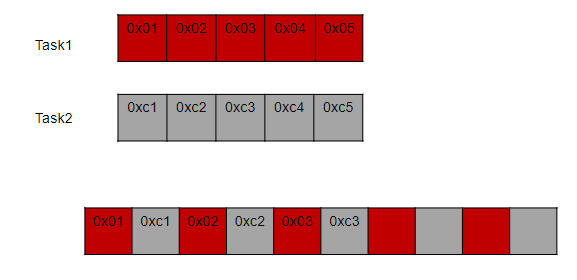
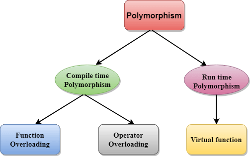

# BÀI 1: COMPILER-MACRO
<details><summary>Chi tiết</summary>
<p>
  
## 1. Compiler
<details><summary>Chi tiết</summary>
<p>
  
Compiler (trình biên dịch) là chương trình có nhiệm vụ xử lý chương trình ngôn ngữ bậc cao (C/C++, Python,...) thành ngôn ngữ bậc thấp hơn để máy tính thực thi (thường là ngôn ngữ máy).

Quá trình biên dịch gồm các giai đoạn như sau:

<p align="center">
  
</p>

- Giai đoạn Preprocessor (Tiền xử lý): thực hiện nhận source code (bao gồm các file: .c,.h,.cpp,.hpp,...), xóa bỏ comment và xử lý các chỉ thị tiền xử lý và đầu ra là file .i.

  Lệnh thực hiện trên terminal:
  ```bash
  gcc -E main.c -o main.i
  ```
- Giai đoạn Compiler: chuyển từ ngôn ngữ bậc cao sang ngôn ngữ bậc thấp assembly, đầu vào là file .i đầu ra là file .s.

    Lệnh thực hiện trên terminal:
  ```bash
  gcc main.i -S -o main.s
  ```
- Giai đoạn Assembler: dịch chương trình sang mã máy 0 và 1, đầu vào là file .s đầu ra là file .o hay còn gọi là file Object.
  
  Lệnh thực hiện trên terminal:
  ```bash
  gcc - c main.s -o main.o
  ```
- Giai đoạn Linker: liên kết các file Object .0 lại thành một chương trình duy nhất.

   Lệnh thực hiện và chạy file trên terminal:
  ```bash
  gcc test1.o test2.o main.o -o main
  ./main
  ```
</p>
</details>

## 2. Macro
### Các chỉ thị tiền xử lý
<details><summary>Chi tiết</summary>
<p>
	
Chỉ thị tiền xử lý là những chỉ thị cung cấp cho bộ tiền xử lý để xử lý những thông tin trước khi bắt đầu quá trình biên dịch. Các chỉ thị tiền xử lý bắt đầu với `#`:
- `#include`: mang toàn bộ mã nguồn của file được include vào file .i mà không cần viết lại, giúp chương trình dễ quản lý do phân chia thành các module.
	
```bash
#include <stdio.h>
#incldue "test1.h"
```
- `#define`: thay thế một đoạn chương trình bị lặp lại, không có kiểu dữ liệu. Việc sử dụng từ khóa `#define` để định nghĩa được gọi là Macro.
```bash
#define PI 3.14
```
- `#undef`: để hủy định nghĩa một `#define` đã được định nghĩa trước đó.
```bash
#include <stdio.h>
#define MAX_SIZE 100

int main() {
	printf("MAX_SIZE is defined as: %d\n", MAX_SIZE);
	
	// Bỏ định nghĩa của MAX_SIZE
	#undef MAX_SIZE
	
	// Định nghĩa lại MAX_SIZE với giá trị khác
	#define MAX_SIZE 50
	
	printf("MAX_SIZE is now redefined as: %d\n", MAX_SIZE);

return 0;
}
```
- `#if`, `#elif`, `#else`: để kiểm tra điều kiện của Macro.
```bash
#include <stdio.h>
// Định nghĩa một macro
#define VERSION 3

int main() {
	// Sử dụng #if, #elif, #else
	#if VERSION == 1                               // Điều kiện #if sai, nếu không còn kiểm tra điều kiện nào
                                                       // nữa đi tới #endif luôn
	  printf("This is version 1.\n");
	#elif VERSION == 2                             // Tiếp tục kiểm tra với #elif
	  printf("This is version 2.\n");            
	#else                                          // Không có điều kiện nào ở trên đúng
	  printf("This is another version.\n");
 	#endif

return 0;
}
```
- `#ifdef`, `#ifndef`: kiểm tra xem macro này đã hoặc chưa được định nghĩa ("đã" ứng với `#ifdef` và "chưa" ứng với `#ifndef`) hay chưa nếu đúng như vậy thì mã phía sau sẽ được biên dịch.
```bash
#include <stdio.h>
// Định nghĩa một macro
#define FEATURE_ENABLED

int main() {
	// Kiểm tra xem FEATURE_ENABLED đã được định nghĩa đúng không?
	#ifdef FEATURE_ENABLED
	  printf("Feature is enabled.\n");
	#endif
	
	// Kiểm tra xem ANOTHER_FEATURE chưa được định nghĩa đúng không?
	#ifndef ANOTHER_FEATURE
	  printf("Another feature is not enabled.\n");
	#endif

return 0;
}
```
</p>
</details>

### Macro function
<details><summary>Chi tiết</summary>
<p>
	
Macro function là khi đoạn chương trình `#define` là một hàm có tham số truyền vào. Nếu macro function có nhiều dòng thì cuối các dòng kết thúc bằng kí tự `\` và dòng cuối cùng không cần.
  
```bash
#include <stdio.h>

#define DISPLAY_SUM(a,b)                        \
printf("This is macro to sum 2 number\n");      \
printf("Result is: %d", a+b);

int main() {
	DISPLAY_SUM(5,6);
return 0;
}
```
- Ưu điểm của macro function so với một function là không tối ưu về bộ nhớ trên RAM nhưng tối ưu về tốc độ. Cụ thể hơn khi viết một function, thì function đó sẽ được lưu vào một vùng nhớ. Khi function được gọi ra trong `main()`, programe counter sẽ lưu địa chỉ hiện tại vào stack pointer và trỏ đến từng địa chỉ của vùng nhớ chứa function. Còn macro function thì thay thế trực tiếp vô luôn, tuy chiếm một bộ nhớ trên RAM và không cần các các bước như trên nhưng tốc độ lại nhanh hơn.

</p>
</details>

### Toán tử trong macro
<details><summary>Chi tiết</summary>
<p>
	
Toán tử `#`: tự chuẩn hóa kiểu chuỗi cho tham số nhập vào.

Toán tử `##`: nối các chuỗi lại với nhau.
```bash
  #include <stdio.h>
  
  // Sử dụng toán tử tự chuẩn hóa 
  #define CREATE_FUNC(func, cmd)  \
  void func() {                   \
      printf(#cmd);               \
      printf("\n");               \
  }
  
  // Sử dụng toán tử nối chuỗi
  #define CREATE_VAR(name)        \
  int int_##name;                 
  
  CREATE_FUNC (test1, this is function test1); 
  CREATE_VAR(test);
  
  int main() {
      return 0;
  }
```
Kết quả trong file .i:
```bash
void test1() { printf("this is function test1"); printf("\n"); };
int int_test;
```
</p>
</details>

### Variadic macro
<details><summary>Chi tiết</summary>
<p>
Là loại macro có thể chấp nhận một số lượng tham số không xác định, cho phép bạn truyền vào bất kỳ số lượng đối số nào khi sử dụng macro.
  
```bash
#include <stdio.h>

// Định nghĩa một variadic macro
#define PRINT_ARGS(format, ...) printf(format, __VA_ARGS__)

int main() {
    // Sử dụng variadic macro để in ra các giá trị
    PRINT_ARGS("This is a variadic macro example: %d, %f\n", 42, 3.14);

    return 0;
}
```

</p>
</details>

</p>
</details>

# BÀI 2: STDARG-ASSERT
<details><summary>Chi tiết</summary>
<p>
  
## 1. Thư viện STDARG
<details><summary>Chi tiết</summary>
<p>
	
Thư viện stdarg.h hỗ trợ viết function với số lượng tham số không xác định. Thư viện này cung cấp một số từ khóa như sau:
- `va_list va`: `va_list` là một kiểu dữ liệu của tập hợp các đối số không xác định được đặt tên là `va`. (Bản chất nó giống như con trỏ kiểu `char` được định nghĩa lại tên bằng `typedef`: `typedef char* va_list;)`.

- `va_start(va, count)`: hàm này mang các kí tự vào chuỗi `va`. Cách hoạt động của nó là sẽ tạo một con trỏ có giá trị bằng địa chỉ kí tự đầu tiên của chuỗi không xác định và thực hiện vòng lặp so sánh các kí tự trong chuỗi có giống với từng kí tự của label count không và con trỏ địa chỉ tăng dần dần ứng với địa chỉ của các kí tự tiếp theo của chuỗi. Sau khi xác định được kí tự giống với label count thì mới bắt đầu mang các kí tự sau dấu `,` vào chuỗi `va`.
  
- `va_arg(va, type)`: lấy giá trị của tham số tiếp theo từ chuỗi va và ép kiểu nó sang kiểu dữ liệu được chỉ định. Khi gọi hàm `va_arg(va, type)` thì nó đọc giá trị tại ô phía sau `va_start` và trỏ tới ô tiếp theo.

- `va_end(va_list ap)`: kết thúc việc sử dụng danh sách đối số biến đổi, giải phóng bộ nhớ.

**Ví dụ nhập vào 5 tham số:**
```bash
  #include <stdio.h>
  #include <stdarg.h>
  
  void display(int count, ...) {
      va_list av;
      va_start(av, count);
     
      for (int i = 0; i < count; i++) {
          printf("Value at %d: %d\n", i, va_arg(av,int)); 
      }
  
      va_end(va);
  }
  
  int main()
  {
      // Số lượng tham số là 5
      display(5, 6, 8, 15, 10, 13);
  
      return 0;
  }
  ```
**Output:**
```bash
> Value at 0: 6
> Value at 1: 8
> Value at 2: 15
> Value at 3: 10
> Value at 4: 13
```
</p>
</details>

## 2. Thư viện ASSERT
<details><summary>Chi tiết</summary>
<p>
	
Thư viện assert.h là thư viện để hỗ trợ debug chương trình.

- Hàm assert(): dùng để kiểm tra điều kiện, nếu điều kiện đúng thì chương trình tiếp tục thực thi còn sai thì dừng chương trình và báo lỗi. 

**Ví dụ báo lỗi chia cho 0:**
```bash
  #include <stdio.h>
  #include <assert.h>
  
  double thuong(int a, int b){
      assert( b != 0 && "Mẫu bằng 0");
      return (double) a/b;
  }
  
  int main(int argc, char const*argv[])
  {
      printf("Thuong: %f\n", thuong(6, 0)); 
      return 0;
  }
  ```
**Báo lỗi như sau:**
```bash
> Assertion failed: b != 0 && "Mẫu bằng 0", file tempCodeRunnerFile.c, line 5
```
Thường thấy hơn sẽ sử dụng macro để định nghĩa một lỗi.
  ```bash
  #include <stdio.h>
  #include <assert.h>
  #define LOG(condition, cmd) assert(condition && #cmd)
  
  double thuong(int a, int b){
      LOG(b != 0, "Mau bang bang 0");
  }
  
  int main(int argc, char const *argv[])
  {
      thuong(6,0);
      return 0;
  }
  ```
  
</p>
</details>

</p>
</details>

# BÀI 3: POINTER
<details><summary>Chi tiết</summary>
<p>
  
## 1. Định nghĩa con trỏ
<details><summary>Chi tiết</summary>
<p>
  
Con trỏ (pointer) là một biến chứa địa chỉ của một đối tượng khác (đối tượng ở đây có thể là: biến, hàm, mảng,...).

**Cú pháp:**
   ```bash
  int   *ptr;        // con trỏ kiểu int
  char  *ptr_char;   // con trỏ kiểu char
  float *ptr_float;  // con trỏ kiểu float
  ```
**Ví dụ:**
   ```bash
  #include <stdio.h>
  
  int a = 10;
  int *ptr = &a;                 // toán tử lấy địa chỉ &
  int *ptr1 = (int*)0x01101010;  // phải ép kiểu khi gán trực tiếp cho địa chỉ
  
  int main(int argc, char const*argv[]){
      printf("Dia chi a: %p\n", &a);
      printf("Gia tri ptr: %p\n", ptr); 
      printf("Gia tri ptr1: %p\n", ptr1); 
      return 0;
  }
  ```
**Kết quả:**
  ```bash
  > Dia chi a: 	  00007FF7960F3000  
  > Gia tri ptr:  00007FF7960F3000
  > Gia tri ptr1: 0000000001101010
  ```
**Kích thước của con trỏ phụ thuộc vào kiến trúc vi xử lý.**

Hệ thống 32 – bit, kích thước của con trỏ là 4 byte.

Hệ thống 64 – bit, kích thước của con trỏ là 8 byte.

  ```bash
  #include <stdio.h>
  #include <stdbool.h>
  
  int main(int argc, char const *argv[]){
      printf("%d bytes\n", sizeof(int *));              // 8bytes
      printf("%d bytes\n", sizeof(char *));             // 8bytes
      printf("%d bytes\n", sizeof(float *));            // 8bytes
      printf("%d bytes\n", sizeof(double *));           // 8bytes
      printf("%d bytes\n", sizeof(long *));             // 8bytes
      printf("%d bytes\n", sizeof(short *));            // 8bytes
      printf("%d bytes\n", sizeof(long long *));        // 8bytes
      printf("%d bytes\n", sizeof(bool *));             // 8bytes
      return 0;
  }
  ```
</p>
</details>

## 2. Các kiểu con trỏ
### Function pointer (Con trỏ hàm)
<details><summary>Chi tiết</summary>
<p>
  
Con trỏ hàm là một biến giữ địa chỉ của hàm.

**Cú pháp:**
  ```bash
  void (*ptr)(int, double);  
  ```
  - Con trỏ ptr trỏ đến hàm kiểu trả về là `void` (ngoài ra còn có thể là `int`,...), tham số truyền vào là kiểu `int` và `double`.
  - Các hàm nào có cùng cú pháp trong cùng một chương trình, con trỏ đều trỏ đến được.
    
**Ví dụ:**
  ```bash
  #include <stdio.h>
  #include <assert.h>
  
  void chao() {
      printf("Hello!\n");
  }
  
  void chia(int a, int b) {
      assert(b != 0);
      printf("Thuong %d va %d: %f\n", a, b, (double)a / (double)b);
  }
  
  int main(int argc, char const *argv[]){
      // Khai báo con trỏ hàm
      void (*ptr0)();
      void (*ptr1)(int, int);
  
      // Gán địa chỉ của hàm cho con trỏ hàm
      ptr0 = chao;
      ptr1 = &chia;
  
      // Gọi hàm ra
      ptr0();
      ptr1(8, 2);

      // Gọi hàm ra
      (*ptr0)();
      (*ptr1)(8, 2);
  
      return 0;
  }
  ```
**Kết quả:**
  ```bash
  > Hello!
  > Thuong 8 va 2: 4.000000
  > Hello!
  > Thuong 8 va 2: 4.000000
  ```
**Ví dụ sử dụng mảng lưu địa chỉ nhiều con trỏ hàm:**
  ```bash
  #include <stdio.h>
  #include <assert.h>
  
  void tong(int a, int b) {
      printf("Tong %d va %d: %d\n", a, b, a + b);
  }
  
  void hieu(int a, int b) {
      printf("Hieu %d va %d: %d\n", a, b, a - b);
  }
  
  void tich(int a, int b) {
      printf("Tich %d va %d: %d\n", a, b, a * b);
  }
  
  void thuong(int a, int b) {
      assert(b != 0);
      printf("Thuong %d va %d: %d\n", a, b, a / b);
  }
  
  int main(int argc, char const *argv[]){
      // Khai báo con trỏ hàm
      void (*array[])(int, int)={&tong,&hieu,&tich,&thuong};
      //void (*array[4])(int, int)={&tong,&hieu,&tich,&thuong};
  
      // Tính
      array[0](1,1);
      array[1](1,1);
      return 0;
  }
  ```
**Kết quả:**
  ```bash
  > Tong 1 va 1: 2
  > Hieu 1 va 1: 0
  ```
**ỨNG DỤNG CON TRỎ HÀM: Tham số truyền vào hàm là một hàm khác.**
  ```bash
  #include <stdio.h>
  #include <assert.h>
  
  void tong(int a, int b) {
      printf("Tong %d va %d: %d\n", a, b, a + b);
  }
  
  void tinhToan(void (*ptr)(int, int), int a, int b) {
      printf("Thuc hien phep toan duoi:\n");
      ptr(a, b);
  }
  
  int main(int argc, char const *argv[]){
      // Gọi hàm
      tinhToan(&tong, 5, 3);
      return 0;
  }
  ```
</p>
</details>

### Void pointer (Con trỏ void)
<details><summary>Chi tiết</summary>
<p>

Void pointer là một con trỏ có thể trỏ đến bất kỳ kiểu dữ liệu nào. 

**Cú pháp:**
  ```bash
  void *ptr; 
  ```

Khi in ra giá trị được void point trỏ đến, do nó không biết kiểu dữ liệu của giá trị được trỏ đến nên phải ép kiểu con trỏ void thành con trỏ kiểu đó trước rồi mới giải tham chiếu (Vd: `*(int*)ptr`).
  
**Ví dụ:**
  ```bash
  #include <stdio.h>
  
  void tong(int a, int b) {
      printf("Tong cua %d va %d la: %d\n", a, b, a + b);
  }
  
  int main(int argc, char const *argv[]) {
      int a = 10;
      double b = 20.5;
      char c = 'X';
  
      void *ptr;
  
      // Trỏ đến biến kiểu int
      ptr = &a;
      printf("Gia tri cua a = %d\n", *(int*)ptr);       // Ép kiểu và giải tham chiếu
  
      // Trỏ đến biến kiểu double
      ptr = &b;
      printf("Gia tri cua b = %.2f\n", *(double*)ptr);  // Ép kiểu và giải tham chiếu
  
      // Trỏ đến biến kiểu char
      ptr = &c;
      printf("Gia tri cua c = %c\n", *(char*)ptr);      // Ép kiểu và giải tham chiếu

      // Trỏ đến hàm
      ptr = &tong;
      ((void (*)(int, int))ptr)(9, 3);                  // Ép kiểu về con trỏ hàm
  
      return 0;
  }
  ```
**Kết quả:**
  ```bash
  > Gia tri cua a = 10
  > Gia tri cua b = 20.50
  > Gia tri cua c = X
  > Tong cua 9 va 3 la: 12
  ```
</p>
</details>

### NULL pointer (Con trỏ NULL)
<details><summary>Chi tiết</summary>
<p>

Con trỏ NULL  là một con trỏ không trỏ đến đối tượng nào hết. Nó có địa chỉ và giá trị bằng 0.

Khi khai báo con trỏ mà chưa sử dụng ngay hoặc sử dụng xong thì phải gán NULL.

**Cú pháp:**
  ```bash
  int *ptr_null = NULL;
  //  ptr_null = 0x00: địa chỉ khởi tạo
  // *ptr_null = 0   : giá trị tại địa chỉ khởi tạo
  ```

</p>
</details>

### Pointer to constant (Con trỏ hằng)
<details><summary>Chi tiết</summary>
<p>

Con trỏ hằng là con trỏ **chỉ có thể đọc giá trị tại địa chỉ mà nó trỏ đến**, nghĩa là không được phép dùng toán tử giải tham chiếu `*` truy cập đến địa chỉ để thay đổi giá trị.

**Cú pháp:**
  ```bash
  <data_type> const *ptr_const; 
  const <data_type> *ptr_const;
  ```
**Ví dụ**
  ```bash
  #include <stdio.h>
  
  int value = 10;
  const int *ptr_const = &value;
  
  int main(int argc, char const *argv[]){
      printf("%p\n", ptr_const);
      printf("%d\n", *ptr_const);

      // Lỗi: Không được phép thay đổi giá trị của con trỏ hằng!
      *ptr_const = 20;
      printf("%d\n", *ptr_const);
      return 0;
  }
  ```
Kết quả sau khi chạy sẽ gặp lỗi: ```assignment of read-only location '*ptr_const'```

</p>
</details>

### Constant pointer (Hằng con trỏ)
<details><summary>Chi tiết</summary>
<p>
  
Hằng con trỏ là một con trỏ mà **trỏ đến 1 địa chỉ cố định**, nghĩa là khi con trỏ này được khởi tạo thì nó sẽ không thể trỏ tới địa chỉ khác.

Hằng con trỏ cho phép dùng toán tử giải tham chiếu `*` để thay đổi giá trị.

**Cú pháp:**
  ```bash
  <data_type> *const const_ptr = &value;
  ```
**Ví dụ**
  ```cpp
  #include <stdio.h>
  
  int value1 = 10;
  int value2 = 20;
  int *const const_ptr = &value1;
  
  int main(int argc, char const *argv[]){
      printf("%p\n", const_ptr);
      printf("%d\n", *const_ptr);
  
      const_ptr = &value2;
      printf("%p\n", const_ptr);
      return 0;
  }
  ```
Kết quả sau khi chạy sẽ gặp lỗi: ```assignment of read-only variable 'const_ptr'```

</p>
</details>

### Pointer to pointer (Con trỏ trỏ đến con trỏ)
<details><summary>Chi tiết</summary>
<p>

Con trỏ đến con trỏ là một kiểu dữ liệu trong ngôn ngữ lập trình cho phép lưu trữ địa chỉ của một con trỏ.

Con trỏ đến con trỏ cung cấp một cấp bậc trỏ mới, cho phép thay đổi giá trị của con trỏ gốc.

Cấp bậc này có thể hữu ích trong nhiều tình huống, đặc biệt là khi làm việc với các hàm cần thay đổi giá trị của con trỏ.

**Cú pháp:**
  ```bash
  int **ptp = &p;
  ```
**Ví dụ:**
  ```bash
  #include <stdio.h>
  
  int main() {
      int value = 42;
      int *ptr1 = &value;  // Con trỏ thường trỏ đến một biến
  
      int **ptr2 = &ptr1;  // Con trỏ đến con trỏ
  
      /*
          **ptr2 = &ptr1
          ptr2 = &ptr1;
          *ptr2 = ptr1 = &value;
          **ptr2 = *ptr1 = value
      */
  
      printf("address of value: %p\n", &value);
      printf("value of ptr1: %p\n", ptr1);
  
      printf("address of ptr1: %p\n", &ptr1);
      printf("value of ptr2: %p\n", ptr2);
  
      printf("dereference ptr2 first time: %p\n", *ptr2);
      printf("dereference ptr2 second time: %d\n", **ptr2);
  
      return 0;
  }
  ```
**Kết quả:**
  ```bash
  address of value: 		000000E6425FF904
  value of ptr1: 		000000E6425FF904
  address of ptr1:		000000E6425FF8F8
  value of ptr2: 		000000E6425FF8F8
  dereference ptr2 first time: 	000000E6425FF904
  dereference ptr2 second time: 42
  ```

</p>
</details>

</p>
</details>

# BÀI 4: EXTERN-STATIC-VOLATILE-REGISTER
<details><summary>Chi tiết</summary>
<p>

## 1. Extern
<details><summary>Chi tiết</summary>
<p>
  
Từ khóa `extern` được sử dụng để khai báo rằng một **biến hoặc một hàm** được định nghĩa ở một nơi khác (thường là trong một tệp khác). 

Từ khóa `extern` không tạo ra một biến mới mà chỉ thông báo cho trình biên dịch rằng **biến hoặc một hàm** này đã được định nghĩa ở nơi khác và có thể được sử dụng trong tệp hiện tại.

**Ví dụ file main.c:**
  ```bash
  #include <stdio.h>
  
  int value = 90;
  extern void display();
  
  int main(){
  	printf("hello\n");
  	display();
  }
  ```
**Ở file other.c:**
  ```bash
  #include <stdio.h>
  
  extern int value;
  void display()
  {
  	printf("value: %d\n", value);
  }
  ```
</p>
</details>

## 2. Static
### Static local variables
<details><summary>Chi tiết</summary>
<p>
	
Biến cục bộ tĩnh (Static local variables) là các biến được khai báo với từ khóa `static` ở **trong phạm vi của một hàm**. Nó có những tính chất đặc biệt như sau:

  - **Tồn tại trong suốt vòng đời của chương trình**: Biến cục bộ tĩnh được khai báo bên trong một hàm và chỉ có thể truy cập được từ trong hàm đó, sau khi hàm kết thúc nó không bị phóng bộ nhớ. Thay vào đó, nó vẫn tồn tại trong suốt thời gian chạy của chương trình và giữ lại giá trị của nó giữa các lần gọi hàm.
    
  - **Chỉ khởi tạo một lần**: Biến cục bộ tĩnh chỉ được khởi tạo một lần duy nhất, vào lần đầu tiên hàm được gọi. Sau đó, biến này sẽ giữ nguyên giá trị của nó từ lần cuối cùng hàm được gọi và không được khởi tạo lại trong các lần gọi tiếp theo.

**Ví dụ biến cục bộ tĩnh:**
  ```bash
  #include <stdio.h>
  
  void exampleFunction() {
      static int count = 0;  // Biến static giữ giá trị qua các lần gọi hàm
      count++;
      printf("Count: %d\n", count);
  }
  
  int main() {
      exampleFunction();  // In ra lần 1
      exampleFunction();  // In ra lần 2
      exampleFunction();  // In ra lần 3
      return 0;
  }
  ```
**Kết quả:**
  ```bash
  > Count: 1
  > Count: 2
  > Count: 3
  ```

</p>
</details>

### Static global variables
<details><summary>Chi tiết</summary>
<p>
	
Biến toàn cục tĩnh (Static global variables) là các biến được khai báo với từ khóa `static` ở **ngoài tất cả các hàm** (tức là trong phạm vi toàn cục của file). Nó có những tính chất đặc biệt như sau:
  - **Phạm vi truy cập chỉ giới hạn trong file**: Biến toàn cục tĩnh chỉ có thể truy cập được trong file nơi nó được khai báo. Có nghĩa là các biến này không thể được sử dụng bởi các file khác, ngay cả khi chúng được khai báo là `extern`. Khác với biến toàn cục không có từ khóa `static`, có thể được truy cập từ các file khác nếu được khai báo `extern`.
  - **Thời gian tồn tại**: Biến toàn cục tĩnh có thời gian tồn tại từ khi chương trình bắt đầu cho đến khi chương trình kết thúc, tương tự như các biến toàn cục thông thường. Giá trị của chúng được duy trì trong suốt thời gian chạy của chương trình. Chỉ khởi tạo một lần duy nhất trước khi chương trình bắt đầu thực thi.

**Ví dụ file main.c:**
  ```bash
  #include <stdio.h>
  
  extern void display();
  //extern int s_g_value;      // Không được phép, vì s_g_value là biến toàn cục tĩnh của file other.c!!
  extern int g_value;
  
  int main()
  {
  	printf("hello\n");
  	g_value = 40;
  	
  	display();
  
  	return 0;
  }
  ```
**Ở file other.c:**
```bash
#include <stdio.h>

int g_value = 30;
static int s_g_value = 20;

void display()
{
	printf("static global value: %d\n", s_g_value);
	printf("global value: %d\n", g_value);
}
```

</p>
</details>

## 3. Volatile 
<details><summary>Chi tiết</summary>
<p>
  
Từ khóa `volatile` được sử dụng để thông báo cho trình biên dịch rằng giá trị của một biến có thể thay đổi bất kỳ lúc nào, trình biên dịch không được tối ưu hóa hoặc xóa bỏ các thao tác trên biến đó.

Sau đây là một trường hợp đơn giản trong nhúng mà việc khai báo biến `volatile` rất cần thiết để tránh những lỗi sai khó phát hiện do tính năng optimization của compiler:

**Thanh ghi ngoại vi có ánh xạ đến ô nhớ**

Các thiết bị ngoại vi (GPIO, UART, ...) chứa các thanh ghi mà giá trị của nó có thể thay đổi ngoài ý muốn của dòng chương trình, đặc biệt là những thanh ghi trạng thái.

Ví dụ: đợi một nút bấm, với địa chỉ thanh ghi GPIO tương ứng nút bấm được định nghĩa như sau:

```bash
/* Input data register address */
volatile uint32_t* button = (volatile uint32_t*)0x40020810;
...
while ((*button & (1 << 13)) == 0);
```

Ở đây nếu không có `volatile`, con trỏ button sẽ đọc giá trị tại địa chỉ `0x40020810` (và giá trị này mắc định đang là 0).

Khi đó compiler sẽ tối ưu - optimize điều kiện trong câu lệnh sau trở thành `while ((0 & (1 << 13)) == 0);`

Tức là `while (1);`

Vòng lặp này đương nhiên không bao giờ dừng lại => Bug!

</p>
</details>

## 4. Register
<details><summary>Chi tiết</summary>
<p>
  
 Từ khóa `register` được sử dụng để yêu cầu trình biên dịch lưu trữ một biến trong các thanh ghi của bộ xử lý thay vì trong bộ nhớ RAM. 
  
<p align="center">
  
</p>

Cơ chế tính toán của máy tính:

  - ALU (Arithmetic Logic Unit) nhận dữ liệu từ các thanh ghi (register) hoặc từ bộ nhớ (RAM).
  - ALU thực hiện phép toán.
  - Kết quả của phép toán được gửi và lưu lại về thanh ghi hoặc RAM.
    
Từ khóa `register` làm tăng tốc độ truy cập biến, vì truy cập vào các thanh ghi nhanh hơn nhiều so với truy cập vào bộ nhớ RAM.

**Kiểm tra tốc độ chương trình khi lưu biến trong thanh ghi và trong RAM:**
  ```bash
  #include <stdio.h>
  #include <time.h>
  
  int main(int argc, char const *argv[])
  {
      unsigned long i;                // Lưu trong RAM
      //register unsigned long i;     // Lưu trong thanh ghi
  
      clock_t start, end;
  
      start = clock();
  
      for ( i = 0; i < 99999999; i++);
  
      end = clock();
  
      printf("Time: %f\n", (double)(end - start)/1000);
      
      return 0;
  }
  ```
**Kết quả:**
  ```bash
  > Time: 0.144000    // Lưu trong RAM
  > Time: 0.054000    // Lưu trong thanh ghi
  ```
</p>
</details>

</p>
</details>

# BÀI 5: GOTO-SETJMP.H
<details><summary>Chi tiết</summary>
<p>
  
## 1. Goto
<details><summary>Chi tiết</summary>
<p>
	
Từ khóa `goto` được sử dụng để nhảy đến vị trí bất kì tùy vào label có phạm vi **trong cùng một hàm**.

**Ví dụ:**
```bash
#include <stdio.h>

int main() {
    int num = 0;

    while (num < 10) {
        if (num == 5)
            goto end; 				// Nhảy đến nhãn 'end' khi num bằng 5
        printf("Number: %d\n", num);
        num++;
    }
end:					       // Nhãn 'end'
    printf("This is the end.\n");

    return 0;
}
```
Từ khóa `goto` có thể được thay thế nhiều `break` hoặc các phương pháp khác khi cần thoát ra khỏi một số lượng lớn các vòng lặp lồng nhau. Điều này làm đoạn code trở nên đơn giản hơn. 
```bash
#include <stdio.h>

int main() {
    int i = 0, j;

    while (i < 10) {
        for (j = 0; j < 10; j++) {
            if (i == 5 && j == 5) {
                goto end_loops;  				// Nhảy đến nhãn 'end_loops' để thoát khỏi cả hai vòng lặp
            }
            printf("i = %d, j = %d\n", i, j);
        }
        i++;
    }
end_loops:						       // Nhãn 'end_loops'
    printf("Exited loops at i = %d, j = %d\n", i, j);

    return 0;
}
```

</p>
</details>

## 2. Setjmp.h
<details><summary>Chi tiết</summary>
<p>

Thư viện `setjmp.h` là cung cấp cơ chế nhảy đến một vị trí xác định trong chương trình. **Khác với `go to` phạm vi nhảy có thể nhảy đến vị trí ở một hàm khác**. 

Thư viện này cung cấp hai hàm chính là `setjmp` và `longjmp`, cú pháp sử dụng như sau:

 - Trước tiên, cần khai báo một biến:
```bash 
jmp_buf buffer;  // Tên biến là `buffer` kiểu dữ liệu là `jmp_buf` (kiểu này được định nghĩa sẵn bởi thư viện)
```
- Sử dụng `setjmp` để lưu trữ trạng thái của môi trường tại điểm mà nó được gọi, `setjmp` sẽ trả về 0 nếu nó được gọi lần đầu tiên.
```bash 
int val = setjmp(buffer);	// val = 0
```
- Sử dung `longjmp`, chương trình sẽ quay trở lại điểm mà `setjmp` đã được gọi, và `setjmp` sẽ trả về giá trị là một số nguyên (không bao giờ là 0, vì giá trị 0 đặc biệt để nhận diện việc gọi setjmp lần đầu tiên).
```bash 
longjmp(buffer, 1); // Nhảy trở lại điểm trước đó với giá trị trả về val = 1
```
**Ví dụ:**
```bash
#include <stdio.h>
#include <setjmp.h>

jmp_buf buffer;						// Khai báo tên biến là `buffer`

void jump_function() {
    printf("In jump_function.\n");
    longjmp(buffer, 5); 				// Nhảy trở lại setjmp và trả về giá trị 5
}

int main() {
    int val = setjmp(buffer); 			       // Đây là nơi chương trình sẽ quay lại sau khi longjmp được gọi
    printf("I'm here! \n");
    if (val == 0) {
        // Thực thi lần đầu khi setjmp trả về 0
        printf("Val = %d\n", val);
        jump_function(); 			       // Gọi hàm sẽ thực hiện longjmp
    } else {
        // Thực thi sau khi longjmp được gọi và setjmp trả về 5
        printf("Val = %d\n", val);
    }

    return 0;
}
```
**Kết quả:**
```bash
> I'm here! 
> Val = 0
> In jump_function.
> I'm here! 
> Val = 5
```

Ứng dụng của hai hàm `setjmp`/`longjmp` thường được sử dụng để thực hiện xử lý ngoại lệ. Nhưng, đó chưa phải là cách thông dụng nhất trong việc xử lý ngoại lệ.

**Ví dụ xử lý ngoại lệ khi chia cho 0:**
```bash
#include <stdio.h>
#include <setjmp.h>

jmp_buf buf;
int exception_code;

#define TRY if ((exception_code = setjmp(buf)) == 0) 
#define CATCH(x) else if (exception_code == (x)) 
#define THROW(x) longjmp(buf, (x))

double divide(int a, int b) {
    if (b == 0) {
        THROW(1); 						// Mã lỗi 1 cho lỗi chia cho 0
    }
    return (double)a / b;
}

int main() {
    int a = 10;
    int b = 0;
    double result = 0.0;

    TRY {
        result = divide(a, b);
        printf("Result: %f\n", result);
    } CATCH(1) {
        printf("Error: Divide by 0!\n");
    }

    return 0;
}
```

</p>
</details>

</p>
</details>

# BÀI 6: BITMASK
<details><summary>Chi tiết</summary>
<p>
	
Bitmask là một kỹ thuật thực hiện các thao tác trên các bit của word. 

Thay vì sử dụng một biến riêng cho mỗi cờ (flag), bạn có thể sử dụng bitmask để lưu trữ nhiều giá trị nhị phân (on/off, true/false).

Ví dụ:
```bash
uint8_t bitmask = 0b10101010;
```
Giả sử ta có một dãy bitmask 8 bit (1 byte) để lưu trữ trạng thái của 8 thiết bị khác nhau. Mỗi thiết bị có thể ở trạng thái bật (1) hoặc tắt (0).
<p align="center">
  
</p>

## NOT bitwise
<details><summary>Chi tiết</summary>
<p>
	
NOT bitwise (phép đảo bit) là phép toán làm cho tất cả các bit của giá trị đó sẽ bị đảo ngược: bit 0 sẽ trở thành 1, và bit 1 sẽ trở thành 0.

Toán tử NOT: `~`

**Ví dụ:**
```bash
uint8_t value = 0b00001101;  
uint8_t not_value = ~value;  // Sử dụng phép NOT bitwise
```
**Kết quả:**
```bash
> 0b11110010
```
</p>
</details>

## AND bitwise
<details><summary>Chi tiết</summary>
<p>
	
Phép AND bitwise thực hiện so sánh từng cặp bit tương ứng giữa hai số:

 - Nếu cả hai bit đều là 1, kết quả là 1.
 - Nếu một trong hai bit hoặc cả hai bit là 0, kết quả là 0.

<p align="center">
  
</p>

Toán tử AND: `&`

**Ví dụ:**
```bash
uint8_t a = 0b11001010; // Số thứ nhất
uint8_t b = 0b10110110; // Số thứ hai
uint8_t result = a & b;  // Áp dụng AND bitwise
```
**Kết quả:**
```bash
  11001010
& 10110110
  --------
> 10000010
```
</p>
</details>

## OR bitwise
<details><summary>Chi tiết</summary>
<p>
	
Phép OR bitwise thực hiện so sánh từng cặp bit tương ứng giữa hai số:

 - Nếu ít nhất một trong hai bit là 1, kết quả là 1.
 - Nếu cả hai bit đều là 0, kết quả là 0.

<p align="center">
  	
</p>

Toán tử OR: `|`

**Ví dụ:**
```bash
uint8_t a = 0b11001010; // Số thứ nhất
uint8_t b = 0b10110110; // Số thứ hai
uint8_t result = a | b;  // Áp dụng OR bitwise
```
**Kết quả:**
```bash
  11001010
| 10110110
  --------
> 11111110
```
</p>
</details>

## XOR bitwise
<details><summary>Chi tiết</summary>
<p>
	
Phép XOR bitwise (Exclusive OR) thực hiện so sánh từng cặp bit tương ứng giữa hai số:

 - Nếu hai bit khác nhau (một là 0 và một là 1), kết quả là 1.
 - Nếu hai bit giống nhau (cả hai cùng là 0 hoặc cùng là 1), kết quả là 0.

<p align="center">
  	
</p>

Toán tử XOR: `^`

**Ví dụ:**
```bash
uint8_t a = 0b11001010; // Số thứ nhất
uint8_t b = 0b10110110; // Số thứ hai
uint8_t result = a ^ b;  // Áp dụng XOR bitwise
```
**Kết quả:**
```bash
  11001010
^ 10110110
  --------
> 01111100
```
</p>
</details>

## Shift left bitwise
<details><summary>Chi tiết</summary>
<p>
	
Phép Shift left bitwise dịch chuyển tất cả các bit trong một giá trị nhị phân sang trái một số vị trí cụ thể. Các bit bên phải được lấp đầy bằng các số 0.

Toán tử Shift left: `<<`

**Ví dụ:**
```bash
uint8_t value = 0b00001101;  // Giá trị ban đầu: 13 (00001101)
uint8_t shifted_value = value << 2;  // Dịch trái 2 bit
```
**Kết quả:**
```bash
  00001101 << 2
  -----------
> 00110100
```
</p>
</details>

## Shift right bitwise
<details><summary>Chi tiết</summary>
<p>
	
Phép Shift right dịch chuyển tất cả các bit trong một giá trị nhị phân sang phải một số vị trí cụ thể. Các bit bên trái được lấp đầy bằng các số 0.

Toán tử Shift right: `>>`

**Ví dụ:**
```bash
uint8_t value = 0b00101100;  // Giá trị ban đầu: 44 (00101100)
uint8_t shifted_value = value >> 2;  // Dịch phải 2 bit
```
**Kết quả:**
```bash
  00101100 >> 2
  -----------
> 00001011
```
</p>
</details>


</p>
</details>

# BÀI 7: STRUCT-UNION
<details><summary>Chi tiết</summary>
<p>

## 1. Struct
<details><summary>Chi tiết</summary>
<p>

### Khái niệm
`struct` là một cấu trúc dữ liệu cho phép lập trình viên tự định nghĩa một kiểu dữ liệu mới bằng cách nhóm các biến có các kiểu dữ liệu khác nhau lại với nhau.

**Cú pháp:**
```c
struct StructureName {
    data_type1 variable_name1;
    data_type2 variable_name2;
    // Other members of the structure
};

// Ví dụ
struct SinhVien {
    char ten[50];        // Tên sinh viên
    int tuoi;            // Tuổi sinh viên
    float diem_trung_binh; // Điểm trung bình
};
```

### Kích thước của struct

Kích thước của một `struct` trong C phụ thuộc vào các **thành phần bên trong** nó và cách chúng được **sắp xếp trong bộ nhớ**.

**Ví dụ 1:**
```c
typedef struct {
    uint16_t c;    // Kiểu uint16_t = 2 byte
    uint32_t a;    // Kiểu uint32_t = 4 bytes, kích thước lớn nhất.
    uint8_t  b;    // Kiểu uint8_t = 1 bytes
} examp1;
```

Kích thước của `examp1` sẽ được tính như sau:

- Lấy **kích thước kiểu dữ liệu lớn nhất** của thành phần bên trong làm chuẩn, `uint32_t` tương đương 4 bytes, giả sử ta có một bảng ô nhớ mỗi hàng kích thước 4 bytes như hình.
<p align="center">
  	
</p>

- Lần lượt sắp xếp các biến thành phần trong `frame` vào từng hàng, bắt đầu với biến c. Biến c chiếm 2 bytes còn thừa 2 bytes.
- Biến a có kích thước 4 bytes không vừa với 2 bytes thừa đó nên phải xuống hàng mới, và 2 bytes thừa sẽ bị đánh dấu là **padding**.
- Tiếp tục với biến c, biến c chiếm 1 byte và thừa 3 bytes. Do không còn biến nào nữa nên 3 bytes thừa sẽ bị **padding**.
  <p align="center">
  	
  </p>
  
 - Kích thước của cả `examp1` sẽ bằng số hàng (3 hàng) đã lấp vào nhân với kích thước hàng (4 bytes) là 12 bytes.
   
**Ví dụ 2:**
```c
typedef struct {
    uint8_t a[9];	//Kiểu uint8_t = 1 byte
    uint64_t b[3];	//Kiểu uint64_t = 8 byte, kích thước lớn nhất.
    uint16_t c[10];	//Kiểu uint16_t = 2 byte
    uint32_t d[2];	//Kiểu uint32_t = 4 byte
} exam2;
```
Tương tự thao tác như ví dụ 1 ta được kích thước là 72 bytes.
<p align="center">
  	
</p>
 
### Tối ưu bộ nhớ bằng cách sắp xếp thứ tự khai báo

Với ví dụ 1, thứ tự khai báo chưa được tối ưu. Bằng cách sắp xếp lại thứ tự khai báo ta có thể giảm kích thước của struct..

**Ví dụ 1 sau khi được tối ưu:**
```c
typedef struct {
    uint32_t a;    // Kiểu uint32_t = 4 bytes, kích thước lớn nhất.
    uint8_t  b;    // Kiểu uint8_t = 1 bytes
    uint16_t c;    // Kiểu uint16_t = 2 byte
} examp1;
```
Kích thước sau khi tối ưu đã được giảm đáng kể còn 8 bytes.

<p align="center">
  	
</p>
</p>
</details>

## 2. Union
<details><summary>Chi tiết</summary>
<p>

### Khái niệm
`union` trong ngôn ngữ lập trình C là một kiểu dữ liệu tự định nghĩa, tương tự như `struct`.

**Cú pháp:**
```c
union UnionName {
    data_type1 variable_name1;
    data_type2 variable_name2;
    // Other members of the union
};

// Ví dụ
 union examp3{
    uint8_t a[13];  // Kiểu uint8_t = 1 bytes	
    uint32_t b[3];  // Kiểu uint32_t = 4 bytes, kích thước lớn nhất.
    uint16_t c[6];  // Kiểu uint16_t = 2 byte
};
```
Nhưng đặc trưng là tất cả các thành phần bên trong `union` đều chia sẻ cùng một vùng nhớ. 

**Địa chỉ các biến thành phần:**
```c
Dia chi data:	00000097873FF9E4
Dia chi data.a: 00000097873FF9E4
Dia chi data.b: 00000097873FF9E4
Dia chi data.c: 00000097873FF9E4
```
Điều này có nghĩa là union chỉ có thể lưu trữ một giá trị cho một thành phần tại một thời điểm.
### Kích thước của union

Kích thước của union sẽ bằng kích thước của **thành phần có kích thước lớn nhất**.

Cách tính kích thước cũng gần giống với `struct`, lấy **kích thước kiểu dữ liệu lớn nhất** của thành phần bên trong làm chuẩn, `uint32_t` tương đương 4 bytes, giả sử ta có một bảng ô nhớ mỗi hàng kích thước 4 bytes.

Vì các thành phần của `union` chia sẻ cùng một vị trí bộ nhớ, nên ta lấp các thành phần vào bảng một cách độc lập:

- Kích thước của `uint8_t a[13]` là 16 bytes.
<p align="center">
  	
</p>

- Kích thước của `uint32_t b[3]` là 12 bytes.
<p align="center">
  	
</p>

- Kích thước của `uint16_t c[6]` là 12 bytes.
<p align="center">
  	
</p>

Nên 16 bytes là kích thước của `examp3`


</p>
</details>

## 3. Ứng dụng kết hợp struct và union
<details><summary>Chi tiết</summary>
<p>
	
Ứng dụng của `struct` và `union` sẽ thường thấy trong lập trình nhúng, điển hình nhất là trong việc truyền nhận dữ liệu.
	
Ví dụ khi truyền một khung dữ liệu, `union` cho phép tiết kiệm bộ nhớ bằng cách chia sẻ cùng một vùng nhớ cho các thành phần khác nhau của `struct`.

<p align="center">
  	
</p>

**Ví dụ:**
```c
#include <stdio.h>
#include <stdint.h>
#include <string.h>

typedef union {
    struct {
        uint8_t id[2];
        uint8_t data[4];
        uint8_t check_sum[2];
    } data;

    uint8_t frame[8];

} Data_Frame;

int main(int argc, char const *argv[]){
    Data_Frame transmitter_data, receiver_data;

    // Gửi data đi
    strcpy(transmitter_data.data.id, "10");
    strcpy(transmitter_data.data.data, "1234");
    strcpy(transmitter_data.data.check_sum, "70");
    // Nhận data về
    strcpy(receiver_data.frame, transmitter_data.frame);

    return 0;
}
```
</p>
</details>

</p>
</details>

# BÀI 8: MEMORY LAYOUT
<details><summary>Chi tiết</summary>
<p>
Chương trình main.exe (trên window), main.hex (nạp vào vi điều khiển) được lưu ở bộ nhớ SSD (ROM) hoặc FLASH. Khi nhấn run chương trình trên window (cấp nguồn cho vi điều khiển) thì những chương trình này sẽ được copy vào bộ nhớ RAM để thực thi.

Chương trình C/C++ được tổ chức lưu trong memory layout (phân vùng nhớ) thành các phần như sau:

## 1. Text segment
Phân vùng này chứa:
 - Mã máy (mã máy là tập hợp các lệnh thực thi).
 - Hằng số (const), con trỏ kiểu char

Quyền truy cập thường chỉ có quyền đọc và thực thi, nhưng không có quyền ghi.

Tất cả các biến lưu ở phần vùng Text đều không thể thay đổi giá trị mà chỉ được đọc.

**Ví dụ:**
```c
#include <stdio.h>

const int a = 10;			//Hằng số
char *arr1 = "Hello";			//Con trỏ kiểu char

int main() {
    //a=10;             		//Không được phép thay đổi->Bị lỗi
    //arr1[3] = 'E';

    printf("a: %d\n", a);
    printf("arr1: %s", arr1);

    return 0;
}
```
## 2. Data segment
Hay còn gọi là phân vùng Initialized Data Segment (Dữ liệu Đã Khởi Tạo), chứa:
 - Biến toàn cục và biến static (static global, static local) được khởi tạo với giá trị khác 0.
   
Quyền truy cập là đọc và ghi, tức là có thể đọc và thay đổi giá trị của biến.

Tất cả các biến sẽ được thu hồi sau khi chương trình kết thúc.

**Ví dụ:**
```c
#include <stdio.h>

int a = 10;			//Biến toàn cục khởi tạo khác 0
double d = 20.5;		//Biến toàn cục khởi tạo khác 0

static int var = 5;		//Biến static toàn cục khởi tạo khác 0

void test(){
    static int local = 10;	//Biến static cục bộ khởi tạo khác 0
}

int main(int argc, char const *argv[]){  
    a = 15;			//Có thể đọc và thay đổi giá trị của biến
    d = 25.7;
    var = 12;
    printf("a: %d\n", a);
    printf("d: %f\n", d);
    printf("var: %d\n", var);
    
    return 0;
}
```
## 3. Bss segment
Hay còn gọi là phân vùng Uninitialized Data Segment (Dữ liệu Chưa Khởi Tạo):
 - Biến toàn cục khởi tạo với giá trị bằng 0 hoặc không gán giá trị.
 - Biến static với giá trị khởi tạo bằng 0 hoặc không gán giá trị.
   
Quyền truy cập là đọc và ghi, tức là có thể đọc và thay đổi giá trị của biến.

Tất cả các biến sẽ được thu hồi sau khi chương trình kết thúc.

**Ví dụ:**
```c
#include <stdio.h>

typedef struct 			//Lưu ý: Đây là kiểu dữ liệu,
{				//nó không nằm bất kì trong phân vùng nào!	
    int x;
    int y;
} Point_Data;

int a = 0;			//Biến toàn cục khởi tạo bằng 0
int b;				//Biến toàn cục ko khởi tạo

static int global = 0;		//Biến static toàn cục khởi tạo bằng 0
static int global_2;		//Biến static toàn cục ko khởi tạo

static Point_Data p1 = {5,7};	//Lưu ý: biến p1 này đã khởi tạo có giá trị nên nằm ở DS

void test(){
    static int local = 0;	//Biến static cục bộ khởi tạo bằng 0
    static int local_2;		//Biến static cục bộ ko khởi tạo
}

int main() {
    global = 0;			//Lưu ý: dù thay đổi giá trị nó vẫn nằm ở BSS

    printf("a: %d\n", a);
    printf("global: %d\n", global);

    return 0;
}
```
## 4. Stack
Phân vùng này chứa:
 - Các biến cục bộ, tham số truyền vào.
   
Quyền truy cập là đọc và ghi, nghĩa là có thể đọc và thay đổi giá trị của biến trong suốt thời gian chương trình chạy.

Sau khi ra khỏi hàm, sẽ thu hồi vùng nhớ.

LIFO(Last In Fist Out).


**Ví dụ:**
```c
#include <stdio.h>

void test(){
    int test = 0;
    test = 5;
    printf("test: %d\n",test);
}

int sum(int a, int b){
    int c = a + b;
    printf("sum: %d\n",c);
    return c;
}

int main() {
    sum(3,5);
    /*
        0x01
        0x02
        0x03
    */
   test();
   /*
    int test = 0; // 0x01
   */
  
    return 0;
}
```
## 5. Heap
Heap được sử dụng để **cấp phát bộ nhớ động** trong quá trình thực thi của chương trình.

Quyền truy cập: có quyền đọc và ghi, nghĩa là có thể đọc và thay đổi giá trị của biến trong suốt thời gian chương trình chạy.

Nếu liên tục cấp phát vùng nhớ mà không giải phóng thì sẽ bị lỗi tràn vùng nhớ Heap (Heap overflow).

Nếu khởi tạo một vùng nhớ quá lớn mà vùng nhớ Heap không thể lưu trữ một lần được sẽ bị lỗi khởi tạo vùng nhớ Heap thất bại.

**Ví dụ:**
```c
int *A = (int *)malloc(18446744073709551615);
```

Các hàm như `malloc()`, `calloc()`, `realloc()`, và `free()` được sử dụng để cấp phát và giải phóng bộ nhớ trên heap.

### Hàm `malloc()`
Cấp phát một vùng nhớ có kích thước được xác định bằng số byte và trả về một con trỏ đến vùng nhớ này. 

Vùng nhớ được cấp phát nhưng không được khởi tạo (nội dung là ngẫu nhiên).

Tại sao gọi là ngẫu nhiên vì nó có thể chứa các giá trị rác từ trước đó, lập trình viên cần tự khởi tạo giá trị cho vùng nhớ sau khi cấp phát.

**Đây là điểm khác biệt so với calloc!**

**Ví dụ:**
```c
#include <stdio.h>
#include <stdlib.h> // malloc, calloc, realloc, free
#include <stdint.h>

int main(int argc, char const *argv[]) {
    uint16_t *ptr = NULL;
    ptr = (uint16_t*)malloc(sizeof(uint16_t)*4); 	//0x01 0x02 0x03 0x04 0x05 0x06 0x07 0x08
    
    for (int i=0; i<4; i++) {
        ptr[i] = 2*i;
    }

    for (int i=0; i<8; i++) {
        printf("Địa chỉ: %p, giá trị: %d\n", (uint8_t*)ptr+i, *((uint8_t*)ptr+i));
    }

    free(ptr);

    return 0;
}
```
 - Sử dụng hàm `malloc` để cấp phát một vùng nhớ đủ để chứa 4 phần tử uint16_t (tổng cộng là 8 byte). Con trỏ ptr sẽ trỏ đến vùng nhớ được cấp phát.
 - Vòng lặp `for`: Gán giá trị cho các phần tử tiếp theo của mảng.
 - Vòng lặp `for` thứ hai duyệt qua từng byte của vùng nhớ đã cấp phát (tổng cộng là 8 byte vì mỗi uint16_t chiếm 2 byte và có 4 phần tử).

**Output từ Terminal:**
```c
> Địa chỉ: 000002353F1A8990, giá trị: 0
> Địa chỉ: 000002353F1A8991, giá trị: 0
> Địa chỉ: 000002353F1A8992, giá trị: 2
> Địa chỉ: 000002353F1A8993, giá trị: 0
> Địa chỉ: 000002353F1A8994, giá trị: 4
> Địa chỉ: 000002353F1A8995, giá trị: 0
> Địa chỉ: 000002353F1A8996, giá trị: 6
> Địa chỉ: 000002353F1A8997, giá trị: 0
```
Giải thích tại sao lại có kết quả như vậy, lấy phần tử `ptr[1]` đại diện:
 - `ptr[1] = 2` (dạng nhị phân: 0b 00000000 00000010).
 - Byte 3: 0b00000010 (2).
 - Byte 4: 0b00000000 (0).

### Hàm `calloc()`
Cấp phát bộ nhớ cho một mảng gồm nhiều phần tử, **khởi tạo tất cả các phần tử của mảng với giá trị 0**, và trả về một con trỏ đến vùng nhớ này.

**Ví dụ:**
```c
#include <stdio.h>
#include <stdlib.h>
#include <stdint.h>

int main() {
    // Cấp phát bộ nhớ cho 6 phần tử kiểu uint16_t bằng hàm calloc
    uint16_t *ptr = NULL;
    ptr = (uint16_t*)calloc(6, sizeof(uint16_t));

    // In địa chỉ và giá trị của từng phần tử trong mảng
    for (int i = 0; i < 6; i++) {
        printf("Địa chỉ: %p, giá trị: %d\n", (void*)(ptr + i), ptr[i]);
    }

    // Giải phóng bộ nhớ đã cấp phát
    free(ptr);

    return 0;
}
```
**Output từ Terminal:**
```c
> Địa chỉ: 00000241654EE9D0, giá trị: 0
> Địa chỉ: 00000241654EE9D2, giá trị: 0
> Địa chỉ: 00000241654EE9D4, giá trị: 0
> Địa chỉ: 00000241654EE9D6, giá trị: 0
> Địa chỉ: 00000241654EE9D8, giá trị: 0
> Địa chỉ: 00000241654EE9DA, giá trị: 0
```
### Hàm `realloc()`
Thay đổi kích thước của vùng nhớ đã được cấp phát trước đó bằng malloc hoặc calloc, và trả về một con trỏ đến vùng nhớ mới (nội dung của vùng nhớ có thể thay đổi).

```c
uint16_t *ptr = NULL;
ptr = (uint16_t*)malloc(sizeof(uint16_t)*4); 		//0x01 0x02 0x03 0x04 0x05 0x06 0x07 0x08

//Cấp phát thêm 4 byte nữa
ptr = (uint16_t*)realloc(ptr, sizeof(uint16_t)*6); 	//0x01 0x02 0x03 0x04 0x05 0x06 0x07 0x08 0x09 0x0A 0x0B 0x0C
```

### Hàm `free()`
Giải phóng bộ nhớ đã được cấp phát trước đó bằng `malloc`, `calloc`, hoặc `realloc`.
```c
free(ptr);
```

</p>
</details>

# BÀI 9: LINKED LIST
<details><summary>Chi tiết</summary>
<p>
	
## 1. Khái niệm
<details><summary>Chi tiết</summary>
<p>
	
Linked List là một cấu trúc dữ liệu bao gồm một chuỗi các node (nút), mỗi nút chứa hai thành phần chính:
- Dữ liệu (data): Đây là giá trị được lưu trữ trong nút.
- Con trỏ (pointer): Đây là tham chiếu (địa chỉ) đến nút tiếp theo trong danh sách.
 <p align="center">
  	
</p>

Trong C, ta thường dùng cấu trúc (struct) để định nghĩa một node. Cấu trúc này bao gồm:
- Một thành viên lưu dữ liệu.
- Một thành viên là con trỏ trỏ đến node tiếp theo cùng kiểu dữ liệu.
```c
typedef struct Node {
    int data;           // Giá trị (dữ liệu) của node
    struct Node* next;  // Con trỏ trỏ đến node tiếp theo
} Node_t;
```
</p>
</details>

## 2. Thao tác trên danh sách liên kết
<details><summary>Chi tiết</summary>
<p>
	
### Khởi tạo một node mới 
```c
// Hàm khởi tạo một node mới
Node* create_node(int value) {
    // Cấp phát bộ nhớ động cho node mới
    Node* new_node = (Node*)malloc(sizeof(Node));

    // Gán giá trị cho node và trỏ next đến NULL
    new_node->data = value;
    new_node->next = NULL;

    return new_node;
}
```

### Thêm một node vào vị trí cuối cùng
```c
// Hàm khởi tạo một node mới
Node* create_node(int value) {...}

// Hàm thêm một node vào cuối danh sách
void push_back(node** array, int value) {
    // Tạo một node mới
    node* new_node = create_node(value);

    // Nếu danh sách trống, node mới sẽ là node đầu tiên
    if (*array == NULL) {
        *array = new_node;
        return;
    }

    // Duyệt đến node cuối cùng
    node* temp = *array;
    while (temp->next != NULL) {
        temp = temp->next;
    }

    // Gán node mới vào cuối danh sách
    temp->next = new_node;
}
```
### Thêm một node vào vị trí đầu tiên
```c
// Hàm khởi tạo một node mới
Node* create_node(int value) {...}

// Hàm thêm một node vào đầu danh sách
void push_front(node** array, int value) {
    // Tạo một node mới
    node* new_node = create_node(value);

    // Node mới trỏ đến node hiện tại đang là đầu danh sách
    new_node->next = *array;

    // Gán node mới làm đầu danh sách
    *array = new_node;
}

```
### Thêm một node vào vị trí bất kì
```c
// Hàm tạo node mới
node* create_node(int value) {...}

// Hàm chèn một node mới vào vị trí `pos`
void insert(node** array, int value, int pos) {
    node* new_node = create_node(value);

    // Nếu chèn vào vị trí đầu tiên (hoặc danh sách rỗng)
    if (pos == 0 || *array == NULL) {
        new_node->next = *array;
        *array = new_node;
        return;
    }

    node* temp = *array;

    // Duyệt đến vị trí trước vị trí cần chèn
    for (int i = 0; temp != NULL && i < pos - 1; i++) {
        temp = temp->next;
    }

    // Nếu vị trí vượt quá kích thước danh sách
    if (temp == NULL) {
        printf("Vị trí vượt quá kích thước danh sách.\n");
        free(new_node); // Giải phóng node mới tạo vì không thể chèn
        return;
    }

    // Chèn node mới vào danh sách
    new_node->next = temp->next;
    temp->next = new_node;
}
```

### Xóa node ở vị trí cuối cùng
```c
// Hàm xóa node cuối cùng trong danh sách
void pop_back(node** array) {
    // Nếu danh sách rỗng, không làm gì cả
    if (*array == NULL) {
        printf("Danh sách rỗng.\n");
        return;
    }

    // Nếu danh sách chỉ có một phần tử
    if ((*array)->next == NULL) {
        free(*array);  // Giải phóng node cuối cùng
        *array = NULL; // Đặt lại danh sách thành rỗng
        return;
    }

    // Duyệt đến node gần cuối cùng
    node* temp = *array;
    while (temp->next->next != NULL) {
        temp = temp->next;
    }

    // Giải phóng node cuối cùng
    free(temp->next);
    temp->next = NULL; // Đặt node gần cuối thành node cuối
}
```

### Xóa node ở vị trí đầu tiên
```c
// Hàm xóa node đầu tiên trong danh sách
void pop_front(node** array) {
    // Kiểm tra nếu danh sách rỗng
    if (*array == NULL) {
        printf("Danh sách rỗng.\n");
        return;
    }

    // Lưu lại node đầu tiên
    node* temp = *array;

    // Di chuyển đầu danh sách sang node tiếp theo
    *array = (*array)->next;

    // Giải phóng node đầu tiên
    free(temp);
}
```

### Xóa một node tại vị trí bất kì
```c
// Hàm xóa node tại vị trí `pos` trong danh sách
void delete_list(node** array, int pos) {
    // Nếu danh sách rỗng hoặc vị trí không hợp lệ
    if (*array == NULL || pos < 0) {
        printf("Danh sách rỗng hoặc vị trí không hợp lệ.\n");
        return;
    }

    node* temp = *array;

    // Nếu vị trí cần xóa là node đầu tiên
    if (pos == 0) {
        *array = temp->next; // Di chuyển đầu danh sách
        free(temp);          // Giải phóng node đầu tiên
        return;
    }

    // Duyệt đến node trước vị trí cần xóa
    for (int i = 0; temp != NULL && i < pos - 1; i++) {
        temp = temp->next;
    }

    // Nếu vị trí vượt quá kích thước danh sách
    if (temp == NULL || temp->next == NULL) {
        printf("Vị trí vượt quá kích thước danh sách.\n");
        return;
    }

    // Node cần xóa là `temp->next`
    node* node_to_delete = temp->next;
    temp->next = node_to_delete->next; // Liên kết lại danh sách

    free(node_to_delete); // Giải phóng node tại vị trí `pos`
}
```

### Lấy giá trị của node cuối cùng
```c
// Hàm lấy giá trị của node cuối cùng trong danh sách
int back(node* array) {
    // Kiểm tra nếu danh sách rỗng
    if (array == NULL) {
        printf("Danh sách rỗng.\n");
        return -1; // Giá trị đặc biệt để biểu thị danh sách rỗng
    }

    // Duyệt đến node cuối cùng
    node* temp = array;
    while (temp->next != NULL) {
        temp = temp->next;
    }

    // Trả về giá trị của node cuối cùng
    return temp->data;
}
```

### Lấy giá trị của node đầu tiên
```c
// Hàm lấy giá trị của node đầu tiên trong danh sách
int front(node* array) {
    // Kiểm tra nếu danh sách rỗng
    if (array == NULL) {
        printf("Danh sách rỗng.\n");
        return -1; // Giá trị đặc biệt để biểu thị danh sách rỗng
    }

    // Trả về giá trị của node đầu tiên
    return array->data;
}
```

### Lấy giá trị tại vị trí bất kì
```c
// Hàm lấy giá trị của node tại vị trí `pos`
int get(node* array, int pos) {
    // Kiểm tra nếu danh sách rỗng hoặc vị trí không hợp lệ
    if (array == NULL || pos < 0) {
        printf("Danh sách rỗng hoặc vị trí không hợp lệ.\n");
        return -1; // Giá trị đặc biệt để biểu thị lỗi
    }

    node* temp = array;
    int current_pos = 0;

    // Duyệt qua danh sách đến vị trí `pos`
    while (temp != NULL && current_pos < pos) {
        temp = temp->next;
        current_pos++;
    }

    // Nếu vị trí vượt quá số lượng node trong danh sách
    if (temp == NULL) {
        printf("Vị trí vượt quá kích thước danh sách.\n");
        return -1; // Giá trị đặc biệt để biểu thị lỗi
    }

    // Trả về giá trị của node tại vị trí `pos`
    return temp->data;
}
```

### Lấy kích thước của list
```c
// Hàm tính kích thước của danh sách liên kết
int size(node* array) {
    int count = 0;
    node* temp = array;

    // Duyệt qua danh sách và đếm số lượng node
    while (temp != NULL) {
        count++;
        temp = temp->next;
    }

    return count;
}
```

### Kiểm tra list có rỗng hay không
```c
// Hàm kiểm tra xem danh sách có rỗng hay không
bool empty(node* array) {
    return (array == NULL);
}
```

</p>
</details>

</p>
</details>

# BÀI 10: STACK-QUEUE
<details><summary>Chi tiết</summary>
<p>

## 1. Stack
<details><summary>Chi tiết</summary>
<p>

## Khái niệm
Stack (ngăn xếp) là một cấu trúc dữ liệu hoạt động theo nguyên tắc LIFO (Last In, First Out), tức là phần tử được thêm vào sau cùng sẽ được lấy ra đầu tiên.
<p align="center">
  	
</p>

## Các thao tác trên stack
### Push
Push trong stack dùng để thêm một phần tử mới vào đỉnh của stack.

Stack đầy khi chỉ số của phần tử đỉnh top bằng kích thước của stack trừ đi 1 (top == size - 1).

Nếu stack đã đầy mà cố tình thêm một phần tử nữa bằng cách push, thì quá trình này sẽ không thành công và sẽ gặp phải tình trạng "stack overflow"

**Ví dụ 1:**
```c
#include <stdio.h>
#include <stdlib.h>

typedef struct Stack {
    int* items;
    int size;
    int top;
} Stack;

void initialize( Stack *stack, int size) {
    stack->items = (int*) malloc(sizeof(int) * size);
    stack->size = size;
    stack->top = -1;
}

int is_full( Stack stack) {
    return stack.top == stack.size - 1;
}

void push( Stack *stack, int value) {
    if (!is_full(*stack)) {
        stack->items[++stack->top] = value;
        printf("Pushed %d to stack\n", value);  // Hiển thị giá trị đã được push vào stack
    } else {
        printf("Stack overflow\n");
    }
}

int main() {
    Stack stack1;
    initialize(&stack1, 5);

    push(&stack1, 10);
    push(&stack1, 20);
    push(&stack1, 30);
    push(&stack1, 40);
    push(&stack1, 50);
    push(&stack1, 60);  // Thử nghiệm khi stack đầy

    return 0;
}
```
### Pop
Pop trong stack dùng để xóa một phần tử ở đỉnh của stack. 

Khi stack không có phần tử nào thì không thể dùng pop.

Nếu cố tình pop khi stack rỗng, sẽ gặp phải tình trạng gọi là "stack underflow".

**Ví dụ 2:**
```c
#include <stdio.h>
#include <stdlib.h>

typedef struct Stack {
    int* items;
    int size;
    int top;
} Stack;

void initialize(Stack *stack, int size) {
    stack->items = (int*) malloc(sizeof(int) * size);
    stack->size = size;
    stack->top = -1;
}

int is_empty(Stack stack) {
    return stack.top == -1;
}

int pop(Stack *stack) {
    if (!is_empty(*stack)) {
        printf("Popped %d from stack\n", stack->items[stack->top]);
        return stack->items[stack->top--];
    } else {
        printf("Stack underflow\n");
        return -1;
    }
}

int main() {
    Stack stack1;
    initialize(&stack1, 5);

    // Push các phần tử vào stack
    stack1.items[++stack1.top] = 10;
    stack1.items[++stack1.top] = 20;
    stack1.items[++stack1.top] = 30;

    // Pop các phần tử từ stack đến khi stack rỗng
    pop(&stack1);
    pop(&stack1);
    pop(&stack1);
    pop(&stack1);  // Thử nghiệm khi stack rỗng

    return 0;
}
```
### Top
Top trong stack dùng để lấy giá trị của phần tử ở đỉnh.

Khi stack không có phần tử nào (tức là stack rỗng), giá trị của top thường sẽ là -1.

Cứ mỗi lần push hoặc pop, giá trị top sẽ cộng lên hoặc trừ xuống 1.

Khi stack đầy, giá trị top là size - 1.

**Ví dụ 3:**
```c
#include <stdio.h>
#include <stdlib.h>

typedef struct Stack {
    int* items;
    int size;
    int top;
} Stack;

void initialize(Stack *stack, int size) {
    stack->items = (int*) malloc(sizeof(int) * size);
    stack->size = size;
    stack->top = -1;
}

int is_empty(Stack stack) {
    return stack.top == -1;
}

int top(Stack stack) {
    if (!is_empty(stack)) {
        printf("Top element: %d\n", stack.items[stack.top]);
        return stack.items[stack.top];
    } else {
        printf("Stack is empty\n");
        return -1;
    }
}

int main() {
    Stack stack1;
    initialize(&stack1, 5);

    // Push các phần tử vào stack
    stack1.items[++stack1.top] = 10;
    stack1.items[++stack1.top] = 20;
    stack1.items[++stack1.top] = 30;

    // Lấy giá trị phần tử ở đỉnh stack mà không xóa nó
    top(stack1);

    // Thử nghiệm khi stack rỗng
    stack1.top = -1;  // Xóa các phần tử trong stack bằng cách đặt top về -1
    top(stack1);      // Gọi top khi stack rỗng

    return 0;
}
```

</p>
</details>

## 2. Queue
<details><summary>Chi tiết</summary>
<p>

## Khái niệm
Queue là một cấu trúc dữ liệu tuân theo nguyên tắc "First In, First Out" (FIFO), nghĩa là phần tử đầu tiên được thêm vào hàng đợi sẽ là phần tử đầu tiên được lấy ra. 
<p align="center">
  	
</p>

Chỉ để cập tới **Circular queue**, ta có hai từ khóa front và rear:

- front đại diện cho vị trí của phần tử đầu tiên trong hàng đợi. Đây là phần tử sẽ được lấy ra đầu tiên khi thực hiện thao tác dequeue (lấy phần tử ra).
- rear đại diện cho vị trí của phần tử cuối cùng trong hàng đợi. Đây là phần tử cuối cùng được thêm vào khi thực hiện thao tác enqueue (thêm phần tử vào).

Khi queue rỗng, front và rear bằng -1.

Khi queue đầy, (rear + 1) % size == front.

Khi thực hiện dequeue, chỉ số front sẽ được tăng lên để trỏ tới phần tử tiếp theo trong hàng đợi.

Khi thực hiện enqueue, rear sẽ được tăng lên để trỏ tới vị trí mới cho phần tử vừa được thêm vào hàng đợi.

Nếu hàng đợi đầy, rear sẽ quay vòng theo cơ chế vòng tròn (circular queue), điều này có nghĩa là khi rear đạt tới giới hạn của mảng, nó sẽ quay về 0 để sử dụng lại vị trí cũ chỉ khi có phần tử được dequeue.

<p align="center">
  	
</p>

## Các thao tác trên stack
### Enqueue
Enqueue trong hàng chờ queue được sử dụng để thêm một phần tử vào cuối hàng chờ.

Chỉ có thể thực hiện enqueue khi hàng đợi không đầy.

Khi hàng đợi đã đầy, việc gọi enqueue sẽ không thêm phần tử mới và chương trình sẽ báo lỗi "Queue overflow".

**Ví dụ 4:**
```c
#include <stdio.h>
#include <stdlib.h>

typedef struct Queue {
    int* items;
    int size;
    int front, rear;
} Queue;

void initialize(Queue *queue, int size) 
{
    queue->items = (int*) malloc(sizeof(int)* size);
    queue->front = -1;
    queue->rear = -1;
    queue->size = size;
}

int is_full(Queue queue) {
    return (queue.rear + 1) % queue.size == queue.front;
}

int is_empty(Queue queue) {
    return queue.front == -1;
}

void enqueue(Queue *queue, int value) {
    if (!is_full(*queue)) {
        if (is_empty(*queue)) {
            queue->front = queue->rear = 0;
        } else {
            queue->rear = (queue->rear + 1) % queue->size;
        }
        queue->items[queue->rear] = value;
        printf("Enqueued %d\n", value);
    } else {
        printf("Queue overflow\n");
    }
}

int main() {
    Queue queue;
    initialize(&queue, 3);

    enqueue(&queue, 10);
    enqueue(&queue, 20);
    enqueue(&queue, 30);

    enqueue(&queue, 40);  // Hàng đợi đầy, sẽ in ra "Queue overflow"

    return 0;
}
```
### Dequeue
Dequeue trong hàng chờ queue dùng để lấy phần tử từ đầu hàng chờ ra.

Chỉ có thể sử dụng dequeue khi hàng đợi không rỗng.

Khi hàng đợi rỗng, việc gọi dequeue sẽ không có phần tử nào để lấy ra và chương trình sẽ báo lỗi "Queue underflow".

**Ví dụ 5:**
```c
#include <stdio.h>
#include <stdlib.h>

typedef struct Queue {
    int* items;
    int size;
    int front, rear;
} Queue;

void initialize(Queue *queue, int size) 
{
    queue->items = (int*) malloc(sizeof(int)* size);
    queue->front = -1;
    queue->rear = -1;
    queue->size = size;
}

int is_empty(Queue queue) {
    return queue.front == -1;
}

int dequeue(Queue *queue) {
    if (!is_empty(*queue)) {
        int dequeued_value = queue->items[queue->front];
        if (queue->front == queue->rear) {
            queue->front = queue->rear = -1;
        } else {
            queue->front = (queue->front + 1) % queue->size;
        }
        printf("Dequeued %d\n", dequeued_value);
        return dequeued_value;
    } else {
        printf("Queue underflow\n");
        return -1;
    }
}

int main() {
    Queue queue;
    initialize(&queue, 3);

    // Giả lập việc thêm phần tử vào hàng đợi trước
    queue.items[++queue.rear] = 10;
    queue.items[++queue.rear] = 20;
    queue.items[++queue.rear] = 30;
    queue.front = 0;

    // Dequeue các phần tử
    dequeue(&queue);
    dequeue(&queue);
    dequeue(&queue);

    // Thử nghiệm dequeue khi hàng đợi rỗng
    dequeue(&queue);

    return 0;
}
```
### Front
Front để lấy giá trị phần tử ở đầu hàng đợi mà không xóa nó.

**Ví dụ 6:**
```c
#include <stdio.h>
#include <stdlib.h>

typedef struct Queue {
    int* items;
    int size;
    int front, rear;
} Queue;

void initialize(Queue *queue, int size) 
{
    queue->items = (int*) malloc(sizeof(int) * size);
    queue->front = -1;
    queue->rear = -1;
    queue->size = size;
}

int is_empty(Queue queue) {
    return queue.front == -1;
}

int front(Queue queue) {
    if (!is_empty(queue)) {
        printf("Front element: %d\n", queue.items[queue.front]);
        return queue.items[queue.front];
    } else {
        printf("Queue is empty\n");
        return -1;
    }
}

int main() {
    Queue queue;
    initialize(&queue, 3);

    // Giả lập việc thêm phần tử vào hàng đợi
    queue.items[++queue.rear] = 10;
    queue.items[++queue.rear] = 20;
    queue.items[++queue.rear] = 30;
    queue.front = 0;

    // Lấy phần tử ở đầu hàng đợi mà không xóa nó
    front(queue);

    // Giả lập hàng đợi rỗng và kiểm tra lại
    queue.front = queue.rear = -1;
    front(queue);  // Hàng đợi rỗng, sẽ in "Queue is empty"

    return 0;
}
```
</p>
</details>
</p>
</details>

# BÀI 11: JSON
<details><summary>Chi tiết</summary>
<p>
</p>
</details>

# BÀI 12: BINARY SEARCH-FILE OPERATIONS-CODE STANDARDS
<details><summary>Chi tiết</summary>
<p>

</p>
</details>

# BÀI 13: PTHREAD
<details><summary>Chi tiết</summary>
<p>

## 1. Thread
Thread (luồng) là đơn vị thực thi nhỏ nhất của một tiến trình. Mỗi tiến trình có thể chứa nhiều thread, và các thread này chạy song song với nhau.

Các thread trong cùng tiến trình chia sẻ tài nguyên với nhau nhưng sẽ có stack và bộ đếm chương trình riêng biệt.

Đa luồng (multithreading) là kỹ thuật trong lập trình mà một tiến trình (process) có thể tạo ra và quản lý nhiều luồng (threads) hoạt động đồng thời.

Bản chất đa luồng cũng là tuần tự nhưng phân chia thời gian ở các task.

<p align="center">
  
</p>

## 2. Thư viện pthread.h

Pthread là thư viện tiêu chuẩn hỗ trợ lập trình đa luồng trong C/C++.

Hàm `pthread_create` được sử dụng để tạo một thread mới.

```c 
int pthread_create(pthread_t *thread, const pthread_attr_t *attr, 
                   void *(*start_routine)(void *), void *arg);
```   

`pthread_t *thread`: Một con trỏ tới một biến `pthread_t` để lưu trữ ID của thread mới được tạo. Có thể sử dụng ID này để tham chiếu đến thread sau khi tạo nó (ví dụ như đợi thread kết thúc với pthread_join).

`const pthread_attr_t *attr`: Đây là một con trỏ tới một biến thuộc kiểu `pthread_attr_t`, định nghĩa các thuộc tính của thread mới. Nếu muốn tạo một thread với các thuộc tính mặc định, hãy đặt giá trị này là `NULL`.

`void *(*start_routine)(void *)`: Con trỏ tới hàm mà thread mới sẽ thực thi. Hàm này phải có định dạng `void *function(void *arg)`. Khi thread mới được tạo, nó sẽ bắt đầu chạy từ hàm này.

`void *arg`: Tham số sẽ được truyền vào hàm `start_routine`. Tham số này thường được sử dụng để truyền dữ liệu cho thread. Nếu không cần tham số, có thể truyền `NULL`.   


</p>
</details>

# BÀI 14: CLASS
<details><summary>Chi tiết</summary>
<p>
	
## 1. Định nghĩa class

Trong C++, từ khóa "class" được sử dụng để định nghĩa một lớp, là một cấu trúc dữ liệu tự định nghĩa có thể chứa dữ liệu và các hàm thành viên liên quan.

## 2. Các từ khóa liên quan

### Access specifier (Phạm vi truy cập)

Các từ khóa như `private`, `public`, và `protected` được gọi chung là access specifiers hay phạm vi truy cập.

Phạm vi truy cập xác định quyền truy cập của các thành viên trong một class:

- `public`: Cho phép các thành phần trong class có thể truy cập được từ bên ngoài (bất kỳ đâu).

- `private`: _chưa học tới_.

- `protected`: _chưa học tới_.

### Object (Đối tượng)

Được tạo ra từ một class và có đầy đủ các thuộc tính và phương thức mà class đó đã định nghĩa.

**Ví dụ về object:**
```c++
#include <iostream>
using namespace std;

class HinhChuNhat {
    // Do something ...
};

int main()
{
    // Declar object
    HinhChuNhat hinh;

    return 0;
}
```
### Property (Thuộc tính) 

Là các biến thành viên.

**Ví dụ về property:**
```c++
#include <iostream>
using namespace std;

class HinhChuNhat {
public:
    // Properties
    double chieuDai;  
    double chieuRong; 
};

int main() {
    HinhChuNhat hinh;
    
    // Assign values to properties
    hinh.chieuDai = 20;
    hinh.chieuRong = 10;
}
```
### Method (Phương thức)

Là các hàm thành viên.

**Ví dụ về method:**
```c++
#include <iostream>
using namespace std;

class HinhChuNhat {
public:
    // Properties
    double chieuDai;  
    double chieuRong; 

    // Method
    double DienTich() { 
        return chieuDai * chieuRong;
    }

    // Method
    void display();
};

// Implementation of the display method
void HinhChuNhat::display() {
    cout << "Dien tich: " << DienTich() << endl;
}

int main() {
    HinhChuNhat hinh;
    
    // Assign values to properties
    hinh.chieuDai = 20;
    hinh.chieuRong = 10;

    hinh.display();

    return 0;
}
```
### Constructor

Là method đặc biệt của class. 

Được gọi tự động khi một object của class được tạo ra nhằm khởi tạo giá trị mặc định cho properties. 

Tên của constructor phải trùng với tên class.

Có nhiều dạng constructor:
  
- Constructor không có tham số truyền vào.

    **Ví dụ constructor không có tham số truyền vào:**
    ```c++
    #include <iostream>
    using namespace std;

    class HinhChuNhat {
    public:
        // Properties
        double chieuDai;  
        double chieuRong; 

        // Method
        double DienTich() { 
            return chieuDai * chieuRong;
        }

        // Method
        void display();

        // Constructor to assign default values to properties
        HinhChuNhat() {
            chieuDai = 20;
            chieuRong = 30;
        }
    };

    // Implementation of the display method
    void HinhChuNhat::display() {
        cout << "Dien tich: " << DienTich() << endl;
    }

    int main() {
        // Create a object
        HinhChuNhat hinh;
        
        hinh.display();

        return 0;
    }
    ```
    **Constructor không có tham số truyền vào còn có cách viết khác:**
    ```c++
    // Constructor using initializer list
    HinhChuNhat() : chieuDai(10.5), chieuRong(20) {}
    ```

- Constructor có tham số truyền vào.  
    ```c++
    #include <iostream>
    using namespace std;

    class HinhChuNhat {
    public:
        double chieuDai;  // property
        double chieuRong; // property

        // Constructor with parameters
        HinhChuNhat(int a, int b) {
            chieuDai = a;
            chieuRong = b;
        }

        // Method to calculate area
        double DienTich() { 
            return chieuDai * chieuRong;
        }

        // Method to display area
        void display();
    };

    // Implementation of the display method
    void HinhChuNhat::display() {
        cout << "Dien tich: " << DienTich() << endl;
    }

    int main() {
        // Create a object but pass parameters.
        HinhChuNhat hinh(15, 25);

        hinh.display();

        return 0;
    }
    ```

    **Constructor có tham số truyền vào còn có cách viết khác:**
    ```c++
    #include <iostream>
    using namespace std;

    class HinhChuNhat {
    public:
        double chieuDai;  
        double chieuRong; 

        // Constructor with default parameters
        HinhChuNhat(int a = 3, int b = 5) {
            chieuDai = a;
            chieuRong = b;
        }
        // Do something ...
    };

    int main() {
        // This will use the default values: chieuDai = 3, chieuRong = 5
        HinhChuNhat hinh1;

         // This will use the provided values: chieuDai = 10, chieuRong = 20
        HinhChuNhat hinh2(10, 20);
        return 0;
    }
    ```
### Destructor 

Là method đặc biệt của class. 

Được gọi tự động khi object được giải phóng. 

Mục đích chính của destructor là giải phóng tài nguyên. 

Tên trùng với tên của class và thêm ký tự ~ ở phía trước tên.

**Ví dụ destructor:**
```c++
#include <iostream>
using namespace std;

class HinhChuNhat {
public:
    string name; 

    // Constructor
    HinhChuNhat(string n) : name(n) {
        cout << "Khoi tao object: " << name << endl;
    }
    // Destructor
    ~HinhChuNhat() {
        cout << "Destructor: " << name << endl;
    }
};
```
### Static member

Bao gồm biến tĩnh (static properties) và hàm tĩnh (static methods).

Tất cả các object của class được dùng chung địa chỉ và giá trị.

```c++
#include <iostream>
using namespace std;

class HinhChuNhat {
public:
    double chieuDai;   
    double chieuRong;  
    static int var;    // static property
};

// Static member initialization
int HinhChuNhat::var;

int main(int argc, char const *argv[]) {
    // Create instances of HinhChuNhat
    HinhChuNhat hinh1;
    HinhChuNhat hinh2;

    // Access static member directly through class
    cout << "address of var: " << &hinh1.var << '\n'; 
    cout << "address of var: " << &hinh2.var << '\n'; 

    // Output
    // address of var: 0x7ff78e1c7030
    // address of var: 0x7ff78e1c7030
    return 0;
}
```
</p>
</details>

# BÀI 15: OOP
<details><summary>Chi tiết</summary>
<p>

## 1. Tính đóng gói (Encapsulation)
Tính đóng gói là ẩn đi các property “mật” khỏi người dùng. 

Và để làm được điều này, ta sẽ khai báo các property ở quyền truy cập private (tức là không thể truy cập trực tiếp tới các property này). 

**Ví dụ tính đóng gói:**
```c++
class SinhVien{
    private:
        // Tính đóng gói-ẩn đi các property
        string name;
        int id;
};
```
Trong trường hợp muốn đọc hoặc ghi các property này, thì ta truy cập gián tiếp bằng các method ở quyền truy cập public.

Bài trước đã học method đặc biệt để làm việc với property là Contructor và Destructor, bài này có thêm method đặc biệt Setter và Getter.

- Getter: Được sử dụng để lấy giá trị của một thuộc tính property.
- Setter: Được sử dụng để đặt, thay đổi giá trị và kiểm tra tính hợp lệ của property.

**Ví dụ Setter và Getter method:**
```c++
#include <iostream>
#include <string>
using namespace std;

class SinhVien{
    private:
        string name;
        int id;
   
    public:
        // Contructor
        SinhVien(){
            static int ID = 1;
            id = ID;
            ID++;
        }

        // Setter-thêm tên mới
        void setName(string newName){   
            // Kiểm tra kí tự đặc biệt
            name = newName;
        }

        // Getter-lấy tên sv
        string getName(){   
            return name;
        }

        // Getter-lấy id sv
        int getID(){
            return id;
        }

        void display(){
            cout << "Ten: " << getName() << endl;
            cout << "ID: " << getID() << endl;
        }
};

int main(int argc, char const *argv[])
{
    SinhVien sv1, sv2;

    sv1.setName("Trung");
    sv1.display();

    sv2.setName("Tuan");
    sv2.display();

    return 0;
}
```
## 2. Tính kế thừa (Inheritance)
Tính kế thừa là khả năng sử dụng lại các property và method của một class trong một class khác. 

Trong tính kế thừa, ta chia làm hai loại class: class cha (base class) và class con (subclass hay derived class). 

Để kế thừa từ class khác, ta dùng ký tự ":".

Có 3 kiểu kế thừa là public, private và protected. Những property và method được kế thừa từ class cha sẽ nằm ở quyền truy cập của class con tương ứng với kiểu kế thừa.

### Kế thừa public
- Các member public của class cha vẫn sẽ là public trong class con.

- Các member protected của class cha vẫn sẽ là protected trong class con.

- Các member private của class cha không thể truy cập trực tiếp từ class con nhưng có thể được truy cập gián tiếp qua các phương thức public hoặc protected của class cha.

**Ví dụ ta có hai class như sau:**
```c++
#include <iostream>
using namespace std;

class Animal {
public:
    void eat() {
        cout << "Animal is eating" << endl;
    }
    
    void accessPrivate() {
        breathe();
    }

protected:
    void sleep() {
        cout << "Animal is sleeping" << endl;
    }

private:
    void breathe() {
        cout << "Animal is breathing" << endl;
    }
};

// Class con
class Dog : public Animal {
public:
    void accessProtected() {
        // sleep() truy cập thoải mái ở trong class con.
        sleep();  
    }
};

int main() {
    Dog myDog;
    // eat() ở class cha là public ở class con là public, eat() truy cập ở đâu cũng được.
    myDog.eat(); 
    // sleep() ở class cha là protected ở class con là protected, sleep() truy cập qua phương thức public của class con.
    myDog.accessProtected();
    // breathe() ở class cha là private, chỉ truy cập gián tiếp qua các phương thức public hoặc protected của class cha.
    myDog.accessPrivate();    
}
```
### Kế thừa private
- Các member public, protected của class cha sẽ trở thành private trong class con.

- Các member private của class cha không thể truy cập trực tiếp từ class con nhưng có thể được truy cập gián tiếp qua các phương thức public hoặc protected của class cha.

**Không cần ví dụ thêm vì logic cũng như ví dụ trên.**

### Kế thừa protected
- Các member public, protected của class cha sẽ là protected trong class con.

- Các member private của class cha không thể truy cập trực tiếp từ class con nhưng có thể được truy cập gián tiếp qua các phương thức public hoặc protected của class cha.

**Không cần ví dụ thêm vì logic cũng như ví dụ trên.**
### Ghi đè hàm (Function overriding)

Điều này xảy ra khi một class con định nghĩa lại một method đã được định nghĩa trongclass cha.

Method mới trong class con phải có cùng tên, kiểu trả về và danh sách tham số với method của class cha.

Method mới sẽ thay thế method của class cha khi được gọi từ một object của class con.

**Ví dụ về ghi đè hàm:**
```c++
#include <iostream>
using namespace std;

class Animal {
public:
    void sound() {
        cout << "Some generic sound" << endl;
    }
};

class Dog : public Animal {
public:
    // Function overriding
    void sound() {
        cout << "Woof!" << endl;
    }
};

int main() {
    Dog myDog;  
    myDog.sound(); 
    // Gọi method sound() của Dog, output: "Woof!"
}
```
## 3. Tính đa hình (Pholymorphism)

Tính đa hình có nghĩa là "nhiều dạng" và nó xảy ra khi chúng ta có nhiều class có liên quan với nhau thông qua tính kế thừa.

Tính đa hình chủ yếu được chia thành hai loại:
<p align="center">
  
</p>

### Đa hình tại thời điểm chạy (Run-time Polymorphism). 

_chưa học tới_

### Đa hình tại thời điểm biên dịch (Compile-time Polymorphism).

Tính đa hình này được sử dụng bằng cách nạp chồng hàm (Function overloading) hoặc nạp chồng toán tử (Operator overloading).

- Function overloading: cung cấp nhiều định nghĩa cho một function bằng cách thay đổi số lượng input parameter, kiểu dữ liệu của input parameter.

    **Ví dụ function overloading:**
    ```c++
    #include <iostream>
    #include <string>

    using namespace std;

    // 1 method có thể có nhiều input parameter, return type khác nhau
    class TinhToan{
        private:
            int a;
            int b;
        public:
            int tong(int a, int b){
                return a+b;
            }
            double tong(int a, int b, int c, double d){
                return (double)a+b+c+d;
            }
            double tong(int a, double b){
                return (double)a+b;
            }
    };

    int main(int argc, char const *argv[]){

        TinhToan th, th1, th2;
        cout << th.tong(2, 5) << endl;
        cout << th1.tong(2, 5, 7, 6.7) << endl;
        cout << th2.tong(2, 3.5) << endl;

        return 0;
    }
    ```
- Operator overloading: _chưa học tới_

## 4. Tính trừu tượng (Abstraction)

Tính trừu tượng đề cập đến việc ẩn đi các chi tiết cụ thể của một đối tượng và chỉ hiển thị những gì cần thiết để sử dụng đối tượng đó.

Nó có sự tương đồng với tính đóng gói nhưng tính đóng gói là ẩn đi các property còn tính trừu tượng là ẩn đi các method hay quá trình tính toán.

**Ví dụ tính trừu tượng:**
```c++
#include <iostream>
#include <string>
#include <cmath>

using namespace std;

class GiaiPhuongTrinh{
    private:
        // Tính đóng gói-ẩn các property	
        double a;
        double b;
        double c;
        double x1;
        double x2;
        double delta;

        // Tính trừu tượng-ẩn các method
        void tinhNghiem(){	
            delta = b*b - 4*a*c;
            if (delta < 0){
                delta = -1;
            }
            else if (delta == 0){
                x1 = x2 = -b/ (2*a);
            }
            else if (delta > 0){
                x1 = (-b + sqrt(delta))/(2*a);
                x2 = (-b - sqrt(delta))/(2*a);
            }
        }
       
    public:
        // Chỉ show ra phần sử dụng đơn giản cho user
        void enterNumber(double num_a, double num_b, double num_c);
        void printResult();

};

void GiaiPhuongTrinh::enterNumber(double num_a, double num_b, double num_c){
    a = num_a;
    b = num_b;
    c = num_c;
}

void GiaiPhuongTrinh::printResult(){
    tinhNghiem();
    if (delta == -1){
        cout << "PT vo nghiem" << endl;
    }
    else if (delta == 0){
        cout << "PT co nghiem chung: " << x1 << endl;
    }
    else if (delta > 0){
        cout << "PT co 2 nghiem: \n";
        cout << "x1: " << x1 << endl;
        cout << "x2: " << x2 << endl;
    }
}
int main()
{
  GiaiPhuongTrinh phuongtrinh1;
  phuongtrinh1.enterNumber(1,5,4);
  phuongtrinh1.printResult();
  return 0;
}
```

</p>
</details>